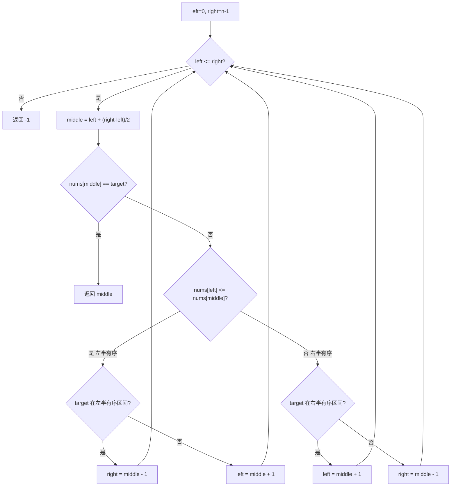

# 二分法 - 搜索旋转排序数组

> [LeetCode 33. 搜索旋转排序数组](https://leetcode.cn/problems/search-in-rotated-sorted-array/)

## 题目说明

整数数组 `nums` 按升序排列，数组中的值 **互不相同**。在某个下标 `k` 处旋转后得到：

`[nums[k], nums[k+1], ..., nums[n-1], nums[0], nums[1], ..., nums[k-1]]`

例如 `[0,1,2,4,5,6,7]` 在下标 `3` 处旋转后为 `[4,5,6,7,0,1,2]`。

给你旋转后的数组 `nums` 和一个整数 `target`，如果 `nums` 中存在这个目标值，则返回它的下标，否则返回 `-1`。要求时间复杂度为 O(log n)。

## 解题思路

仍是 [二分查找](./二分法查找有序数组目标值)，但不能直接用 `nums[mid]` 和 `target` 比较来决定往哪边走——中间可能隔着旋转点，单调性被打断了。

旋转后，任意中点都会把当前区间拆成两段：**至少有一段是有序的**。用 `nums[left]` 和 `nums[middle]` 判断哪边有序，再看 `target` 是否落在这段有序区间里：在就缩小到这边，不在就去另一边。

- `nums[left] <= nums[middle]`：左半段 `[left, middle]` 有序
- 否则：右半段 `[middle, right]` 有序

先比较 `nums[middle] == target` 再收缩区间。后面判断「是否落在有序半边」时用了 `<=`，若没有提前返回，命中 `middle` 时会被 `middle - 1` / `middle + 1` 跳过。

题目保证元素互不相同，所以 `nums[left] <= nums[middle]` 能唯一判定左半段有序。有重复时这个判断会失效（见 81 题）。

### 过程

1. 数组为空：返回 `-1`
2. 初始化：`left = 0`，`right = nums.length - 1`
3. 当 `left <= right` 时：
   - `middle = left + (right - left) / 2`
   - `nums[middle] == target`：返回 `middle`
   - 左半段有序：
     - `target` 在 `[nums[left], nums[middle]]` 内：`right = middle - 1`
     - 否则：`left = middle + 1`
   - 右半段有序：
     - `target` 在 `[nums[middle], nums[right]]` 内：`left = middle + 1`
     - 否则：`right = middle - 1`
4. 循环结束仍未命中，返回 `-1`

以 `nums = [4, 5, 6, 7, 0, 1, 2]`，`target = 0` 为例：

| 轮次 | left | right | middle | nums[middle] | 有序半边 | 操作 |
|------|------|-------|--------|--------------|----------|------|
| 1 | 0 | 6 | 3 | 7 | 左 `[4,7]`，0 不在其中 | `left = 4` |
| 2 | 4 | 6 | 5 | 1 | 左 `[0,1]`，0 在其中 | `right = 4` |
| 3 | 4 | 4 | 4 | 0 | 命中 | 返回 `4` |

再看 `target = 3`（不存在）：

| 轮次 | left | right | middle | nums[middle] | 操作 |
|------|------|-------|--------|--------------|------|
| 1 | 0 | 6 | 3 | 7 | 3 不在左半 `[4,7]`，`left = 4` |
| 2 | 4 | 6 | 5 | 1 | 3 不在左半 `[0,1]`，`left = 6` |
| 3 | 6 | 6 | 6 | 2 | 3 不在 `[2,2]`，`left = 7` |

区间空，返回 `-1`。



## 复杂度

| 类型 | 复杂度 | 说明 |
|------|------|------|
| 时间复杂度 | O(log n) | 每次将区间减半 |
| 空间复杂度 | O(1) | 仅使用常数额外变量 |

## 代码

```java
class Solution {
    public int search(int[] nums, int target) {
        if (nums.length == 0) {
            return -1;
        }
        int left = 0;
        int right = nums.length - 1;
        while (left <= right) {
            int middle = left + (right - left) / 2;
            if (nums[middle] == target) {
                return middle;
            }
            if (nums[left] <= nums[middle]) {
                if (target >= nums[left] && target <= nums[middle]) {
                    right = middle - 1;
                } else {
                    left = middle + 1;
                }
            } else {
                if (target >= nums[middle] && target <= nums[right]) {
                    left = middle + 1;
                } else {
                    right = middle - 1;
                }
            }
        }
        return -1;
    }
}
```

## 参考

- 作者：[青驰](https://leetcode.cn/problems/search-in-rotated-sorted-array/submissions/)
- 来源：[力扣（LeetCode）](https://leetcode.cn/problems/search-in-rotated-sorted-array/)
