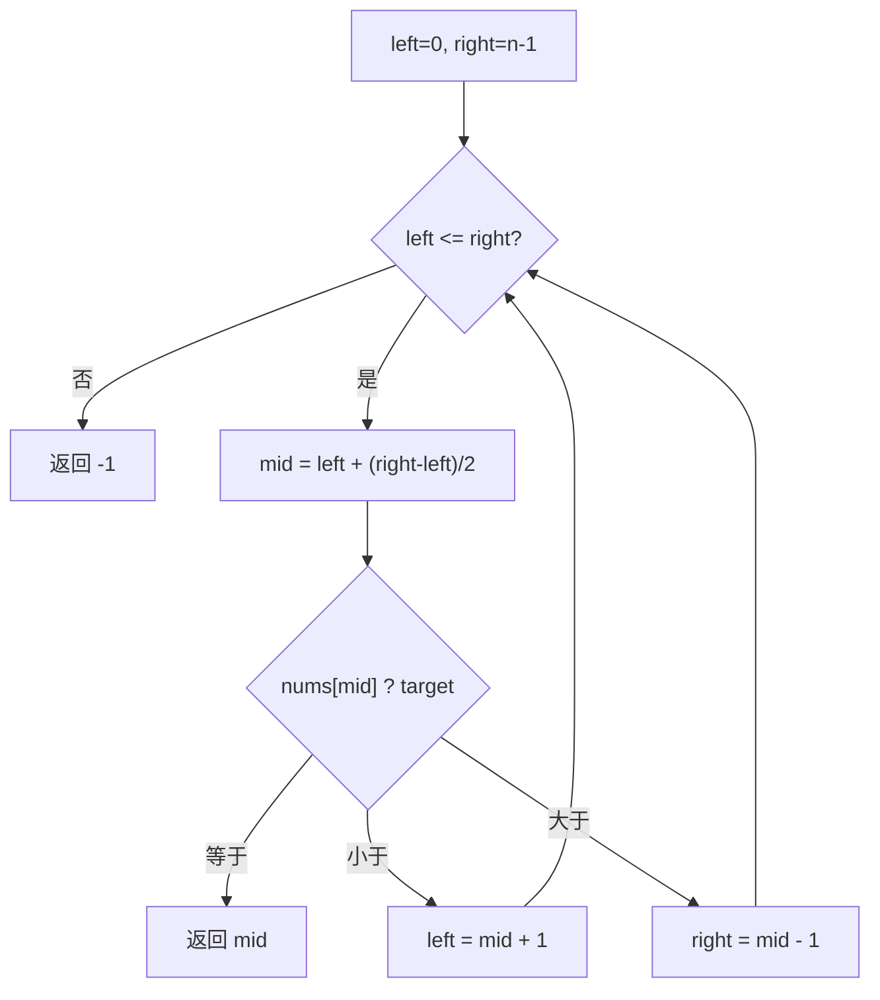

# 二分法查找有序数组目标值

> [LeetCode 704. 二分查找](https://leetcode.cn/problems/binary-search/)

## 题目说明

给定一个 **升序排列** 且 **元素不重复** 的整数数组 `nums`，以及一个目标值 `target`，在数组中查找目标值：

- 找到则返回其下标
- 不存在则返回 `-1`

## 解题思路

数组已升序且无重复元素，适合使用 **二分查找**：通过不断对比中间值，递归（循环）缩小查找区间，直到找到目标值；若区间为空，则说明目标值不存在。

### 过程

通过控制左右下标缩小范围：

1. 初始化：`left = 0`，`right = nums.length - 1`
2. 取中点：`mid = left + (right - left) / 2`（避免溢出）
3. 比较：
   - `nums[mid] == target`：`mid` 即为目标下标
   - `nums[mid] < target`：目标在右半边，令 `left = mid + 1`
   - 否则：目标在左半边，令 `right = mid - 1`
4. 循环条件：`left <= right`（允许相等，保证能检查到只剩一个元素的情况）
5. 循环结束仍未命中，返回 `-1`



## 复杂度

| 类型 | 复杂度 | 说明 |
|------|------|------|
| 时间复杂度 | O(\log N) | 每次将区间减半 |
| 空间复杂度 | O(1) | 仅使用常数额外变量 |

## 代码

```java
/**
 * 二分法查找
 *
 * @date 2026/7/21 18:35
 */
public class BinarySearch {

    public static int search(int[] nums, int target) {
        int left = 0;
        int right = nums.length - 1;

        while (left <= right) {
            int mid = left + (right - left) / 2;
            if (nums[mid] == target) {
                return mid;
            }
            if (nums[mid] < target) {
                left = mid + 1;
            } else {
                right = mid - 1;
            }
        }
        return -1;
    }

    public static void main(String[] args) {
        int[] nums = {-1, 0, 3, 5, 9, 12};
        int target = 9;
        int index = search(nums, target);
        System.out.println("Element found at index " + index);
    }
}
```

### 示例

输入：`nums = [-1,0,3,5,9,12]`，`target = 9`

| 轮次 | left | right | mid | nums[mid] | 操作 |
|------|------|-------|-----|-----------|------|
| 1 | 0 | 5 | 2 | 3 | 3 < 9，`left = 3` |
| 2 | 3 | 5 | 4 | 9 | 命中，返回 `4` |

输出：`4`

## 参考

- 作者：[青驰](https://leetcode.cn/problems/binary-search/solutions/3999809/er-fen-fa-cha-zhao-you-xu-shu-zu-mu-biao-l1ma/)
- 来源：[力扣（LeetCode）](https://leetcode.cn/problems/binary-search/)
