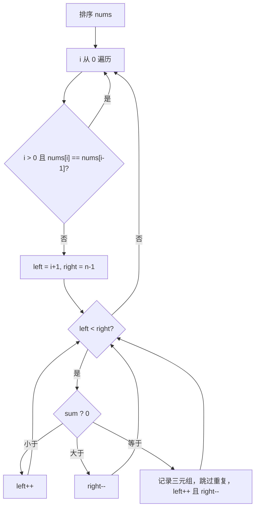

# 双指针 - 三数之和

> [LeetCode 15. 三数之和](https://leetcode.cn/problems/3sum/)

## 题目说明

给你一个整数数组 `nums`，判断是否存在三个元素 `a`、`b`、`c`，使得 `a + b + c = 0`。请找出所有和为 `0` 且不重复的三元组。

答案中不可以包含重复的三元组。

## 解题思路

先排序，再枚举第一个数，剩下两个数用 **左右双指针** 在有序数组上找互补。排序后可以从两端向中间夹逼，并把相同值跳过，从而同时做到 O(n²) 和去重。

- **外层 `i`**：固定三元组的第一个数 `current = nums[i]`
- **左指针 `left = i + 1`**、**右指针 `right = n - 1`**：在 `i` 右侧寻找 `nums[left] + nums[right] = -current`

### 过程

1. 将 `nums` 排序
2. `i` 从 `0` 遍历到末尾：
   - 若 `i > 0` 且 `nums[i] == nums[i - 1]`：跳过，避免第一个数重复
   - 初始化 `left = i + 1`，`right = nums.length - 1`
3. 当 `left < right` 时计算 `sum = nums[left] + nums[right] + current`：
   - `sum < 0`：和偏小，`left++`
   - `sum > 0`：和偏大，`right--`
   - `sum == 0`：记录三元组，再分别跳过 `left`、`right` 上的重复值，然后 `left++`、`right--`
4. 循环结束，返回结果

以 `nums = [-1, 0, 1, 2, -1, -4]` 为例，排序后为 `[-4, -1, -1, 0, 1, 2]`：

| 轮次 | i | current | left | right | sum | 操作 |
|------|---|---------|------|-------|-----|------|
| 1 | 0 | -4 | 1 | 5 | -3 | 偏小，`left++` |
| 2 | 0 | -4 | 2 | 5 | -3 | 偏小，`left++` |
| 3 | 0 | -4 | 3 | 5 | -2 | 偏小，`left++` |
| 4 | 0 | -4 | 4 | 5 | -1 | 偏小，`left++`，区间结束 |
| 5 | 1 | -1 | 2 | 5 | 0 | 命中 `[-1, -1, 2]`，去重后收缩 |
| 6 | 1 | -1 | 3 | 4 | 0 | 命中 `[-1, 0, 1]`，去重后收缩 |
| 7 | 2 | -1 | — | — | — | 与 `nums[1]` 重复，跳过 |
| 8 | 3 | 0 | 4 | 5 | 3 | 偏大，`right--`，区间结束 |

输出：`[[-1, -1, 2], [-1, 0, 1]]`



第一个数大于 0 时，后面全是正数，不可能再凑出 0，可提前结束外层循环。

## 复杂度

| 类型 | 复杂度 | 说明 |
|------|------|------|
| 时间复杂度 | O(n²) | 排序 O(n log n)，外层 n 次、内层双指针最多 O(n) |
| 空间复杂度 | O(1) | 不计返回结果，仅使用常数额外变量（排序若算入则为 O(log n)） |

## 代码

```java
class Solution {
    public List<List<Integer>> threeSum(int[] nums) {
        Arrays.sort(nums);
        List<List<Integer>> result = new ArrayList();
        for (int i = 0; i < nums.length; i++) {
            if (i > 0 && nums[i] == nums[i - 1]) {
                continue;
            }
            Integer current = nums[i];
            int left = i + 1;
            int right = nums.length - 1;
            while (left < right) {
                List<Integer> res = new ArrayList();
                int sum = nums[left] + nums[right] + current;
                if (sum < 0) {
                    left++;
                }
                if (sum > 0) {
                    right--;
                }
                if (sum == 0) {
                    res.add(nums[left]);
                    res.add(nums[right]);
                    res.add(current);
                    result.add(res);
                    while (left < right && nums[left] == nums[left + 1]) {
                        left++;
                    }
                    while (left < right && nums[right] == nums[right - 1]) {
                        right--;
                    }
                    left++;
                    right--;
                }
            }
        }
        return result;
    }
}
```

## 参考

- 作者：[青驰](https://leetcode.cn/problems/3sum/solutions/4015473/shuang-zhi-zhen-san-shu-zhi-he-by-vigila-65sl/)
- 来源：[力扣（LeetCode）](https://leetcode.cn/problems/3sum/)
