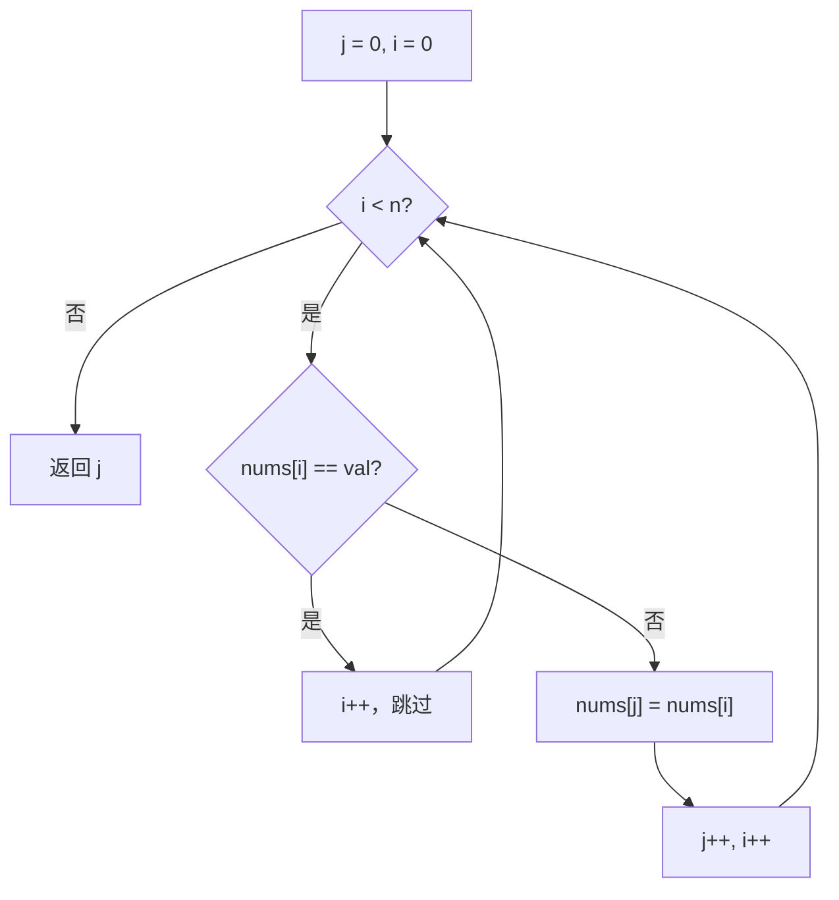

# 双指针 - 原地移除元素

> [LeetCode 27. 移除元素](https://leetcode.cn/problems/remove-element/)

## 题目说明

给你一个数组 `nums` 和一个值 `val`，你需要 **原地** 移除所有数值等于 `val` 的元素。元素的顺序可以改变。返回移除后数组的新长度。

不要使用额外的数组空间，必须仅使用 O(1) 额外空间并 **原地** 修改输入数组。

## 解题思路

使用 **快慢指针**：

- **快指针 `i`**：遍历整个数组
- **慢指针 `j`**：指向下一个有效元素应写入的位置

若当前元素等于 `val`，快指针继续前进，慢指针不动；若不相等，则将有效元素写回 `nums[j]`，再让慢指针前进。最终 `j` 即为不等于 `val` 的元素个数。

### 过程

1. 初始化：`j = 0`（慢指针，表示最终有效数组的下标）
2. 快指针 `i` 从 `0` 遍历到 `nums.length - 1`：
   - 若 `nums[i] == val`：跳过（`j` 不变，`i` 继续）
   - 否则：`nums[j] = nums[i]`，然后 `j++`
3. 循环结束，返回 `j`

以 `nums = [3, 2, 2, 3]`，`val = 3` 为例：

| 轮次 | i | nums[i] | 操作 | j | 数组状态 |
|------|---|---------|------|---|----------|
| 1 | 0 | 3 | 等于 val，跳过 | 0 | `[3, 2, 2, 3]` |
| 2 | 1 | 2 | `nums[0] = 2`，`j++` | 1 | `[2, 2, 2, 3]` |
| 3 | 2 | 2 | `nums[1] = 2`，`j++` | 2 | `[2, 2, 2, 3]` |
| 4 | 3 | 3 | 等于 val，跳过 | 2 | `[2, 2, 2, 3]` |

返回：`2`（前 `j` 个元素为有效结果）



## 复杂度

| 类型 | 复杂度 | 说明 |
|------|------|------|
| 时间复杂度 | O(n) | 快指针遍历数组一次 |
| 空间复杂度 | O(1) | 原地修改，仅使用常数额外变量 |

## 代码

```java
class Solution {
    public int removeElement(int[] nums, int val) {
        int j = 0;
        for (int i = 0; i < nums.length; i++) {
            if (nums[i] == val) {
                continue;
            } else {
                nums[j] = nums[i];
                j++;
            }
        }
        return j;
    }
}
```

## 参考

- 作者：[青驰](https://leetcode.cn/problems/remove-element/solutions/4000380/yuan-di-yi-chu-yuan-su-by-vigilant-parek-75fg/)
- 来源：[力扣（LeetCode）](https://leetcode.cn/problems/remove-element/)
