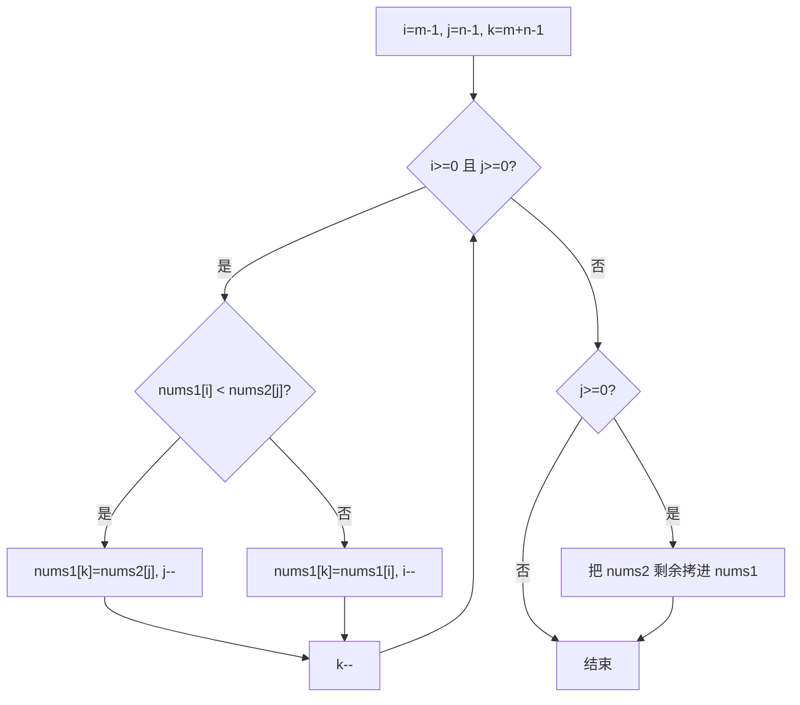

# 双指针 - 合并两个有序数组

> [LeetCode 88. 合并两个有序数组](https://leetcode.cn/problems/merge-sorted-array/)

## 题目说明

给你两个按 **非递减顺序** 排列的整数数组 `nums1` 和 `nums2`，另有两个整数 `m` 和 `n`，分别表示两数组中的元素数目。

请把 `nums2` 合并到 `nums1` 中，使合并后的数组同样按非递减顺序排列。

`nums1` 的长度为 `m + n`，后 `n` 个位置是预留空位（值为 `0`），应 **原地** 写入结果，不要返回新数组。

例如：

- `nums1 = [1,2,3,0,0,0]`, `m = 3`, `nums2 = [2,5,6]`, `n = 3` → `[1,2,2,3,5,6]`
- `nums1 = [1]`, `m = 1`, `nums2 = []`, `n = 0` → `[1]`
- `nums1 = [0]`, `m = 0`, `nums2 = [1]`, `n = 1` → `[1]`

## 解题思路

和 [有序数组平方](./双指针-有序数组平方) 一样，从后往前填：最大值一定在两个数组的尾部，先放到 `nums1` 的末尾，就不会覆盖还没比较过的前半段。

三个指针：

- `i`：`nums1` 有效部分的末尾（`m - 1`）
- `j`：`nums2` 的末尾（`n - 1`）
- `k`：写入位置（`m + n - 1`）

每次把 `nums1[i]` 和 `nums2[j]` 里较大的写到 `nums1[k]`，对应指针和 `k` 一起左移。

第一轮循环结束后：

- `nums1` 还有剩余：它们本来就在正确位置，不用动
- `nums2` 还有剩余：逐个拷进 `nums1` 前面的空位

若从前往后合并，需要额外数组，否则会覆盖 `nums1` 里还没处理的数。

### 过程

1. `i = m - 1`，`j = n - 1`，`k = m + n - 1`
2. 当 `i >= 0` 且 `j >= 0`：
   - `nums1[i] < nums2[j]`：写入 `nums2[j]`，`j--`
   - 否则写入 `nums1[i]`，`i--`
   - `k--`
3. `nums2` 还有剩余时，继续拷到 `nums1[k]`

以 `nums1 = [1, 2, 3, 0, 0, 0]`，`nums2 = [2, 5, 6]` 为例：

| 轮次 | i | j | k | 比较 | 写入 | nums1 |
|------|---|---|---|------|------|--------|
| 1 | 2 | 2 | 5 | 3 < 6 | 6 | `[1, 2, 3, 0, 0, 6]` |
| 2 | 2 | 1 | 4 | 3 < 5 | 5 | `[1, 2, 3, 0, 5, 6]` |
| 3 | 2 | 0 | 3 | 3 > 2 | 3 | `[1, 2, 3, 3, 5, 6]` |
| 4 | 1 | 0 | 2 | 2 == 2 | 2 | `[1, 2, 2, 3, 5, 6]` |
| 5 | 0 | 0 | 1 | 1 < 2 | 2 | `[1, 2, 2, 3, 5, 6]` |

`j < 0`，结束。输出：`[1, 2, 2, 3, 5, 6]`



## 复杂度

| 类型 | 复杂度 | 说明 |
|------|------|------|
| 时间复杂度 | O(m + n) | 每个元素最多被比较、写入一次 |
| 空间复杂度 | O(1) | 原地合并，只用三个指针 |

## 代码

```java
class Solution {
    public void merge(int[] nums1, int m, int[] nums2, int n) {
        int i = m - 1;
        int j = n - 1;
        int k = m + n - 1;
        while(i >= 0 && j >= 0){
            if(nums1[i] < nums2[j]){
                nums1[k] = nums2[j];
                j--;
            }else{
                nums1[k] = nums1[i];
                i--;
            }
            k--;
        }
        while(j >= 0){
            nums1[k] = nums2[j];
            j--;
            k--;
        }
    }
}
```

## 参考

- 作者：[青驰](https://leetcode.cn/problems/merge-sorted-array/solutions/4028564/shuang-zhi-zhen-he-bing-liang-ge-you-xu-3gt6a/)
- 来源：[力扣（LeetCode）](https://leetcode.cn/problems/merge-sorted-array/)
