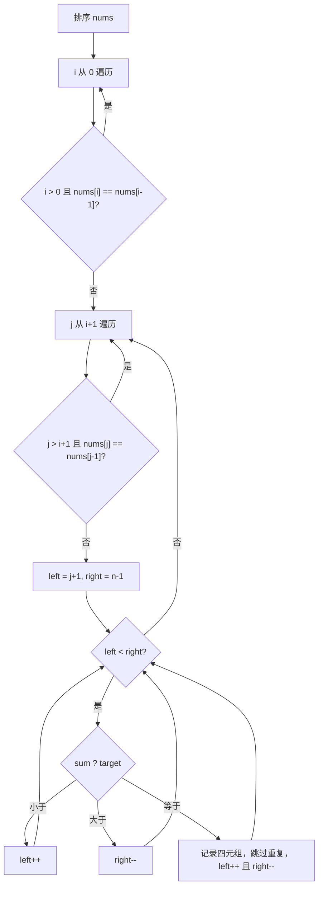

# 双指针 - 四数之和

> [LeetCode 18. 四数之和](https://leetcode.cn/problems/4sum/)

## 题目说明

给你一个由 `n` 个整数组成的数组 `nums`，和一个目标值 `target`。请找出并返回满足 `nums[a] + nums[b] + nums[c] + nums[d] == target` 的不重复四元组。

答案中不可以包含重复的四元组。下标须两两不同。

## 解题思路

在 [三数之和](./双指针-三数之和) 上再套一层循环：先排序，枚举前两个数 `i`、`j`，剩下两个数用 **左右双指针** 在有序数组上找互补。排序后可以从两端向中间夹逼，并把相同值跳过，从而同时做到 O(n³) 和去重。

- **外层 `i`**：固定四元组的第一个数
- **内层 `j`**：固定四元组的第二个数，从 `i + 1` 开始
- **左指针 `left = j + 1`**、**右指针 `right = n - 1`**：在 `j` 右侧寻找 `nums[left] + nums[right] = target - nums[i] - nums[j]`

四数相加可能超出 `int` 范围，求和时要用 `long`。

### 过程

1. 将 `nums` 排序
2. `i` 从 `0` 遍历到末尾：
   - 若 `i > 0` 且 `nums[i] == nums[i - 1]`：跳过，避免第一个数重复
3. `j` 从 `i + 1` 遍历到末尾：
   - 若 `j > i + 1` 且 `nums[j] == nums[j - 1]`：跳过，避免第二个数重复
   - 初始化 `left = j + 1`，`right = nums.length - 1`
4. 当 `left < right` 时计算 `sum = nums[i] + nums[j] + nums[left] + nums[right]`：
   - `sum < target`：和偏小，`left++`
   - `sum > target`：和偏大，`right--`
   - `sum == target`：记录四元组，再分别跳过 `left`、`right` 上的重复值，然后 `left++`、`right--`
5. 循环结束，返回结果

`j` 的去重条件必须是 `j > i + 1`，不能写成 `j > 0`。否则当 `nums[j] == nums[i]` 时会把合法的第二位数也跳过。

以 `nums = [1, 0, -1, 0, -2, 2]`，`target = 0` 为例，排序后为 `[-2, -1, 0, 0, 1, 2]`：

| 轮次 | i | j | left | right | sum | 操作 |
|------|---|---|------|-------|-----|------|
| 1 | 0 | 1 | 2 | 5 | -1 | 偏小，`left++` |
| 2 | 0 | 1 | 3 | 5 | -1 | 偏小，`left++` |
| 3 | 0 | 1 | 4 | 5 | 0 | 命中 `[-2, -1, 1, 2]`，去重后收缩 |
| 4 | 0 | 2 | 3 | 5 | 0 | 命中 `[-2, 0, 0, 2]`，去重后收缩 |
| 5 | 0 | 3 | — | — | — | 与 `nums[2]` 重复，跳过 |
| 6 | 1 | 2 | 3 | 5 | 1 | 偏大，`right--` |
| 7 | 1 | 2 | 3 | 4 | 0 | 命中 `[-1, 0, 0, 1]`，去重后收缩 |
| 8 | 1 | 3 | — | — | — | 与 `nums[2]` 重复，跳过 |

输出：`[[-2, -1, 1, 2], [-2, 0, 0, 2], [-1, 0, 0, 1]]`



当前最小四数之和已经大于 `target` 时，后续只会更大，可提前结束对应循环；当前最大四数之和仍小于 `target` 时，可跳过本轮。

## 复杂度

| 类型 | 复杂度 | 说明 |
|------|------|------|
| 时间复杂度 | O(n³) | 排序 O(n log n)，两层枚举 O(n²)，内层双指针最多 O(n) |
| 空间复杂度 | O(1) | 不计返回结果，仅使用常数额外变量（排序若算入则为 O(log n)） |

## 代码

```java
class Solution {
    public List<List<Integer>> fourSum(int[] nums, int target) {
        Arrays.sort(nums);
        List<List<Integer>> lists = new ArrayList<>();
        for (int i = 0; i < nums.length; i++) {
            if (i > 0 && nums[i] == nums[i - 1]) {
                continue;
            }
            for (int j = i + 1; j < nums.length; j++) {
                if (j > i + 1 && nums[j] == nums[j - 1]) {
                    continue;
                }
                int left = j + 1;
                int right = nums.length - 1;
                while (left < right) {
                    long sum = (long) nums[i] + nums[j] + nums[left] + nums[right];
                    if (sum < target) {
                        left++;
                    }
                    if (sum > target) {
                        right--;
                    }
                    if (sum == target) {
                        List<Integer> list = new ArrayList<>();
                        list.add(nums[i]);
                        list.add(nums[j]);
                        list.add(nums[left]);
                        list.add(nums[right]);
                        lists.add(list);
                        while (left < right && nums[left] == nums[left + 1]) {
                            left++;
                        }
                        while (left < right && nums[right] == nums[right - 1]) {
                            right--;
                        }
                        left++;
                        right--;
                    }
                }
            }
        }
        return lists;
    }
}
```

## 参考

- 作者：[青驰](https://leetcode.cn/problems/4sum/solutions/4021678/si-shu-zhi-he-shuang-zhi-zhen-qu-zhong-b-hs37/)
- 来源：[力扣（LeetCode）](https://leetcode.cn/problems/4sum/)
