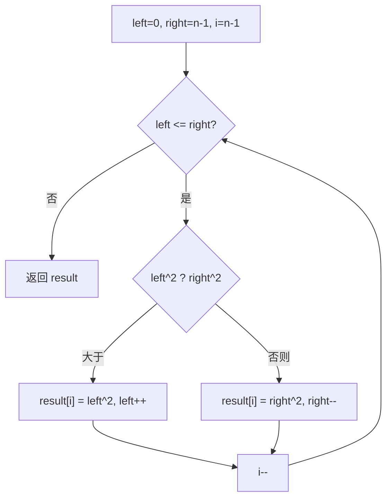

# 双指针 - 有序数组平方

> [LeetCode 977. 有序数组的平方](https://leetcode.cn/problems/squares-of-a-sorted-array/)

## 题目说明

给你一个按 **非递减顺序** 排序的整数数组 `nums`，返回每个数字平方组成的新数组，要求也按 **非递减顺序** 排序。

## 解题思路

数组已有序，平方后最大值一定出现在两端（负数绝对值可能更大）。使用 **双指针** 从左右两端比较平方值，将较大者依次放入结果数组的末尾，从而从大到小填满结果数组。

### 过程

1. 初始化：`left = 0`，`right = nums.length - 1`，`result` 为同长度新数组，`i = nums.length - 1`（从末尾往前填）
2. 循环条件：`left <= right`
3. 比较两端平方：
   - 若 `nums[left]² > nums[right]²`：`result[i] = nums[left]²`，`left++`
   - 否则：`result[i] = nums[right]²`，`right--`
4. 每轮填完后 `i--`，继续找当前次大值
5. 循环结束，返回 `result`

以 `nums = [-4, -1, 0, 3, 10]` 为例：

| 轮次 | left | right | left² | right² | 操作 | i | result |
|------|------|-------|-------|--------|------|---|--------|
| 1 | 0 | 4 | 16 | 100 | 取右，`right--` | 4 | `[_, _, _, _, 100]` |
| 2 | 0 | 3 | 16 | 9 | 取左，`left++` | 3 | `[_, _, _, 16, 100]` |
| 3 | 1 | 3 | 1 | 9 | 取右，`right--` | 2 | `[_, _, 9, 16, 100]` |
| 4 | 1 | 2 | 1 | 0 | 取左，`left++` | 1 | `[_, 1, 9, 16, 100]` |
| 5 | 2 | 2 | 0 | 0 | 取右，`right--` | 0 | `[0, 1, 9, 16, 100]` |

输出：`[0, 1, 9, 16, 100]`



## 复杂度

| 类型 | 复杂度 | 说明 |
|------|------|------|
| 时间复杂度 | O(n) | 左右指针各最多移动 n 次 |
| 空间复杂度 | O(n) | 需要新数组存放结果 |

## 代码

```java
class Solution {
    public int[] sortedSquares(int[] nums) {
        int left = 0;
        int right = nums.length - 1;
        int[] result = new int[nums.length];
        int i = nums.length - 1;
        while (left <= right) {
            if (nums[left] * nums[left] > nums[right] * nums[right]) {
                result[i] = nums[left] * nums[left];
                left++;
            } else {
                result[i] = nums[right] * nums[right];
                right--;
            }
            i--;
        }
        return result;
    }
}
```

## 参考

- 作者：[青驰](https://leetcode.cn/problems/squares-of-a-sorted-array/solutions/4000404/shuang-zhi-zhen-you-xu-shu-zu-ping-fang-2c6ka/)
- 来源：[力扣（LeetCode）](https://leetcode.cn/problems/squares-of-a-sorted-array/)
