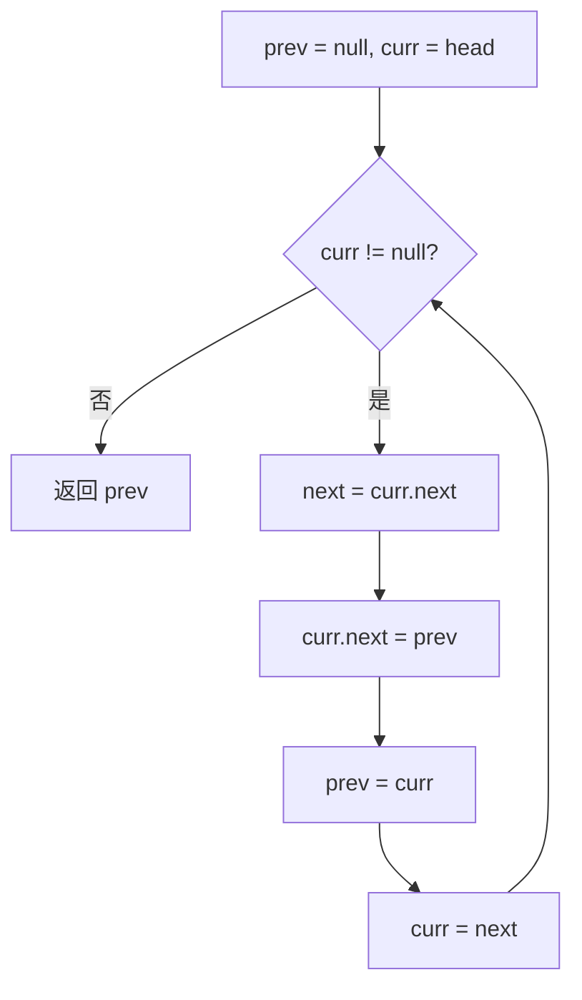

# 双指针反转链表

> [LeetCode 206. 反转链表](https://leetcode.cn/problems/reverse-linked-list/)

## 题目说明

给你单链表的头节点 `head`，请你反转链表，并返回反转后的链表。

## 解题思路

使用 **双指针** 原地反转链表：遍历每个节点时，将其 `next` 指向前一个节点，从而完成整条链的方向翻转。

### ListNode 结构

单链表是嵌套结构，包含两个属性；当 `next` 为 `null` 时表示链表结束：

```java
int val;
ListNode next;
```

### 过程

三个指针的含义：

- `prev`：已经翻转好的链表
- `curr`：正在处理的节点
- `next`：剩余尚未处理的链表

1. **初始化**：`prev = null`，`curr = head`
2. **循环**（`curr != null`）：
   - 先保存 `curr` 的下一个节点：`next = curr.next`
   - 让 `curr` 指向 `prev`：`curr.next = prev`
   - `prev` 前进一步：`prev = curr`
   - `curr` 前进一步：`curr = next`
3. **结束**：`curr == null`，`prev` 即为新的头节点，返回 `prev`

以 `1 → 2 → 3 → 4 → 5` 为例：

| 轮次 | 操作前 curr | next | 翻转后 curr | prev | 剩余 curr |
|------|-------------|------|-------------|------|-----------|
| 1 | `1 → 2 → 3 → 4 → 5` | `2 → 3 → 4 → 5` | `1 → null` | `1 → null` | `2 → 3 → 4 → 5` |
| 2 | `2 → 3 → 4 → 5` | `3 → 4 → 5` | `2 → 1 → null` | `2 → 1 → null` | `3 → 4 → 5` |
| … | … | … | … | … | … |
| 末 | `5` | `null` | `5 → 4 → 3 → 2 → 1 → null` | `5 → 4 → 3 → 2 → 1 → null` | `null` |



## 复杂度

| 类型 | 复杂度 | 说明 |
|------|------|------|
| 时间复杂度 | O(n) | 每个节点只访问一次 |
| 空间复杂度 | O(1) | 仅使用三个指针，无额外空间开销 |

## 代码

```java
/**
 * Definition for singly-linked list.
 * public class ListNode {
 *     int val;
 *     ListNode next;
 *     ListNode() {}
 *     ListNode(int val) { this.val = val; }
 *     ListNode(int val, ListNode next) { this.val = val; this.next = next; }
 * }
 */
class Solution {
    public ListNode reverseList(ListNode head) {
        ListNode prev = null;
        ListNode curr = head;
        while (curr != null) {
            ListNode next = curr.next;
            curr.next = prev;
            prev = curr;
            curr = next;
        }
        return prev;
    }
}
```

## 参考

- 作者：[青驰](https://leetcode.cn/problems/reverse-linked-list/solutions/4003781/shuang-zhi-zhen-fan-zhuan-lian-biao-by-v-d2ru/)
- 来源：[力扣（LeetCode）](https://leetcode.cn/problems/reverse-linked-list/)
