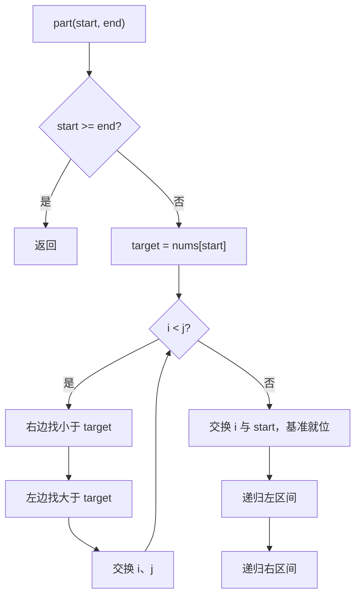

# 快速排序 - 排序数组

> [LeetCode 912. 排序数组](https://leetcode.cn/problems/sort-an-array/)

## 题目说明

给你一个整数数组 `nums`，请将数组升序排列。

例如：

- `nums = [5,2,3,1]` → `[1,2,3,5]`
- `nums = [5,1,1,2,0,0]` → `[0,0,1,1,2,5]`

## 解题思路

**快速排序**：选一个基准 `target`，把数组分成「小于等于它」和「大于等于它」两段，再对两段递归。

本写法用左右指针：

1. 基准取区间最左 `nums[start]`
2. `j` 从右往左找 **小于** 基准的，`i` 从左往右找 **大于** 基准的，找到就交换
3. `i`、`j` 相遇后，把基准和相遇位置交换，基准就落在最终位置
4. 对 `[start, i-1]`、`[i+1, end]` 继续分治

必须 **先右后左**。基准在最左侧，右边先停在「该放到左边」的数上；两指针相遇时这个位置一定 ≤ 基准，再和 `start` 交换才正确。先动左边，相遇点可能仍大于基准，交换后分区会乱。

### 过程

1. `start >= end`：区间最多一个元素，返回
2. `target = nums[start]`，`i = start`，`j = end`
3. 当 `i < j`：
   - 右指针：`nums[j] >= target` 就 `j--`
   - 左指针：`nums[i] <= target` 就 `i++`
   - 仍有 `i < j` 则交换 `nums[i]` 与 `nums[j]`
4. 交换 `nums[i]` 与 `nums[start]`，基准就位
5. 递归左右两侧

以 `nums = [3, 6, 8, 1, 2]` 第一轮为例，`target = 3`：

| 步骤 | i | j | 数组 | 动作 |
|------|---|---|------|------|
| 右找小 | 0 | 4 | `[3, 6, 8, 1, 2]` | `2 < 3`，j 停 |
| 左找大 | 1 | 4 | 同上 | `6 > 3`，i 停 |
| 交换 | 1 | 4 | `[3, 2, 8, 1, 6]` | 6 ↔ 2 |
| 右找小 | 1 | 3 | 同上 | `1 < 3`，j 停 |
| 左找大 | 2 | 3 | 同上 | `8 > 3`，i 停 |
| 交换 | 2 | 3 | `[3, 2, 1, 8, 6]` | 8 ↔ 1 |
| 相遇 | 2 | 2 | 同上 | i == j |
| 基准就位 | 2 | 2 | `[1, 2, 3, 8, 6]` | 3 ↔ 1 |

随后对 `[1, 2]` 和 `[8, 6]` 再分治。



最坏情况每次基准都是最值（如已有序且总取最左），退化成 O(n²)。平均 O(n log n)。面试可提：随机选基准、或三数取中，降低退化概率。

## 复杂度

| 类型 | 复杂度 | 说明 |
|------|------|------|
| 时间复杂度 | 平均 O(n log n)，最坏 O(n²) | 每层分区 O(n)，平均递归 log n 层 |
| 空间复杂度 | 平均 O(log n) | 递归栈深度；最坏 O(n) |

## 代码

```java
class Solution {
    public int[] sortArray(int[] nums) {
    
        //快速排序
        part(nums, 0, nums.length - 1);
        return nums;
    }

    public void part(int[] nums, int start, int end) {
       if(start >= end){
            return;
       }
       int target = nums[start];
       int i = start;
       int j = end;
       while(i < j){
            //找小的和大的换
            while(i < j && nums[j] >= target){
                j--;
            }
            while(i < j && nums[i] <= target){
                i++;
            }        
            if(i < j){
                swap(nums, i, j);
            }
       }
       swap(nums, i, start);
       part(nums, start, i - 1);
       part(nums, i + 1, end);
    }
    private void swap(int[] nums, int i, int j){
        int tmp = nums[i];
        nums[i] = nums[j];
        nums[j] = tmp;
    }
}
```

## 参考

- 来源：[力扣（LeetCode）](https://leetcode.cn/problems/sort-an-array/)
