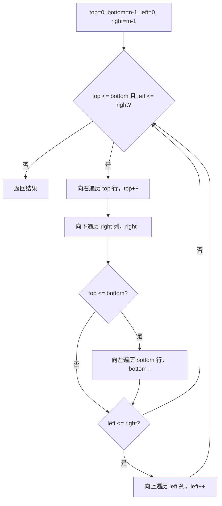

# 矩阵模拟 - 螺旋矩阵

> [LeetCode 54. 螺旋矩阵](https://leetcode.cn/problems/spiral-matrix/)

## 题目说明

给你一个 `m x n` 矩阵 `matrix`，请按照 **顺时针螺旋顺序** 返回矩阵中的所有元素。

例如：

```
[[1, 2, 3],
 [4, 5, 6],
 [7, 8, 9]]
```

输出：`[1, 2, 3, 6, 9, 8, 7, 4, 5]`

## 解题思路

用四个边界圈住尚未遍历的区域：**上 `top`、下 `bottom`、左 `left`、右 `right`**。每走完一条边就收缩对应边界，按「右 → 下 → 左 → 上」循环，直到区域为空。

核心选择：

- 向右走完顶行后 `top++`
- 向下走完右列后 `right--`
- 向左走完底行后 `bottom--`
- 向上走完左列后 `left++`

向左、向上前必须再判断一次边界。向右、向下已经收缩过 `top`、`right`，剩下可能只剩一行或一列，此时再走就会重复。

### 过程

1. 初始化：`top = 0`，`bottom = n - 1`，`left = 0`，`right = m - 1`
2. 循环条件：`top <= bottom && left <= right`
3. 每轮按四条边遍历：
   - **向右**：固定 `top`，`j` 从 `left` 到 `right`，然后 `top++`
   - **向下**：固定 `right`，`i` 从 `top` 到 `bottom`，然后 `right--`
   - **向左**：若 `top <= bottom`，固定 `bottom`，`j` 从 `right` 到 `left`，然后 `bottom--`
   - **向上**：若 `left <= right`，固定 `left`，`i` 从 `bottom` 到 `top`，然后 `left++`
4. 循环结束，返回结果

只剩一行时，向右已经把这一行走完，`top++` 后 `top > bottom`，不能再向左。只剩一列时，向下已经把这一列走完，`right--` 后 `left > right`，不能再向上。

以 `matrix = [[1, 2, 3], [4, 5, 6], [7, 8, 9]]` 为例：

| 轮次 | 方向 | 边界 | 遍历 | 收缩后 |
|------|------|------|------|--------|
| 1 | 向右 | top=0, left=0..right=2 | 1, 2, 3 | top=1 |
| 1 | 向下 | right=2, top=1..bottom=2 | 6, 9 | right=1 |
| 1 | 向左 | bottom=2, right=1..left=0 | 8, 7 | bottom=1 |
| 1 | 向上 | left=0, bottom=1..top=1 | 4 | left=1 |
| 2 | 向右 | top=1, left=1..right=1 | 5 | top=2 |
| 2 | 向下 | top=2 > bottom=1，空走 | — | right=0 |
| 2 | 向左 / 向上 | `top > bottom` 且 `left > right`，跳过 | — | — |

输出：`[1, 2, 3, 6, 9, 8, 7, 4, 5]`



## 复杂度

| 类型 | 复杂度 | 说明 |
|------|------|------|
| 时间复杂度 | O(m × n) | 每个元素恰好访问一次 |
| 空间复杂度 | O(1) | 不计返回结果，仅使用四个边界变量 |

## 代码

```java
class Solution {
    public List<Integer> spiralOrder(int[][] matrix) {
        int m = matrix[0].length;
        int n = matrix.length;
        List<Integer> nums = new ArrayList<>();
        int top = 0;
        int bottom = n - 1;
        int left = 0;
        int right = m - 1;
        while (top <= bottom && left <= right) {
            // 向右
            for (int j = left; j < right + 1; j++) {
                nums.add(matrix[top][j]);
            }
            top++;
            // 向下
            for (int j = top; j < bottom + 1; j++) {
                nums.add(matrix[j][right]);
            }
            right--;
            // 向左：向右、向下之后若已无下一行，则不能再向左
            if (top <= bottom) {
                for (int j = right; j > left - 1; j--) {
                    nums.add(matrix[bottom][j]);
                }
                bottom--;
            }
            // 向上：单列走完后 right--，若再向上会重复
            if (left <= right) {
                for (int j = bottom; j > top - 1; j--) {
                    nums.add(matrix[j][left]);
                }
                left++;
            }
        }
        return nums;
    }
}
```

## 参考

- 作者：[青驰](https://leetcode.cn/problems/spiral-matrix/solutions/4032673/ju-zhen-mo-ni-bian-jie-shou-suo-luo-xuan-nnk3/)
- 来源：[力扣（LeetCode）](https://leetcode.cn/problems/spiral-matrix/)
