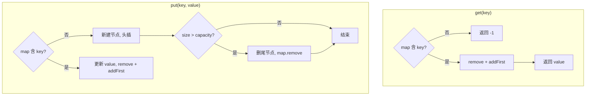

# 哈希双向链表 - LRU 缓存

> [LeetCode 146. LRU 缓存](https://leetcode.cn/problems/lru-cache/)

## 题目说明

请你设计并实现一个满足 **LRU（最近最少使用）** 缓存约束的数据结构。实现 `LRUCache` 类：

- `LRUCache(int capacity)`：以正整数作为容量 `capacity` 初始化 LRU 缓存
- `int get(int key)`：如果关键字 `key` 存在于缓存中，则返回关键字的值，否则返回 `-1`
- `void put(int key, int value)`：如果关键字 `key` 已存在，则变更其数据值；如果不存在，则插入该组 `key-value`。如果插入后数量超过容量，则逐出 **最久未使用** 的关键字

`get` 和 `put` 必须以 **O(1)** 平均时间复杂度运行。

## 解题思路

O(1) 查找靠 **HashMap**，O(1) 调整使用顺序靠 **双向链表**：

- Map：`key → Node`，快速定位节点
- 双向链表：靠近 `head` 的是最近使用，靠近 `tail` 的是最久未使用
- 哨兵节点 `head`、`tail` 简化头插和尾删，避免空指针判断

核心操作：

- **访问 / 更新**：先从链表摘下该节点，再插入到头部
- **插入新键**：头插；若 `map.size() > capacity`，删除尾部前驱（真正的最久未使用节点），同时从 map 中移除

### 过程

`get(key)`：

1. map 中不存在 → 返回 `-1`
2. 取出节点，从链表删除，再插入头部，返回 `value`

`put(key, value)`：

1. **不存在**：新建节点放入 map 并头插；若超出容量，删除 `tail.prev` 并从 map 移除
2. **已存在**：更新 `value`，从链表删除后再头插（视为最近使用）

以 `capacity = 2` 为例：

| 操作 | 链表（头 → 尾） | map | 返回 |
|------|-----------------|-----|------|
| `put(1,1)` | `1` | `{1}` | - |
| `put(2,2)` | `2 → 1` | `{1,2}` | - |
| `get(1)` | `1 → 2` | `{1,2}` | `1` |
| `put(3,3)` | 超出容量，删 2；`3 → 1` | `{1,3}` | - |
| `get(2)` | `3 → 1` | `{1,3}` | `-1` |



链表结构示意：

```text
head ⇄ 最近使用 ⇄ ... ⇄ 最久未使用 ⇄ tail
```

## 复杂度

| 类型 | 复杂度 | 说明 |
|------|------|------|
| 时间复杂度 | O(1) | HashMap 查找 + 双向链表头插 / 删除均为常数时间 |
| 空间复杂度 | O(capacity) | map 与链表最多存放 capacity 个节点 |

## 代码

```java
class LRUCache {
    private int capacity;
    private Map<Integer, Node> map;
    private Node head;
    private Node tail;

    public LRUCache(int capacity) {
        this.capacity = capacity;
        this.map = new HashMap<Integer, Node>();
        head = new Node(0, 0);
        tail = new Node(0, 0);
        head.next = tail;
        tail.prev = head;
    }

    public int get(int key) {
        if (!map.containsKey(key)) {
            return -1;
        }
        Node node = map.get(key);
        remove(node);
        addFirstNode(node);
        return node.value;
    }

    public void put(int key, int value) {
        if (!map.containsKey(key)) {
            Node node = new Node(key, value);
            map.put(key, node);
            addFirstNode(node);
            if (map.size() > capacity) {
                Node last = tail.prev;
                remove(last);
                map.remove(last.key);
            }
        } else {
            Node node = map.get(key);
            node.value = value;
            remove(node);
            addFirstNode(node);
        }
    }

    public void remove(Node node) {
        node.prev.next = node.next;
        node.next.prev = node.prev;
    }

    public void addFirstNode(Node node) {
        node.prev = head;
        node.next = head.next;
        head.next = node;
        node.next.prev = node;
    }

    class Node {
        Node prev;
        Node next;
        int key;
        int value;

        public Node(int key, int value) {
            this.key = key;
            this.value = value;
        }
    }
}
```

## 参考

- 作者：[青驰](https://leetcode.cn/problems/lru-cache/solutions/4007427/shuang-xiang-lian-biao-hashmapshi-xian-l-fxrz/)
- 来源：[力扣（LeetCode）](https://leetcode.cn/problems/lru-cache/)
