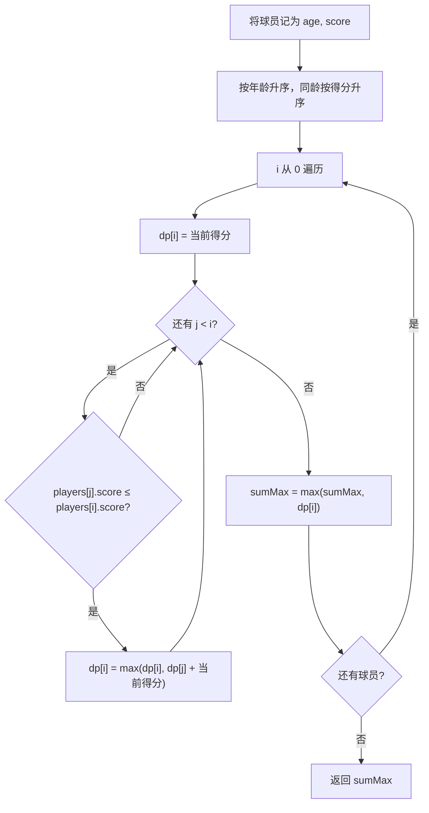

# 动态规划 - 无矛盾的最佳球队

> [LeetCode 1626. 无矛盾的最佳球队](https://leetcode.cn/problems/best-team-with-no-conflicts/)

## 题目说明

假设你是球队教练，需要从若干球员中组成一支球队。每位球员有 `scores[i]` 和 `ages[i]`。

若一名 **年龄更小** 的球员得分 **严格高于** 一名年龄更大的球员，就会产生矛盾。同龄球员之间不会矛盾。

请返回所有无矛盾球队中，得分总和的最大值。球队可以只选一名球员。

例如：

- `scores = [4, 5, 6, 5]`
- `ages = [2, 1, 2, 1]`

无矛盾的最大得分是 `16`，对应球员得分 `[5, 5, 6]`。

## 解题思路

先按年龄排序，把问题变成「在有序序列上选一个得分非递减的子序列，使得分之和最大」。这与最长递增子序列同类，用 **动态规划** 求解。

排序规则：

- 先按年龄升序
- 年龄相同再按得分升序

同龄球员无论得分如何都不会矛盾，得分小的排在前面，后面更容易接到更大得分。

状态定义：

```
dp[i] = 以第 i 名球员结尾的无矛盾球队的最大得分
```

转移：

```
dp[i] = players[i].score
对每个 j < i，若 players[j].score ≤ players[i].score：
    dp[i] = max(dp[i], dp[j] + players[i].score)
```

年龄已经有序，`j` 一定不比 `i` 更老。只要 `j` 的得分不超过 `i`，把 `i` 接到以 `j` 结尾的球队后面就不会产生矛盾。最终答案是所有 `dp[i]` 的最大值。

### 过程

1. 把每位球员记成 `(age, score)` 二元组
2. 按年龄升序排序，年龄相同则按得分升序
3. 初始化 `dp[i] = players[i].score`，表示至少可以单选自己
4. 枚举 `i`，再枚举 `j = 0 .. i-1`：
   - 若 `players[j].score <= players[i].score`：尝试用 `dp[j] + players[i].score` 更新 `dp[i]`
5. 同步维护全局最大值 `sumMax`
6. 返回 `sumMax`

以 `scores = [4, 5, 6, 5]`，`ages = [2, 1, 2, 1]` 为例，排序后为：

```
(age=1, score=5), (age=1, score=5), (age=2, score=4), (age=2, score=6)
```

| i | 当前球员 | 可接的 j | dp[i] |
|---|---------|----------|-------|
| 0 | (1, 5) | 无 | 5 |
| 1 | (1, 5) | j=0，得分 5 ≤ 5 | 5 + 5 = 10 |
| 2 | (2, 4) | 前两人得分都是 5，5 ≰ 4 | 4 |
| 3 | (2, 6) | j=0 / j=1 均可接 | 10 + 6 = 16 |

更年轻且得分更高的两名球员不能和 `(2, 4)` 组队，但可以和 `(2, 6)` 组队。输出：`16`。



## 复杂度

| 类型 | 复杂度 | 说明 |
|------|------|------|
| 时间复杂度 | O(n²) | 排序 O(n log n)，两层枚举转移 O(n²) |
| 空间复杂度 | O(n) | 球员数组与 `dp` 数组各 O(n) |

## 代码

```java
class Solution {
    public int bestTeamScore(int[] scores, int[] ages) {
        // 先按照球员年龄排序
        int[][] players = new int[scores.length][2];
        for (int i = 0; i < players.length; i++) {
            players[i][0] = ages[i];
            players[i][1] = scores[i];
        }
        Arrays.sort(players, (a, b) -> {
            if (a[0] == b[0]) {
                return a[1] - b[1];
            }
            return a[0] - b[0];
        });
        // 动态规划找最大值
        int sumMax = 0;
        int[] dp = new int[scores.length];
        for (int i = 0; i < players.length; i++) {
            dp[i] = players[i][1];
            for (int j = 0; j < i; j++) {
                if (players[j][1] <= players[i][1]) {
                    dp[i] = Math.max(dp[i], dp[j] + players[i][1]);
                }
            }
            sumMax = Math.max(dp[i], sumMax);
        }
        return sumMax;
    }
}
```

## 参考

- 作者：[青驰](https://leetcode.cn/problems/best-team-with-no-conflicts/solutions/4033230/dong-tai-gui-hua-wu-mao-dun-zui-jia-qiu-5bwuk/)
- 来源：[力扣（LeetCode）](https://leetcode.cn/problems/best-team-with-no-conflicts/)
