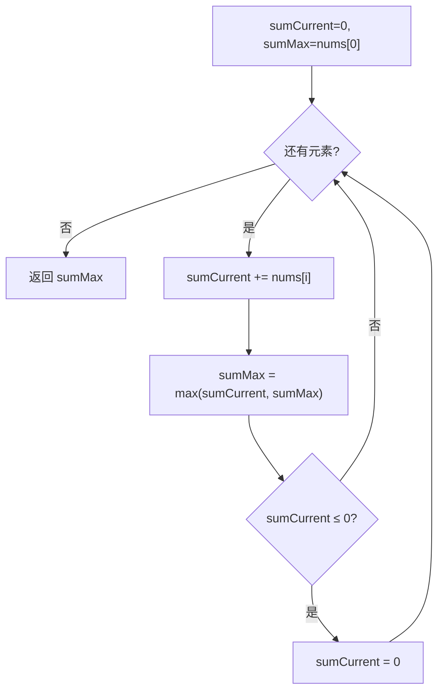

# 动态规划 - 最大子数组和

> [LeetCode 53. 最大子数组和](https://leetcode.cn/problems/maximum-subarray/)

## 题目说明

给你一个整数数组 `nums`，找出一个具有最大和的 **连续子数组**（子数组最少包含一个元素），返回其最大和。

子数组是数组中的一个连续部分。

**示例 1：**

- 输入：`nums = [-2,1,-3,4,-1,2,1,-5,4]`
- 输出：`6`
- 解释：连续子数组 `[4,-1,2,1]` 的和最大，为 `6`

**示例 2：**

- 输入：`nums = [1]`
- 输出：`1`

**示例 3：**

- 输入：`nums = [5,4,-1,7,8]`
- 输出：`23`

## 解题思路

使用 **动态规划（Kadane）**：从左到右扫描，维护「当前连续段的和」`sumCurrent`。若这段和已经 `≤ 0`，它对后面的元素只有负贡献，应丢弃，从下一个元素重新起段。

状态可以理解为：

- `sumCurrent`：以当前位置结尾的连续子数组和（前缀非正则清零，等价于重新开始）
- `sumMax`：全局最大和

转移含义：

```
sumCurrent = sumCurrent + nums[i]
sumMax = max(sumMax, sumCurrent)
若 sumCurrent ≤ 0，则 sumCurrent = 0
```

与标准转移 `f(i) = nums[i] + max(f(i-1), 0)` 等价：前一段和为正才接上，否则从当前元素单独起段。全程只保留两个变量，空间压到常数。

注意：`sumMax` 初始化为 `nums[0]`，并且先更新最大值再决定是否清零。这样当数组全为负数时，仍能正确得到「绝对值最小的那个负数」，而不会把答案当成 `0`。

### 过程

1. 初始化：`sumCurrent = 0`，`sumMax = nums[0]`
2. 从左到右遍历每个元素：
   - `sumCurrent += nums[i]`，把当前元素接入这一段
   - `sumMax = max(sumCurrent, sumMax)`，尝试刷新全局最大
   - 若 `sumCurrent ≤ 0`：这段已经没有正贡献，清零，下一次从新段开始
3. 返回 `sumMax`

以 `nums = [-2, 1, -3, 4, -1, 2, 1, -5, 4]` 为例：

| i | nums[i] | sumCurrent（加完后） | sumMax | 是否清零 |
|---|---------|----------------------|--------|----------|
| 0 | -2 | -2 | -2 | 是，置 0 |
| 1 | 1 | 1 | 1 | 否 |
| 2 | -3 | -2 | 1 | 是，置 0 |
| 3 | 4 | 4 | 4 | 否 |
| 4 | -1 | 3 | 4 | 否 |
| 5 | 2 | 5 | 5 | 否 |
| 6 | 1 | 6 | 6 | 否 |
| 7 | -5 | 1 | 6 | 否 |
| 8 | 4 | 5 | 6 | 否 |

输出：`6`（对应子数组 `[4, -1, 2, 1]`）



## 复杂度

| 类型 | 复杂度 | 说明 |
|------|------|------|
| 时间复杂度 | O(n) | 遍历数组一次 |
| 空间复杂度 | O(1) | 仅使用常数额外变量 |

## 代码

```java
class Solution {
    public int maxSubArray(int[] nums) {
        int sumCurrent = 0;
        int sumMax = nums[0];
        for(int i = 0; i < nums.length ; i ++){
            sumCurrent += nums[i];
            sumMax = Math.max(sumCurrent,sumMax);
            if(sumCurrent <= 0){
                sumCurrent = 0;
            }
        }
        return sumMax;
    }
}
```

## 参考

- 作者：[青驰](https://leetcode.cn/problems/maximum-subarray/solutions/4020272/dong-tai-gui-hua-ji-suan-zui-da-zi-shu-z-xqjk/)
- 来源：[力扣（LeetCode）](https://leetcode.cn/problems/maximum-subarray/)
