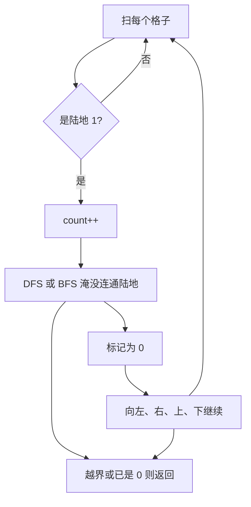

# DFS / BFS - 岛屿数量

> [LeetCode 200. 岛屿数量](https://leetcode.cn/problems/number-of-islands/)

## 题目说明

给你一个由 `'1'`（陆地）和 `'0'`（水）组成的二维网格，请计算网格中岛屿的数量。

岛屿由相邻的陆地组成，这里的「相邻」只计 **上下左右**，不含斜向。你可以假设网格四周都是水。

例如：

```
11110
11010
11000
00000
```

输出：`1`

```
11000
11000
00100
00011
```

输出：`3`

## 解题思路

扫描整个网格。每碰到一块还没访问过的陆地 `'1'`，就发现一座新岛，计数加一，然后把 **与它连通的全部陆地** 都染成 `'0'`，避免同一座岛被数多次。

染色就是图的遍历，两种写法等价：

- **DFS**：递归向四个方向走，一路把连通陆地抹掉
- **BFS**：用队列，弹出当前格，把上下左右入队，同样把连通陆地抹掉

核心都是 **淹没整座岛**。外层两重循环负责「发现新岛」，DFS / BFS 负责「把这座岛淹完」。

原地改 `grid` 当访问标记，不必再开 `visited` 数组。

### 过程

1. `count = 0`
2. 双层循环扫每个格子 `(i, j)`
3. 若是 `'0'`：跳过
4. 若是 `'1'`：
   - 用 DFS 或 BFS 把连通的 `'1'` 全部改成 `'0'`
   - `count++`
5. 返回 `count`

以第二组例子为例：

```
1 1 0 0 0
1 1 0 0 0
0 0 1 0 0
0 0 0 1 1
```

| 发现位置 | 淹没范围 | count |
|----------|----------|-------|
| (0, 0) | 左上四块 `1` | 1 |
| (2, 2) | 中间单独一块 | 2 |
| (3, 3) | 右下两块 | 3 |

其余格子都是水或已被淹没，不再加计数。



DFS 用调用栈，岛屿很大时可能栈溢出；BFS 用队列，空间更可控。网格题两种都能写。

## 复杂度

| 类型 | 复杂度 | 说明 |
|------|------|------|
| 时间复杂度 | O(m × n) | 每个格子最多访问一次 |
| 空间复杂度 | O(m × n) | DFS 最坏整图递归；BFS 队列最坏接近格子数 |

## 代码

### BFS

```java
class Solution {
    public int numIslands(char[][] grid) {
        int countLands = 0;
        for(int i = 0; i < grid.length; i++){
            char[] gridI = grid[i];
            for(int j = 0; j < gridI.length; j++){
                if(gridI[j] == '0'){
                    continue;
                }else{
                    // BFS使用队列
                    Queue<int[]> queue = new LinkedList<>();
                    queue.offer(new int[]{ i, j});
                    while(queue.size() != 0){
                          int[] array = queue.poll();
                          int a = array[0];
                          int b = array[1];
                          if(a < 0 || b < 0 || a >= grid.length || b >= grid[i].length){
                                continue;
                            }
                            if(grid[a][b] == '0'){
                                continue;
                            }
                            grid[a][b] = '0';
                            // 左
                            queue.offer(new int[]{ a, b - 1});
                            // 右
                            queue.offer(new int[]{ a, b + 1});
                            // 上
                            queue.offer(new int[]{ a - 1, b});
                            // 下
                            queue.offer(new int[]{ a + 1, b});
                    }
                    countLands++;
                }
                
            }
        }
        return countLands;
    }
}
```

### DFS

```java
class Solution {
    public int numIslands(char[][] grid) {
        int countLands = 0;
        // 从第二行开始查找
        for(int i = 0; i < grid.length; i++){
            //从第二列开始查找
            char[] gridI = grid[i];
            for(int j = 0; j < gridI.length; j++){
                if(gridI[j] == '0'){
                    continue;
                }else{
                    //继续查找标记
                    lands(grid, i, j);
                    countLands++;
                }
                
            }
        }
        return countLands;
    }
    private void lands(char[][] grid, int i, int j){
        if(i < 0 || j < 0 || i >= grid.length || j >= grid[i].length){
            return;
        }
        if(grid[i][j] == '0'){
            return;
        }
        grid[i][j] = '0';
        // 左
        lands( grid, i, j - 1);
        // 右
        lands( grid, i, j + 1);
        // 上
        lands( grid, i - 1, j);
        // 下
        lands( grid, i + 1, j);
        
    }
}
```

## 参考

- 来源：[力扣（LeetCode）](https://leetcode.cn/problems/number-of-islands/)
