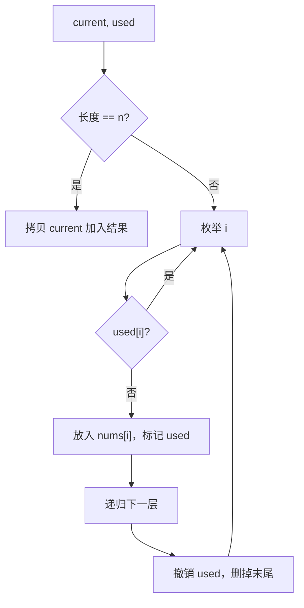

# 回溯 - 全排列

> [LeetCode 46. 全排列](https://leetcode.cn/problems/permutations/)

## 题目说明

给定一个不含重复数字的数组 `nums`，返回其所有可能的全排列。可以按任意顺序返回答案。

例如：

- `nums = [1,2,3]` → `[[1,2,3],[1,3,2],[2,1,3],[2,3,1],[3,1,2],[3,2,1]]`
- `nums = [0,1]` → `[[0,1],[1,0]]`
- `nums = [1]` → `[[1]]`

## 解题思路

用 **回溯**：一层层往当前排列里放还没用过的数，放满就记一份；退回来时把刚放的数拿掉，换下一个再试。

三个状态：

- `current`：正在拼的排列
- `used[i]`：`nums[i]` 这轮路径里用过没有
- `lists`：所有完整排列

`current.size() == nums.length` 时得到一种排列，必须 `new ArrayList<>(current)` 拷一份再放进结果，否则后面回溯会改掉同一份列表。

然后枚举每个下标：用过就跳过；没用过就放入、标记，递归下一层；返回后 **撤销标记、删掉最后一个**，让同层其他选择还能用这个数。

题目保证数字不重复，用下标 `used` 即可，不必再按值去重。

### 过程

1. 从空排列、全 `false` 的 `used` 开始
2. 排列长度等于 `n`：拷贝进结果，返回
3. 否则扫一遍 `nums`：没用过的选上，递归，再撤销
4. 所有分支走完，返回 `lists`

以 `nums = [1, 2, 3]` 为例（只展开从 `1` 开头的一支）：

| current | 本层选择 | 递归后 |
|---------|----------|--------|
| `[]` | 选 1 | `[1]` |
| `[1]` | 选 2 | `[1,2]` |
| `[1,2]` | 选 3 | `[1,2,3]` 记入结果，回溯 |
| `[1,2]` | 3 已试完 | 拿掉 2 |
| `[1]` | 选 3 | `[1,3]` → `[1,3,2]` |
| `[1]` | 2、3 都试完 | 拿掉 1，再试 2、3 开头 |



本质是一棵决策树：每层选一个没用过的数，深度为 n，叶子就是一种排列。共 `n!` 种。

## 复杂度

| 类型 | 复杂度 | 说明 |
|------|------|------|
| 时间复杂度 | O(n × n!) | n! 种排列，每种拷贝要 O(n) |
| 空间复杂度 | O(n) | 递归深度和 `used`、`current`（不含结果） |

## 代码

```java
class Solution {
    private List<List<Integer>> lists = new ArrayList<>();
    public List<List<Integer>> permute(int[] nums) {
        permute(nums, new ArrayList<>(), new boolean[nums.length]);
        return lists;
    }

    public void permute(int[] nums, List<Integer> current, boolean[] used){
        // 判断是否结束
        if(current.size() == nums.length){
            lists.add(new ArrayList<>(current));
            return;
        }
        // 循环尝试不同的组合
        for(int i = 0; i < nums.length; i++){
            // 用过的不在使用
            if(used[i]){
                continue;
            }
            // 没用过的放入当前组合
            current.add(nums[i]);
            used[i] = true;
            permute(nums, current, used);
            //完成与一组之后回溯清除标记
            used[i] = false;
            //删除掉最后一个上一层继续寻找
            current.remove(current.size() - 1);
        }

    }
}
```

## 参考

- 来源：[力扣（LeetCode）](https://leetcode.cn/problems/permutations/)
