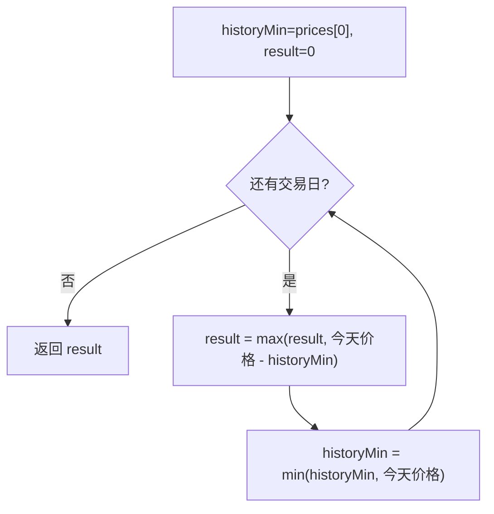

# 贪心 - 买卖股票的最佳时机

> [LeetCode 121. 买卖股票的最佳时机](https://leetcode.cn/problems/best-time-to-buy-and-sell-stock/)

## 题目说明

给定一个数组 `prices`，`prices[i]` 是第 `i` 天的股票价格。你只能选择 **某一天买入**，并在 **之后的某一天卖出**，求能获得的 **最大利润**。如果不能获利，返回 `0`。

只能完成一笔交易（买一次、卖一次）。

例如：

- `prices = [7,1,5,3,6,4]` → `5`（第 2 天买、第 5 天卖，`6 - 1 = 5`）
- `prices = [7,6,4,3,1]` → `0`（一直跌，不交易）

## 解题思路

使用 **贪心**：把每一天都当成卖出日，买入价取它之前出现过的最低价。利润就是 `当天价格 - 历史最低价`，全程取最大。

从左到右扫一遍，维护两个量：

- `historyMin`：到目前为止的最低价（最佳买入点）
- `result`：到目前为止的最大利润

先用当前的历史最低价算今天卖能赚多少，再把今天的价格纳入最低价。这样不会出现「同一天既当买入又当卖出还拿到正利润」——新低当天算出的差值是负数，`max` 会丢掉。

等价理解：`result = max(prices[i] - min(prices[0..i]))`，不需要枚举所有买卖对。

### 过程

1. 初始化：`historyMin = prices[0]`，`result = 0`
2. 从左到右遍历每一天：
   - `result = max(result, prices[i] - historyMin)`
   - `historyMin = min(historyMin, prices[i])`
3. 返回 `result`

以 `prices = [7, 1, 5, 3, 6, 4]` 为例：

| i | 价格 | 卖出利润 | result | historyMin（更新后） |
|---|------|----------|--------|----------------------|
| 0 | 7 | 7 - 7 = 0 | 0 | 7 |
| 1 | 1 | 1 - 7 = -6 | 0 | 1 |
| 2 | 5 | 5 - 1 = 4 | 4 | 1 |
| 3 | 3 | 3 - 1 = 2 | 4 | 1 |
| 4 | 6 | 6 - 1 = 5 | 5 | 1 |
| 5 | 4 | 4 - 1 = 3 | 5 | 1 |

输出：`5`



也可以看成动态规划：`dp[i]` 表示前 `i` 天的最大利润，转移就是上面这两个变量，空间压到常数。

## 复杂度

| 类型 | 复杂度 | 说明 |
|------|------|------|
| 时间复杂度 | O(n) | 遍历价格数组一次 |
| 空间复杂度 | O(1) | 仅使用常数额外变量 |

## 代码

```java
class Solution {
    public int maxProfit(int[] prices) {
        int historyMin = prices[0];
        int result = 0;
        for(int i = 0; i < prices.length; i++){
            result = Math.max(result,prices[i] - historyMin);
            historyMin = Math.min(historyMin, prices[i]);
        }
        return result;      
    }
 
}
```

## 参考

- 作者：[青驰](https://leetcode.cn/problems/best-time-to-buy-and-sell-stock/solutions/4025516/mai-mai-gu-piao-zui-jia-shi-ji-by-vigila-llop/)
- 来源：[力扣（LeetCode）](https://leetcode.cn/problems/best-time-to-buy-and-sell-stock/)
