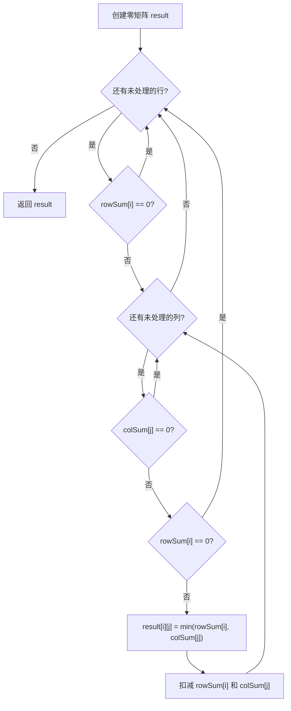

# 贪心 - 根据行列求和构造矩阵

> [LeetCode 1605. 给定行和列的和求可行矩阵](https://leetcode.cn/problems/find-valid-matrix-given-row-and-column-sums/)

## 题目说明

给定两个数组 `rowSum` 和 `colSum`，分别表示一个非负整数矩阵中每一行、每一列的元素之和。

请构造任意一个满足行列和约束的非负整数矩阵。题目保证至少存在一个可行解。

例如：

- `rowSum = [3, 8]`
- `colSum = [4, 7]`

一种可行矩阵为：

```
[[3, 0],
 [1, 7]]
```

## 解题思路

使用 **贪心填充**：按行优先遍历，对每个位置尽量填入当前剩余行和与列和的较小值，填完后扣减对应的行和、列和。

核心选择：

```
matrix[i][j] = min(rowSum[i], colSum[j])
```

这样做能保证：

- 不会超过当前行还需要的和
- 不会超过当前列还需要的和
- 某一行或某一列被填满后，剩余位置自然为 0，继续推进即可

因为题目保证有解，所以贪心填完后，所有 `rowSum`、`colSum` 都会被扣减到 0。

### 过程

1. 创建 `m x n` 的零矩阵 `result`
2. 遍历每一行 `i`：
   - 若 `rowSum[i] == 0`，整行跳过
3. 在第 `i` 行中遍历每一列 `j`：
   - 若 `colSum[j] == 0`，跳过该列
   - 若当前行和已经为 0，结束本行
   - 取 `min(rowSum[i], colSum[j])` 填入 `result[i][j]`
   - 同步扣减 `rowSum[i]` 与 `colSum[j]`
4. 返回矩阵

以 `rowSum = [3, 8]`，`colSum = [4, 7]` 为例：

| 位置 | 当前行和 / 列和 | 填入值 | 扣减后行和 | 扣减后列和 |
|------|-----------------|--------|------------|------------|
| (0,0) | 3 / 4 | 3 | 0 | 1 |
| (0,1) | 行和已为 0，结束本行 | - | 0 | 1 |
| (1,0) | 8 / 1 | 1 | 7 | 0 |
| (1,1) | 7 / 7 | 7 | 0 | 0 |

输出：

```
[[3, 0],
 [1, 7]]
```



## 复杂度

| 类型 | 复杂度 | 说明 |
|------|------|------|
| 时间复杂度 | O(m × n) | 最多遍历矩阵每个位置一次 |
| 空间复杂度 | O(m × n) | 需要返回结果矩阵；若不计返回值则为 O(1) |

## 代码

```java
class Solution {
    public int[][] restoreMatrix(int[] rowSum, int[] colSum) {
        int[][] result = new int[rowSum.length][colSum.length];
        for(int i = 0; i < result.length ;i++){
            int[] rows = result[i];
            if(rowSum[i]==0){
                continue;
            }
            for(int j = 0; j < rows.length; j++){
                if(colSum[j]==0){
                    continue;
                }
                if(rowSum[i]==0){
                    break;
                }
                result[i][j] = Math.min(rowSum[i],colSum[j]);
                rowSum[i] = rowSum[i] - result[i][j];
                colSum[j] = colSum[j] - result[i][j];
            }
        }
        return result;
    }
}
```

## 参考

- 作者：[青驰](https://leetcode.cn/problems/find-valid-matrix-given-row-and-column-sums/solutions/4018535/tan-xin-suan-fa-qiu-ke-xing-ju-zhen-by-v-mf4i/)
- 来源：[力扣（LeetCode）](https://leetcode.cn/problems/find-valid-matrix-given-row-and-column-sums/)
