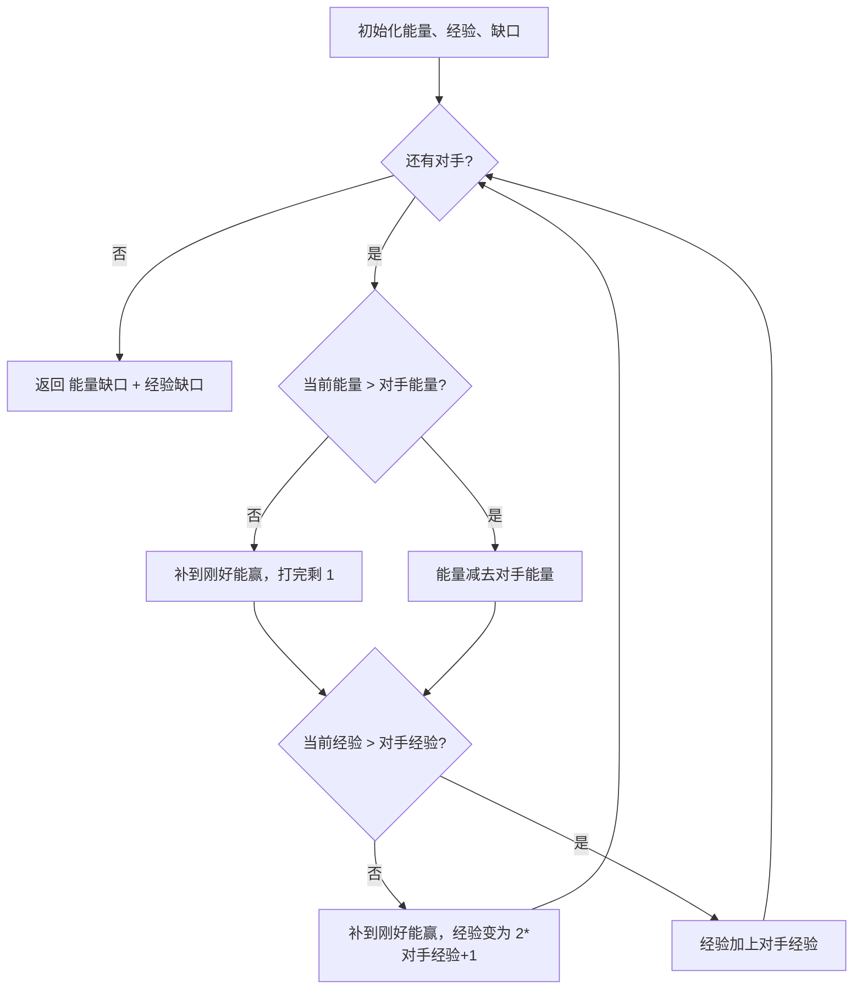

# 贪心 - 赢得比赛的最少训练时长

> [LeetCode 2383. 赢得比赛需要的最少训练时长](https://leetcode.cn/problems/minimum-hours-of-training-to-win-a-competition/)

## 题目说明

你正在参加一场比赛，初始能量为 `initialEnergy`，初始经验为 `initialExperience`。共有 `n` 名对手，第 `i` 名对手的能量和经验分别为 `energy[i]`、`experience[i]`。

击败第 `i` 名对手需要 **当前能量 > `energy[i]` 且当前经验 > `experience[i]`**。击败后：

- 能量减少 `energy[i]`
- 经验增加 `experience[i]`

比赛开始前可以训练：每训练 1 小时，能量或经验加 1。对手必须按顺序击败。求赢得全部比赛所需的 **最少训练小时数**。

## 解题思路

使用 **贪心模拟**：按顺序迎战每一名对手，能量或经验不够时，立刻补到刚好能赢的最小值，再继续战斗。

- **能量**：打完会减少，不够时补 `energy[i] - totalEnergy + 1`，打完后剩余能量为 `1`
- **经验**：打完会增加，不够时补 `experience[i] - totalExperience + 1`。补完后当前经验为 `experience[i] + 1`，再加上对手经验，变为 `experience[i] * 2 + 1`

能量训练和经验训练互不影响，最终答案是两者缺口之和。

### 过程

1. 初始化：`totalEnergy`、`totalExperience` 为初始值，`diffEnergy`、`diffExperience` 为累计训练小时
2. 遍历每一名对手：
   - 能量不够：累计补差，打完后能量置为 `1`
   - 能量够：直接减去对手能量
   - 经验不够：累计补差，打完后经验变为 `experience[i] * 2 + 1`
   - 经验够：直接加上对手经验
3. 返回 `diffEnergy + diffExperience`

以 `initialEnergy = 5`，`initialExperience = 3`，`energy = [1,4,3,2]`，`experience = [2,6,3,1]` 为例：

| 对手 | 当前能量 / 经验 | 能量操作 | 经验操作 | 累计训练 |
|------|-----------------|----------|----------|----------|
| 0 | 5 / 3 | 5 > 1，剩余 4 | 3 > 2，经验变 5 | 0 |
| 1 | 4 / 5 | 4 ≤ 4，补 1，剩余 1 | 5 ≤ 6，补 2，经验变 13 | 3 |
| 2 | 1 / 13 | 1 ≤ 3，补 3，剩余 1 | 13 > 3，经验变 16 | 6 |
| 3 | 1 / 16 | 1 ≤ 2，补 2，剩余 1 | 16 > 1，经验变 17 | 8 |

输出：`8`



## 复杂度

| 类型 | 复杂度 | 说明 |
|------|------|------|
| 时间复杂度 | O(n) | 遍历全部对手一次 |
| 空间复杂度 | O(1) | 仅使用常数额外变量 |

## 代码

```java
class Solution {
    public int minNumberOfHours(int initialEnergy, int initialExperience, int[] energy, int[] experience) {
        int totalEnergy = initialEnergy;
        int diffEnergy = 0;
        int totalExperience = initialExperience;
        int diffExperience = 0;
        for (int i = 0; i < energy.length; i++) {
            if (totalEnergy <= energy[i]) {
                diffEnergy = energy[i] - totalEnergy + 1 + diffEnergy;
                totalEnergy = 1;
            } else {
                totalEnergy = totalEnergy - energy[i];
            }
            if (totalExperience <= experience[i]) {
                diffExperience = experience[i] - totalExperience + 1 + diffExperience;
                totalExperience = experience[i] * 2 + 1;
            } else {
                totalExperience = totalExperience + experience[i];
            }
        }
        return diffEnergy + diffExperience;
    }
}
```

## 参考

- 作者：[青驰](https://leetcode.cn/problems/minimum-hours-of-training-to-win-a-competition/solutions/4010389/jian-dan-de-tan-xin-suan-fa-mo-ni-by-vig-roy7/)
- 来源：[力扣（LeetCode）](https://leetcode.cn/problems/minimum-hours-of-training-to-win-a-competition/)
