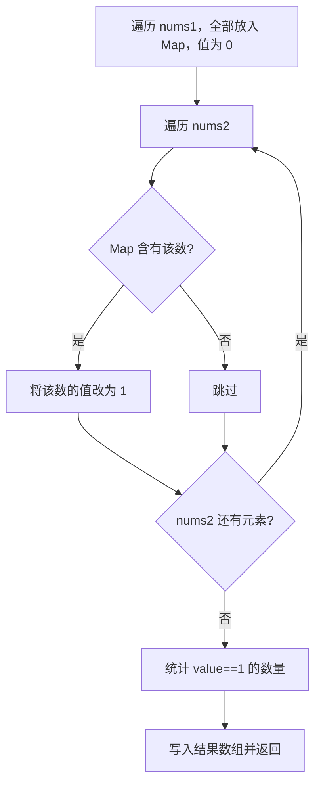

# 哈希表 - 两个数组的交集

> [LeetCode 349. 两个数组的交集](https://leetcode.cn/problems/intersection-of-two-arrays/)

## 题目说明

给定两个数组 `nums1` 和 `nums2`，返回它们的交集。

输出结果中的每个元素一定是 **唯一** 的，可以不考虑顺序。

例如：

- `nums1 = [1,2,2,1]`，`nums2 = [2,2]` → `[2]`
- `nums1 = [4,9,5]`，`nums2 = [9,4,9,8,4]` → `[9,4]`（或 `[4,9]`）

## 解题思路

用 **HashMap** 标记哪些数同时出现在两个数组中：

1. 先遍历 `nums1`，把每个数放入 Map，值初始化为 `0`（表示只在 nums1 中出现过）
2. 再遍历 `nums2`：若该数已在 Map 中，把值改为 `1`（表示两个数组都有）
3. 统计值为 `1` 的 key 个数，据此创建结果数组
4. 再遍历 Map，把值为 `1` 的 key 写入结果

这样天然去重：同一个数只占一个 key，不会重复输出。

### 过程

1. 遍历 `nums1`：`map.put(nums1[i], 0)`
2. 遍历 `nums2`：若 `map.containsKey(nums2[i])`，则 `map.put(nums2[i], 1)`
3. 统计 `value == 1` 的数量 `size`
4. 若 `size == 0`，返回空数组
5. 创建 `result[size]`，再次遍历 Map，把 `value == 1` 的 key 填入结果并返回

以 `nums1 = [1,2,2,1]`，`nums2 = [2,2]` 为例：

| 步骤 | 操作 | Map 状态 |
|------|------|----------|
| 遍历 nums1 | 放入 1、2 | `{1:0, 2:0}` |
| 遍历 nums2 | 2 已存在，改为 1 | `{1:0, 2:1}` |
| 收集结果 | value==1 的是 2 | `[2]` |



## 复杂度

| 类型 | 复杂度 | 说明 |
|------|------|------|
| 时间复杂度 | O(m + n) | m、n 分别为两个数组长度 |
| 空间复杂度 | O(m) | Map 最多存放 nums1 中的不重复元素 |

## 代码

```java
class Solution {
    public int[] intersection(int[] nums1, int[] nums2) {
        Map<Integer,Integer> map = new HashMap();
        for(int i = 0; i < nums1.length; i ++){
            map.put(nums1[i],0);
        }
        for(int i = 0; i < nums2.length; i ++){
            if(map.containsKey(nums2[i])){
                map.put(nums2[i],1);
            }
        }
        int size = 0;
        for(Integer key : map.keySet()){
            if(map.get(key)==1){
                size++;
            }
        }
        if(size == 0){
            return new int[0];
        }
        int[] result = new int[size];
        int index = 0;
        for(Integer key:map.keySet()){
           if(map.get(key)==1){
                result[index]=key;
                index++;
            }
        }
        return result;
    }
}
```

## 参考

- 作者：[青驰](https://leetcode.cn/problems/intersection-of-two-arrays/solutions/4018988/hashliang-ge-shu-zu-de-jiao-ji-by-vigila-g6o6/)
- 来源：[力扣（LeetCode）](https://leetcode.cn/problems/intersection-of-two-arrays/)
