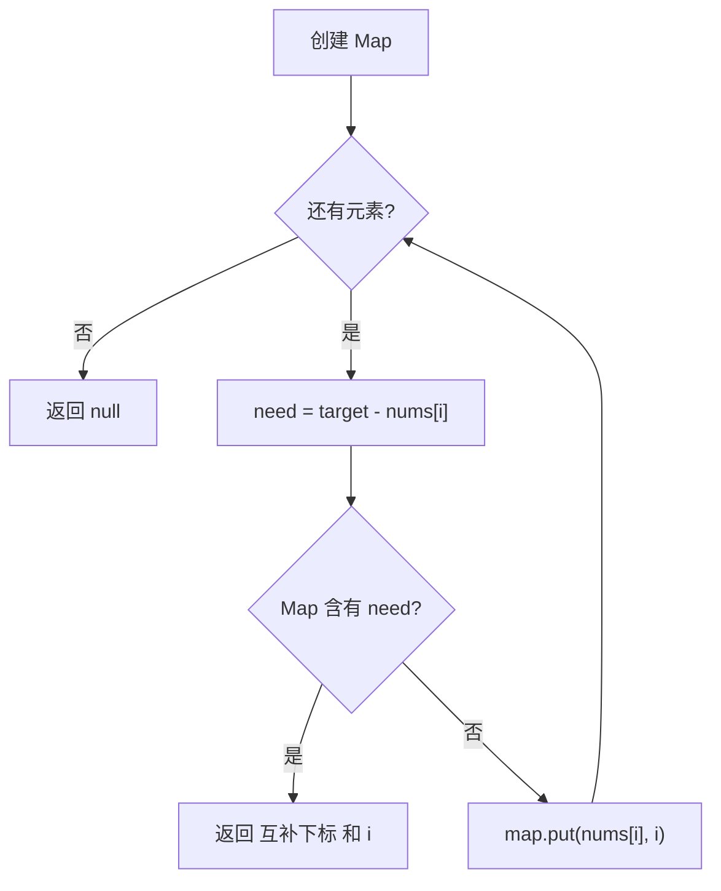

# 哈希表 - 两数之和

> [LeetCode 1. 两数之和](https://leetcode.cn/problems/two-sum/)

## 题目说明

给定一个整数数组 `nums` 和一个整数目标值 `target`，请你在该数组中找出 **和为目标值** `target` 的那 **两个** 整数，并返回它们的数组下标。

你可以假设每种输入只会对应一个答案，并且同一个元素不能使用两次。可以按任意顺序返回答案。

例如：

- `nums = [2,7,11,15]`，`target = 9` → `[0,1]`（因为 `nums[0] + nums[1] = 2 + 7 = 9`）
- `nums = [3,2,4]`，`target = 6` → `[1,2]`
- `nums = [3,3]`，`target = 6` → `[0,1]`

## 解题思路

### 方法一：双重循环

枚举所有下标对 `(i, j)`，其中 `j > i`，检查 `nums[i] + nums[j]` 是否等于 `target`。能保证不使用同一个元素两次，思路直观，但时间是 O(n²)。

### 方法二：哈希表（推荐）

把「再找一个数」变成 **O(1) 查找**：遍历到 `nums[i]` 时，需要的互补数是 `need = target - nums[i]`。若 `need` 已经在 Map 里出现过，直接返回对应下标；否则把当前值和下标放入 Map，供后面的元素使用。

Map 存的是 **值 → 下标**。先查再放，这样不会把当前元素自己当成互补数。

### 过程（哈希表）

1. 创建 `Map<Integer, Integer>`，key 为数组中的值，value 为下标
2. 从左到右遍历：
   - 计算 `need = target - nums[i]`
   - 若 Map 中已有 `need`，返回 `[map.get(need), i]`
   - 否则 `map.put(nums[i], i)`
3. 题目保证有解；若没有则返回 `null`

以 `nums = [2, 7, 11, 15]`，`target = 9` 为例：

| i | nums[i] | need | Map 中是否有 need | 操作 | Map 状态 |
|---|---------|------|-------------------|------|----------|
| 0 | 2 | 7 | 否 | 放入 2→0 | `{2:0}` |
| 1 | 7 | 2 | 是 | 返回 `[0, 1]` | `{2:0}` |



再看 `nums = [3, 2, 4]`，`target = 6`：若先放再查，遍历到 `3` 时会误把自身当成互补。先查再放则：

| i | nums[i] | need | Map 中是否有 need | 操作 |
|---|---------|------|-------------------|------|
| 0 | 3 | 3 | 否 | 放入 3→0 |
| 1 | 2 | 4 | 否 | 放入 2→1 |
| 2 | 4 | 2 | 是 | 返回 `[1, 2]` |

## 复杂度

| 方法 | 时间复杂度 | 空间复杂度 | 说明 |
|------|------------|------------|------|
| 双重循环 | O(n²) | O(1) | 枚举所有数对 |
| 哈希表 | O(n) | O(n) | 一遍遍历，Map 最多存 n 个元素 |

## 代码

### 双重循环

```java
class Solution {
    public int[] twoSum(int[] nums, int target) {
        for(int i = 0; i < nums.length; i++){
            int numI = nums[i];
            for(int j = i+1; j < nums.length; j++){
                if(numI + nums[j] == target){
                    int[] indexs = new int[2];
                    indexs[0] = i;
                    indexs[1] = j;
                    return indexs;
                }
            }
        }
        return null;
    }
}
```

### 哈希表

```java
class Solution {
    public int[] twoSum(int[] nums, int target) {
        Map<Integer,Integer> map = new HashMap();
        for(int i = 0; i < nums.length; i++){
            int need = target-nums[i];
            if(map.containsKey(need)){
                int[] result = new int[2];
                result[0] = map.get(need);
                result[1] = i;
                return result;
            }
            map.put(nums[i],i);
           
        }
        return null;
    }
}
```

## 参考

- 作者：[青驰](https://leetcode.cn/problems/two-sum/solutions/4020757/shuang-zhong-xun-huan-liang-shu-zhi-he-b-2yof/)
- 来源：[力扣（LeetCode）](https://leetcode.cn/problems/two-sum/)
