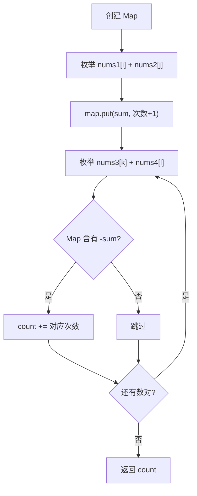

# 哈希表 - 四数相加 II

> [LeetCode 454. 四数相加 II](https://leetcode.cn/problems/4sum-ii/)

## 题目说明

给你四个整数数组 `nums1`、`nums2`、`nums3` 和 `nums4`，数组长度都是 `n`。请计算有多少个元组 `(i, j, k, l)` 能满足：

- `0 <= i, j, k, l < n`
- `nums1[i] + nums2[j] + nums3[k] + nums4[l] == 0`

与 [四数之和](../array/双指针-四数之和) 不同：这里是 **四个独立数组**，统计的是元组 **个数**，不需要去重，也不需要返回具体组合。

## 解题思路

四重循环是 O(n⁴)，不可接受。把四个数组 **两两分组**：先把 `nums1[i] + nums2[j]` 的所有和出现次数记进哈希表，再枚举 `nums3[k] + nums4[l]`，在表里查找互补值 `-(nums3[k] + nums4[l])`。

这样「再找两个数」变成 O(1) 查找，总时间降到 O(n²)。本质仍是 [两数之和](./哈希表-两数之和)：一组存和，另一组找相反数。

Map 存的是 **两数之和 → 出现次数**。同一和可能由多组 `(i, j)` 得到，查找时要把次数累加进答案。

### 过程

1. 创建 `Map<Integer, Integer>`，key 为两数之和，value 为该和出现的次数
2. 枚举 `nums1[i] + nums2[j]`，把和的次数写入 Map
3. 枚举 `nums3[k] + nums4[l]`：
   - 计算 `sum = nums3[k] + nums4[l]`
   - 若 Map 中存在 `-sum`，把对应次数加到 `count`
4. 返回 `count`

以 `nums1 = [1, 2]`，`nums2 = [-2, -1]`，`nums3 = [-1, 2]`，`nums4 = [0, 2]` 为例。

先统计 `nums1 + nums2`：

| i | j | sum | Map 状态 |
|---|---|-----|----------|
| 0 | 0 | 1 + (-2) = -1 | `{-1:1}` |
| 0 | 1 | 1 + (-1) = 0 | `{-1:1, 0:1}` |
| 1 | 0 | 2 + (-2) = 0 | `{-1:1, 0:2}` |
| 1 | 1 | 2 + (-1) = 1 | `{-1:1, 0:2, 1:1}` |

再枚举 `nums3 + nums4`，查找 `-sum`：

| k | l | sum | 查找 -sum | 命中次数 | count |
|---|---|-----|-----------|----------|-------|
| 0 | 0 | -1 + 0 = -1 | 1 | 1 | 1 |
| 0 | 1 | -1 + 2 = 1 | -1 | 1 | 2 |
| 1 | 0 | 2 + 0 = 2 | -2 | 0 | 2 |
| 1 | 1 | 2 + 2 = 4 | -4 | 0 | 2 |

对应两个元组：`(1, 1, 0, 0)` → `2 + (-1) + (-1) + 0 = 0`，`(0, 0, 0, 1)` → `1 + (-2) + (-1) + 2 = 0`。



任意两两分组都可以，把较短的两组合并进 Map 能略省空间，但本题四个数组长度相同，差别不大。

## 复杂度

| 类型 | 复杂度 | 说明 |
|------|------|------|
| 时间复杂度 | O(n²) | 两组各枚举 n² 个数对，哈希查找平均 O(1) |
| 空间复杂度 | O(n²) | Map 最多存放 n² 种两数之和 |

## 代码

```java
class Solution {
    public int fourSumCount(int[] nums1, int[] nums2, int[] nums3, int[] nums4) {
        int count = 0;
        Map<Integer, Integer> map = new HashMap<>();
        for (int i = 0; i < nums1.length; i++) {
            for (int j = 0; j < nums2.length; j++) {
                int sum = nums1[i] + nums2[j];
                map.put(sum, map.getOrDefault(sum, 0) + 1);
            }
        }
        for (int i = 0; i < nums3.length; i++) {
            for (int j = 0; j < nums4.length; j++) {
                int sum = nums3[i] + nums4[j];
                if (map.containsKey(-sum)) {
                    count += map.get(-sum);
                }
            }
        }
        return count;
    }
}
```

## 参考

- 作者：[青驰](https://leetcode.cn/problems/4sum-ii/solutions/4021383/hashliang-liang-fen-zu-si-shu-qiu-he-by-9b98p/)
- 来源：[力扣（LeetCode）](https://leetcode.cn/problems/4sum-ii/)
