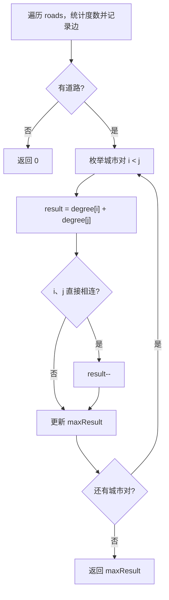

# 哈希表 - 最大网络秩

> [LeetCode 1615. 最大网络秩](https://leetcode.cn/problems/maximal-network-rank/)

## 题目说明

`n` 座城市和一些连接这些城市的道路 `roads` 共同组成一个基础设施网络。每个 `roads[i] = [ai, bi]` 表示城市 `ai` 和 `bi` 之间有一条双向道路。

两座不同城市构成的 **城市对** 的 **网络秩** 定义为：与这两座城市 **直接** 相连的道路总数。如果存在一条道路直接连接这两座城市，则这条道路只计算 **一次**。

整个基础设施网络的 **最大网络秩** 是所有不同城市对中的 **最大网络秩**。

给你整数 `n` 和数组 `roads`，返回整个基础设施网络的 **最大网络秩**。

例如：

- `n = 4`，`roads = [[0,1],[0,3],[1,2],[1,3]]` → `4`（城市 0 和 1 相连的道路共 4 条，中间那条只算一次）
- `n = 5`，`roads = [[0,1],[0,3],[1,2],[1,3],[2,3],[2,4]]` → `5`
- `n = 8`，`roads = [[0,1],[1,2],[2,3],[2,4],[5,6],[5,7]]` → `5`（城市不必全部连通）

## 解题思路

城市对 `(i, j)` 的网络秩几乎等于两座城市的度数之和：

```
rank(i, j) = degree[i] + degree[j]
```

若 `i` 和 `j` **直接相连**，这条边在两边的度数里各被算了一次，需要再减 1：

```
若 i、j 之间有边：rank(i, j) = degree[i] + degree[j] - 1
```

因此分两步：

1. **统计度数**：遍历每条路，两端城市度数各加 1
2. **记录边**：把无向边存进 HashSet，方便 O(1) 判断两座城市是否直接相连。存的时候用 `min + "" + max` 作为唯一键，避免 `[a,b]` 和 `[b,a]` 被当成两条边

然后枚举所有城市对，按上面的公式取最大值。`n ≤ 100`，枚举 O(n²) 可以接受。

### 过程

1. 创建 `count[n+1]` 记录每个城市的度数，创建 `Set` 存放边
2. 遍历 `roads`：
   - 两端城市度数加 1
   - 将 `min(a,b) + "" + max(a,b)` 放入 Set
3. 若没有道路，返回 `0`
4. 枚举所有 `i < j`：
   - `result = count[i] + count[j]`
   - 若 Set 中存在这对城市的边，`result--`
   - 更新全局最大值
5. 返回最大值

以 `n = 4`，`roads = [[0,1],[0,3],[1,2],[1,3]]` 为例：

度数：`0:2`，`1:3`，`2:1`，`3:2`

边集合：`{01, 03, 12, 13}`

| 城市对 | 度数之和 | 是否直接相连 | 网络秩 |
|--------|----------|--------------|--------|
| (0, 1) | 2 + 3 = 5 | 是 | 4 |
| (0, 2) | 2 + 1 = 3 | 否 | 3 |
| (0, 3) | 2 + 2 = 4 | 是 | 3 |
| (1, 2) | 3 + 1 = 4 | 是 | 3 |
| (1, 3) | 3 + 2 = 5 | 是 | 4 |
| (2, 3) | 1 + 2 = 3 | 否 | 3 |

最大网络秩为 `4`。



## 复杂度

| 类型 | 复杂度 | 说明 |
|------|------|------|
| 时间复杂度 | O(n²) | 统计度数 O(m)，枚举城市对 O(n²)；n ≤ 100 |
| 空间复杂度 | O(n + m) | 度数数组 O(n)，边集合 O(m) |

## 代码

```java
class Solution {
    public int maximalNetworkRank(int n, int[][] roads) {
        int[] count = new int[n+1];
        Set<String> set = new HashSet<>();
        for(int i = 0; i < roads.length; i++){
            int[] road = roads[i];
            for (int j = 0; j < road.length; j++){
                count[road[j]] = count[road[j]] +1;
            }
            int min = Math.min(road[0],road[1]);
            int max = Math.max(road[0],road[1]);
            set.add(min + "" + max);
        }
        if(set.isEmpty()){
            return 0;
        }
        Integer maxResult = 0;
        for(int i = 0; i < count.length; i++ ){
            for(int j = i+1; j < count.length; j++ ){
                int result = count[i] + count[j];
                int min = Math.min(i,j);
                int max = Math.max(i,j);
                if(set.contains(min + "" + max)){
                    result --;
                }
                maxResult = Math.max(maxResult,result);
            }               
        }
        
        return maxResult;
    }
}
```

## 参考

- 作者：[青驰](https://leetcode.cn/problems/maximal-network-rank/solutions/4020926/hashchu-li-zui-da-wang-luo-zhi-by-vigila-35it/)
- 来源：[力扣（LeetCode）](https://leetcode.cn/problems/maximal-network-rank/)
