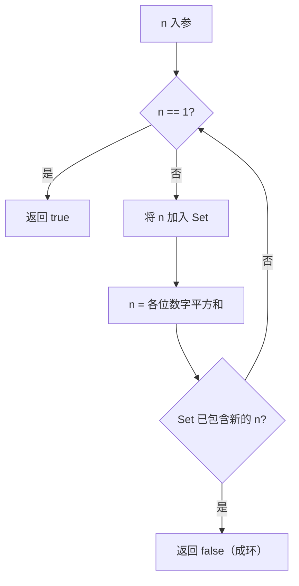

# 哈希集合 - 快乐数

> [LeetCode 202. 快乐数](https://leetcode.cn/problems/happy-number/)

## 题目说明

编写一个算法，判断一个数 `n` 是不是快乐数。

快乐数的定义：

1. 从任意正整数开始，将它替换为各个位上数字的平方和
2. 重复这个过程
3. 最终等于 `1`，则为快乐数
4. 若陷入循环且永远到不了 `1`，则不是快乐数

例如：

- `n = 19` → `true`（`1²+9²=82` → `8²+2²=68` → `6²+8²=100` → `1²+0²+0²=1`）
- `n = 2` → `false`（会进入循环）

## 解题思路

不断做「各位数字平方和」时，只有两种结局：

- 到达 `1` → 快乐数
- 某个中间结果重复出现 → 进入环，不是快乐数

用 **HashSet** 记录已经出现过的数：

- 每次算出新的平方和之前，先把当前 `n` 放入集合
- 若新算出的值已经在集合中，说明成环，返回 `false`
- 若最终变为 `1`，返回 `true`

### 过程

1. 创建 `Set` 存放出现过的数
2. 当 `n != 1` 时循环：
   - 将当前 `n` 加入集合
   - 计算各位数字平方和，得到新的 `n`
   - 若新的 `n` 已在集合中，返回 `false`
3. 循环结束说明 `n == 1`，返回 `true`

以 `n = 19` 为例：

| 当前 n | 平方和计算 | 下一步 | 集合中是否已有 |
|--------|------------|--------|----------------|
| 19 | 1²+9²=82 | 82 | 否 |
| 82 | 8²+2²=68 | 68 | 否 |
| 68 | 6²+8²=100 | 100 | 否 |
| 100 | 1²+0²+0²=1 | 1 | 否 |

到达 1，返回 `true`。



## 复杂度

| 类型 | 复杂度 | 说明 |
|------|------|------|
| 时间复杂度 | O(log n) | 每次平方和位数减少，环检测的中间状态有限 |
| 空间复杂度 | O(log n) | HashSet 存放出现过的中间结果 |

## 代码

```java
class Solution {
    public boolean isHappy(int n) {
        Set<Integer> set = new HashSet<Integer>();
        while(n!=1){
            set.add(n);
            n = sum(n);
            if(set.contains(n)){
                return false;
            }
        }
        return true;
    }
    private int sum(int n){
        int sum = 0;
        while(n>0){
            int num = n%10;
            sum += num*num;
            n = n/10;
        }
        return sum;
    }
}
```

## 参考

- 作者：[青驰](https://leetcode.cn/problems/happy-number/solutions/4019047/hashkuai-le-shu-by-vigilant-parekep-kwfw/)
- 来源：[力扣（LeetCode）](https://leetcode.cn/problems/happy-number/)
