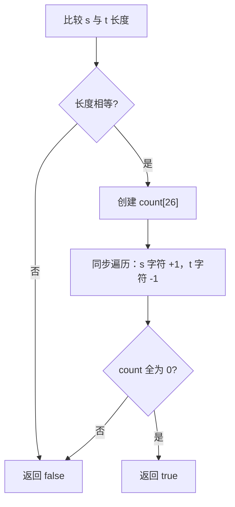

# 数组计数 - 有效的字母异位词

> [LeetCode 242. 有效的字母异位词](https://leetcode.cn/problems/valid-anagram/)

## 题目说明

给定两个字符串 `s` 和 `t`，编写一个函数判断 `t` 是否是 `s` 的字母异位词。

字母异位词：两个字符串包含的字符种类相同，且每种字符出现的次数也相同，只是顺序可能不同。

例如：

- `s = "anagram"`，`t = "nagaram"` → `true`
- `s = "rat"`，`t = "car"` → `false`

## 解题思路

使用长度为 26 的数组做 **字符计数**：因为题目通常约定只包含小写字母，可用 `char - 'a'` 作为下标。

核心做法：

1. 先判断长度是否相等，不等则一定不是异位词
2. 遍历两个字符串：
   - 对 `s` 中的字符：`count[c - 'a']++`
   - 对 `t` 中的字符：`count[c - 'a']--`
3. 最后检查 `count` 是否全为 0：
   - 全为 0：每种字符出现次数刚好抵消，是异位词
   - 存在非 0：某个字符多了或少了，不是异位词

一次遍历同时加减，比分别统计两个数组再比较更简洁。

### 过程

1. 若 `s.length() != t.length()`，直接返回 `false`
2. 创建 `int[26]` 计数数组 `count`
3. 同步遍历 `s` 和 `t`：`s` 对应位置 `+1`，`t` 对应位置 `-1`
4. 再遍历 `count`，若存在非 0 元素则返回 `false`
5. 全部为 0，返回 `true`

以 `s = "anagram"`，`t = "nagaram"` 为例（只列出变化过的字母）：

| 步骤 | 操作 | a | g | m | n | r |
|------|------|---|---|---|---|---|
| 初始 | - | 0 | 0 | 0 | 0 | 0 |
| 处理完 | s 加 / t 减 | 0 | 0 | 0 | 0 | 0 |

最终全为 0，返回 `true`。

再以 `s = "rat"`，`t = "car"` 为例：

| 字符 | s 贡献 | t 贡献 | 最终 count |
|------|--------|--------|------------|
| a | +1 | -1 | 0 |
| c | 0 | -1 | -1 |
| r | +1 | -1 | 0 |
| t | +1 | 0 | 1 |

存在非 0，返回 `false`。



## 复杂度

| 类型 | 复杂度 | 说明 |
|------|------|------|
| 时间复杂度 | O(n) | n 为字符串长度，遍历一次字符，再扫一遍 26 个计数位 |
| 空间复杂度 | O(1) | 固定长度 26 的数组，与输入规模无关 |

## 代码

```java
class Solution {
    public boolean isAnagram(String s, String t) {
        if(s.length()!=t.length()){
            return false;
        }
        int[] count = new int[26];
        for(int i = 0; i<s.length(); i ++){
            count[s.charAt(i)-'a']++;
            count[t.charAt(i)-'a']--;
        }
        for(int num:count){
            if(num!=0){
                return false;
            }
        }
        return true;
    }
}
```

## 参考

- 作者：[青驰](https://leetcode.cn/problems/valid-anagram/solutions/4018953/shi-yong-shu-zu-chu-li-you-xiao-zi-mu-yi-3x5n/)
- 来源：[力扣（LeetCode）](https://leetcode.cn/problems/valid-anagram/)
