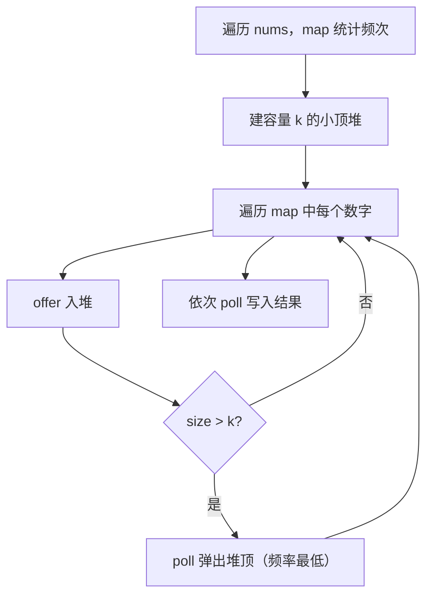

# 小顶堆 - 前 K 个高频元素

> [LeetCode 347. 前 K 个高频元素](https://leetcode.cn/problems/top-k-frequent-elements/)

## 题目说明

给你一个整数数组 `nums` 和一个整数 `k`，请你返回其中出现频率前 `k` 高的元素。可以按任意顺序返回答案。

## 解题思路

先用 **HashMap** 统计每个数的出现次数，再用容量为 `k` 的 **小顶堆** 筛出频率最高的 k 个：

- Map：`数字 → 出现次数`，一遍扫描完成计数
- 小顶堆按频率排序，堆顶永远是当前堆中频率最小的数
- 堆大小超过 `k` 时弹出堆顶：被弹出的一定是目前见过的数里频率最低的，留下的就是前 k 高

用小顶堆而不是大顶堆：不必把全部数字入堆后再取前 k，全程只维护 k 个元素，插入代价是 O(log k) 而不是 O(log n)。

### 过程

1. 遍历 `nums`，用 `map` 记录每个数字的频次
2. 用 `PriorityQueue` 建小顶堆，比较器为 `map.get(a) - map.get(b)`（频率小的在堆顶）
3. 遍历 `map` 的每个数字：
   - 入堆
   - 若堆大小超过 `k`，弹出堆顶
4. 依次弹出堆中剩余元素，写入结果数组

以 `nums = [1, 1, 1, 2, 2, 3]`，`k = 2` 为例，频次为 `{1: 3, 2: 2, 3: 1}`：

| 轮次 | 入堆数字 | 频次 | 堆内容（顶 → 底） | 操作 |
|------|----------|------|-------------------|------|
| 1 | 1 | 3 | `[1]` | 入堆 |
| 2 | 2 | 2 | `[2, 1]` | 入堆 |
| 3 | 3 | 1 | `[3, 2, 1]` | 入堆后 size > 2，弹出 3 |
| — | — | — | `[2, 1]` | 剩余即为前 2 高频 |

输出：`[2, 1]`（顺序任意）



堆里存的是数字本身，比较时通过 `map.get` 取频次。因此比较器依赖外部 map，不能在统计完成前建堆。

## 复杂度

| 类型 | 复杂度 | 说明 |
|------|------|------|
| 时间复杂度 | O(n log k) | 统计频次 O(n)；最多 n 次入堆，每次 O(log k) |
| 空间复杂度 | O(n) | map 最多存 n 个不同数字，堆最多存 k 个 |

## 代码

```java
class Solution {
    public int[] topKFrequent(int[] nums, int k) {
        // 记录频次
        Map<Integer,Integer> map = new HashMap();
        for(int i = 0; i<nums.length; i++){
            map.put(nums[i],map.getOrDefault(nums[i],0)+1);
        }
        // 使用PriorityQueue实现小堆顶
        PriorityQueue<Integer> queueHeap = new PriorityQueue<>(
            (a,b)->map.get(a)-map.get(b)
        );
        for(Integer num : map.keySet()){
            queueHeap.offer(num);
            if(queueHeap.size()>k){
                queueHeap.poll();
            }
        }
        int[] result = new int[k];
        for(int i = 0; i < k; i++){
            result[i] = queueHeap.poll();
        }
        return result;
    }
}
```

## 参考

- 作者：[青驰](https://leetcode.cn/problems/top-k-frequent-elements/solutions/4016832/xiao-dui-ding-topk-by-vigilant-parekep-pxpd/)
- 来源：[力扣（LeetCode）](https://leetcode.cn/problems/top-k-frequent-elements/)
