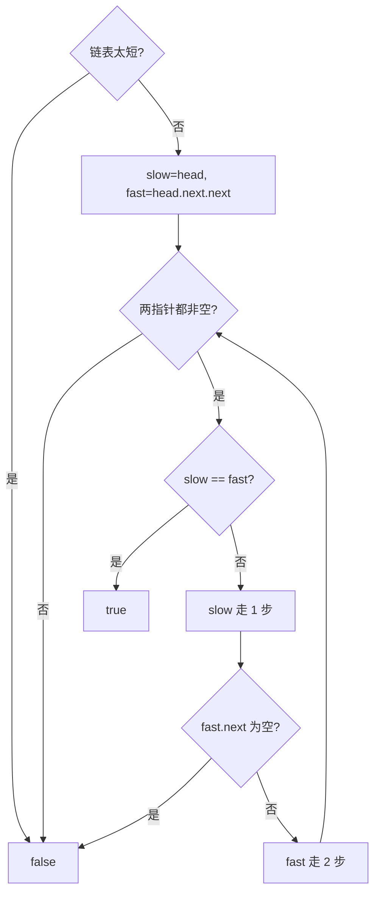

# 快慢指针 - 环形链表

> [LeetCode 141. 环形链表](https://leetcode.cn/problems/linked-list-cycle/)

## 题目说明

给你一个链表的头节点 `head`，判断链表中是否有环。

如果链表中有某个节点，可以通过连续跟踪 `next` 指针再次到达，则链表中存在环。评测系统内部用整数 `pos` 表示链表尾连接到的位置（索引从 `0` 开始）；`pos` 为 `-1` 表示无环。**`pos` 不作为参数传入**，只用来描述真实结构。

如果链表中存在环，返回 `true`；否则返回 `false`。

例如：

- `head = [3,2,0,-4]`, `pos = 1` → `true`（尾节点连回第二个节点）
- `head = [1,2]`, `pos = 0` → `true`
- `head = [1]`, `pos = -1` → `false`

## 解题思路

用 **快慢指针（Floyd 判圈）**：慢指针一次走 1 步，快指针一次走 2 步。

- 有环：快指针会在环里套圈，最终追上慢指针，`slow == fast`
- 无环：快指针会先走到 `null`

链表太短（空、只有一个节点且无后继、或走两步就空）可以直接判无环。下面写法里快指针一开始就放在 `head.next.next`，相当于先迈出两步。

本题只问「有没有环」。若还要找入环的第一个节点，见 [环形链表 II](./快慢指针-环形链表II)。

### 过程

1. `head` 为空，或 `head.next`、`head.next.next` 为空：返回 `false`
2. `slow = head`，`fast = head.next.next`
3. 当两指针都非空：
   - `slow == fast`：有环，返回 `true`
   - 否则 `slow` 走 1 步；若 `fast.next` 为空则无环；否则 `fast` 走 2 步
4. 循环结束仍未相遇：返回 `false`

以 `3 → 2 → 0 → -4`，尾节点连回 `2` 为例：

| 轮次 | slow | fast | 比较 |
|------|------|------|------|
| 初始 | 3 | 0（已先走两步） | 不等 |
| 1 | 2 | -4 | 不等 |
| 2 | 0 | 0 | 相遇，有环 |



## 复杂度

| 类型 | 复杂度 | 说明 |
|------|------|------|
| 时间复杂度 | O(n) | 无环时快指针走到末尾；有环时在环内相遇 |
| 空间复杂度 | O(1) | 仅使用两个指针 |

## 代码

```java
/**
 * Definition for singly-linked list.
 * class ListNode {
 *     int val;
 *     ListNode next;
 *     ListNode(int x) {
 *         val = x;
 *         next = null;
 *     }
 * }
 */
public class Solution {
    public boolean hasCycle(ListNode head) {
        // 链表较短没有环状则直接返回false
        if(head == null || head.next == null || head.next.next == null){
            return false;
        }
        //快慢指针，快指针一次走两步，慢指针一次走1步
        ListNode slow = head;
        ListNode fast = head.next.next;
        while(slow != null && fast != null){
            // 如果中间相等，则说明是环状结构
            if(slow == fast){
                return true;
            }else{
                slow = slow.next;
                if(fast.next == null){
                    return false;
                }
                fast = fast.next.next;
            }
        }
        return false;
    }
}
```

## 参考

- 作者：[青驰](https://leetcode.cn/problems/linked-list-cycle/solutions/4027001/kuai-man-zhi-zhen-pan-duan-shi-fou-huan-kxl5s/)
- 来源：[力扣（LeetCode）](https://leetcode.cn/problems/linked-list-cycle/)
