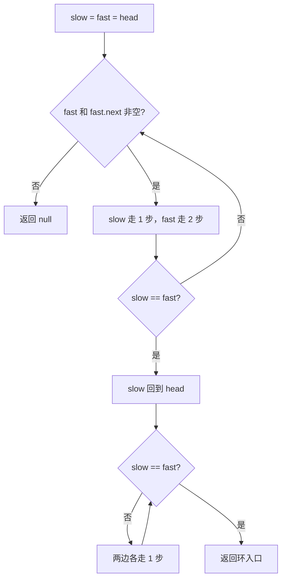
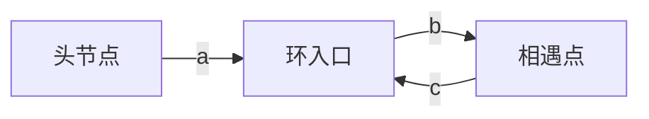

# 快慢指针 - 环形链表 II

> [LeetCode 142. 环形链表 II](https://leetcode.cn/problems/linked-list-cycle-ii/)

## 题目说明

给定一个链表的头节点 `head`，返回链表开始入环的第一个节点。如果链表无环，则返回 `null`。

如果链表中有某个节点，可以通过连续跟踪 `next` 指针再次到达，则链表中存在环。为了表示给定链表中的环，评测系统内部使用整数 `pos` 来表示链表尾连接到链表中的位置（索引从 `0` 开始）。如果 `pos` 是 `-1`，则在该链表中没有环。**注意：`pos` 不作为参数进行传递**，仅仅是为了标识链表的实际情况。

不允许修改链表。

## 解题思路

核心就一句话：**先用快慢指针判断有没有环，再利用数学关系找到环的入口。**

### 第一阶段：判断有没有环

设置两个指针：

- `slow`：一次走一步
- `fast`：一次走两步

如果存在环，`slow == fast` 一定会相遇；如果不存在环，`fast == null || fast.next == null`，说明没有环。

### 第二阶段：为什么相遇后能找到入口？

假设路径如下：

```
头节点 ---- a ----> 环入口 ---- b ----> 相遇点 ---- c ----> 环入口
                         ↑________________________|
```

定义：

- `a`：头节点到环入口的距离
- `b`：环入口到相遇点的距离
- `c`：相遇点到环入口的距离
- 环长度 = `b + c`

当 `slow` 和 `fast` 相遇时：

- `slow` 走了：`a + b`
- `fast` 走了：`a + b + k(b + c)`（`k` 为 fast 在环内多走的圈数）

因为 `fast` 是 `slow` 的 2 倍：

```
2(a + b) = a + b + k(b + c)
```

整理得：

```
a + b = k(b + c)
a = k(b + c) - b
a = (k - 1)(b + c) + c
```

`(b + c)` 是完整的一圈。所以：**从头节点走 `a` 步，和从相遇点走 `c` 步，都会到达环入口。**

相遇后把 `slow` 放回头节点，`fast` 留在相遇点，两边各走一步，再次相遇的节点就是环入口。

### 过程

1. `slow`、`fast` 都从头节点出发
2. `slow` 每次走 1 步，`fast` 每次走 2 步；若 `fast` 走到空，返回 `null`
3. 若 `slow == fast`，说明有环，跳出第一阶段
4. `slow` 重新回到头节点，`fast` 停在相遇点
5. 两边各走一步，直到再次相遇，返回该节点

以 `3 → 2 → 0 → -4`，尾节点连回 `2`（`pos = 1`）为例：

| 阶段 | 操作 | slow | fast |
|------|------|------|------|
| 判环 1 | slow 走 1 步，fast 走 2 步 | 2 | 0 |
| 判环 2 | 继续前进 | 0 | 2 |
| 判环 3 | 相遇 | -4 | -4 |
| 找入口 | slow 回到头节点 | 3 | -4 |
| 同步 1 | 两边各走 1 步，相遇 | 2 | 2 |

输出：节点 `2`（环入口）





## 复杂度

| 类型 | 复杂度 | 说明 |
|------|------|------|
| 时间复杂度 | O(n) | 判环与找入口各线性遍历一次 |
| 空间复杂度 | O(1) | 仅使用两个指针 |

## 代码

```java
/**
 * Definition for singly-linked list.
 * class ListNode {
 *     int val;
 *     ListNode next;
 *     ListNode(int x) {
 *         val = x;
 *         next = null;
 *     }
 * }
 */
public class Solution {
    public ListNode detectCycle(ListNode head) {
        ListNode slow = head;
        ListNode fast = head;

        while (fast != null && fast.next != null) {
            slow = slow.next;
            fast = fast.next.next;
            if (fast == slow) {
                break;
            }
        }
        if (fast == null || fast.next == null) {
            return null;
        }
        slow = head;
        while (slow != fast) {
            slow = slow.next;
            fast = fast.next;
        }
        return slow;
    }
}
```

## 参考

- 作者：[青驰](https://leetcode.cn/problems/linked-list-cycle-ii/solutions/4014941/kuai-man-zhi-zhen-zhao-huan-ru-kou-by-vi-7wkm/)
- 来源：[力扣（LeetCode）](https://leetcode.cn/problems/linked-list-cycle-ii/)
