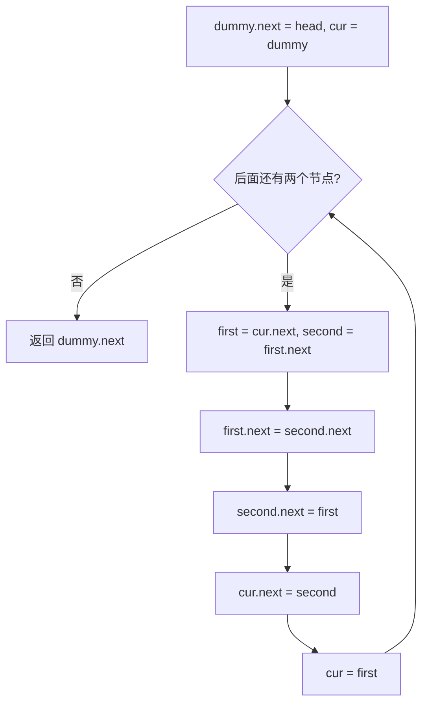

# 虚拟头 - 两两交换链表节点

> [LeetCode 24. 两两交换链表中的节点](https://leetcode.cn/problems/swap-nodes-in-pairs/)

## 题目说明

给你一个链表，两两交换其中相邻的节点，并返回交换后链表的头节点。必须在不修改节点内部值的情况下完成，只能进行节点交换。

例如：`1 → 2 → 3 → 4` 交换后变为 `2 → 1 → 4 → 3`。

## 解题思路

使用 **虚拟头节点 + 循环交换**：

- 虚拟头 `dummy` 指向原 `head`，统一处理「头节点也要被交换」的情况，最终返回 `dummy.next`
- 每次取出相邻的 `first`、`second`，交换它们的指向，再把 `cur` 移到这一对的末尾，继续处理下一对

### 过程

1. 创建虚拟头：`dummy.next = head`，`cur = dummy`
2. 循环条件：后面至少还有两个节点（`cur.next != null && cur.next.next != null`）
3. 取出待交换的两个节点：
   - `first = cur.next`
   - `second = first.next`
4. 交换：
   - `first.next = second.next`（first 接到这一对后面）
   - `second.next = first`（second 接到 first 前面）
   - `cur.next = second`（上一节接到 second）
5. `cur` 移动到这一对的末尾：`cur = first`
6. 循环结束，返回 `dummy.next`

以 `1 → 2 → 3 → 4` 为例：

| 轮次 | cur | first | second | 交换后链表 |
|------|-----|-------|--------|------------|
| 初始 | dummy | - | - | `dummy → 1 → 2 → 3 → 4` |
| 1 | dummy | 1 | 2 | `dummy → 2 → 1 → 3 → 4`，`cur` 移到 1 |
| 2 | 1 | 3 | 4 | `dummy → 2 → 1 → 4 → 3`，`cur` 移到 3 |
| 结束 | 3 后面不足两个节点 | - | - | 返回 `2 → 1 → 4 → 3` |



交换时三个指针的指向变化（以第一对为例）：

```text
交换前：cur → first → second → 后续
交换后：cur → second → first → 后续
```

## 复杂度

| 类型 | 复杂度 | 说明 |
|------|------|------|
| 时间复杂度 | O(n) | 每个节点只访问一次 |
| 空间复杂度 | O(1) | 仅使用常数额外指针 |

## 代码

```java
/**
 * Definition for singly-linked list.
 * public class ListNode {
 *     int val;
 *     ListNode next;
 *     ListNode() {}
 *     ListNode(int val) { this.val = val; }
 *     ListNode(int val, ListNode next) { this.val = val; this.next = next; }
 * }
 */
class Solution {
    public ListNode swapPairs(ListNode head) {
        ListNode dummy = new ListNode(0);
        dummy.next = head;
        ListNode cur = dummy;
        while (cur.next != null && cur.next.next != null) {
            ListNode first = cur.next;
            ListNode second = first.next;
            first.next = second.next;
            second.next = first;
            cur.next = second;
            cur = first;
        }
        return dummy.next;
    }
}
```

## 参考

- 作者：[青驰](https://leetcode.cn/problems/swap-nodes-in-pairs/solutions/4013582/xu-ni-tou-xun-huan-jiao-huan-liang-liang-sydg/)
- 来源：[力扣（LeetCode）](https://leetcode.cn/problems/swap-nodes-in-pairs/)
