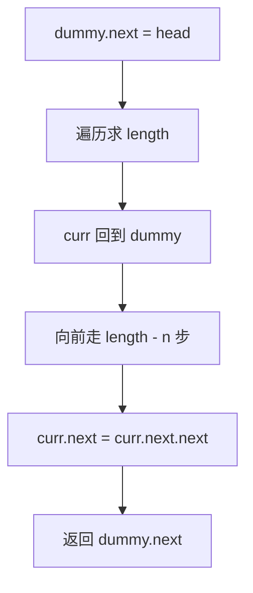

# 虚拟头 - 删除链表倒数第 N 个节点

> [LeetCode 19. 删除链表的倒数第 N 个结点](https://leetcode.cn/problems/remove-nth-node-from-end-of-list/)

## 题目说明

给你一个链表，删除链表的倒数第 `n` 个结点，并且返回链表的头结点。

例如：`1 → 2 → 3 → 4 → 5`，`n = 2`，删除后为 `1 → 2 → 3 → 5`。

## 解题思路

使用 **虚拟头 + 先求长度再定位**：

- 虚拟头 `dummy` 统一处理「删除的是原头节点」的情况，最终返回 `dummy.next`
- 先遍历一遍得到链表长度 `length`
- 要删除倒数第 `n` 个节点，等价于找到它的前驱：从 `dummy` 走 `length - n` 步
- 令前驱的 `next` 跳过待删节点即可

### 过程

1. 创建虚拟头：`dummy.next = head`
2. 从 `dummy` 开始遍历，统计长度 `length`（不含 dummy）
3. `curr` 重新回到 `dummy`，向前走 `length - n` 步，停在待删节点的前驱
4. `curr.next = curr.next.next`，删除目标节点
5. 返回 `dummy.next`

以 `1 → 2 → 3 → 4 → 5`，`n = 2` 为例：

| 步骤 | 操作 | 结果 |
|------|------|------|
| 求长度 | 遍历得到 `length = 5` | `dummy → 1 → 2 → 3 → 4 → 5` |
| 定位前驱 | 从 dummy 走 `5 - 2 = 3` 步 | `curr` 停在 3 |
| 删除 | `3.next = 4.next` | `dummy → 1 → 2 → 3 → 5` |
| 返回 | `dummy.next` | `1 → 2 → 3 → 5` |

若 `n` 等于链表长度（删除头节点），从 dummy 走 `0` 步，`dummy.next` 直接跳过原头节点。



## 复杂度

| 类型 | 复杂度 | 说明 |
|------|------|------|
| 时间复杂度 | O(n) | 先求长度再定位，各遍历一次 |
| 空间复杂度 | O(1) | 仅使用常数额外指针 |

## 代码

```java
/**
 * Definition for singly-linked list.
 * public class ListNode {
 *     int val;
 *     ListNode next;
 *     ListNode() {}
 *     ListNode(int val) { this.val = val; }
 *     ListNode(int val, ListNode next) { this.val = val; this.next = next; }
 * }
 */
class Solution {
    public ListNode removeNthFromEnd(ListNode head, int n) {
        ListNode dummy = new ListNode(0);
        dummy.next = head;
        ListNode curr = dummy;
        int length = 0;
        while (curr.next != null) {
            length++;
            curr = curr.next;
        }
        curr = dummy;
        for (int i = 0; i < length - n; i++) {
            curr = curr.next;
        }
        curr.next = curr.next.next;
        return dummy.next;
    }
}
```

## 参考

- 作者：[青驰](https://leetcode.cn/problems/remove-nth-node-from-end-of-list/solutions/4013836/xu-ni-tou-jie-dian-lian-biao-shan-chu-by-7kfc/)
- 来源：[力扣（LeetCode）](https://leetcode.cn/problems/remove-nth-node-from-end-of-list/)
