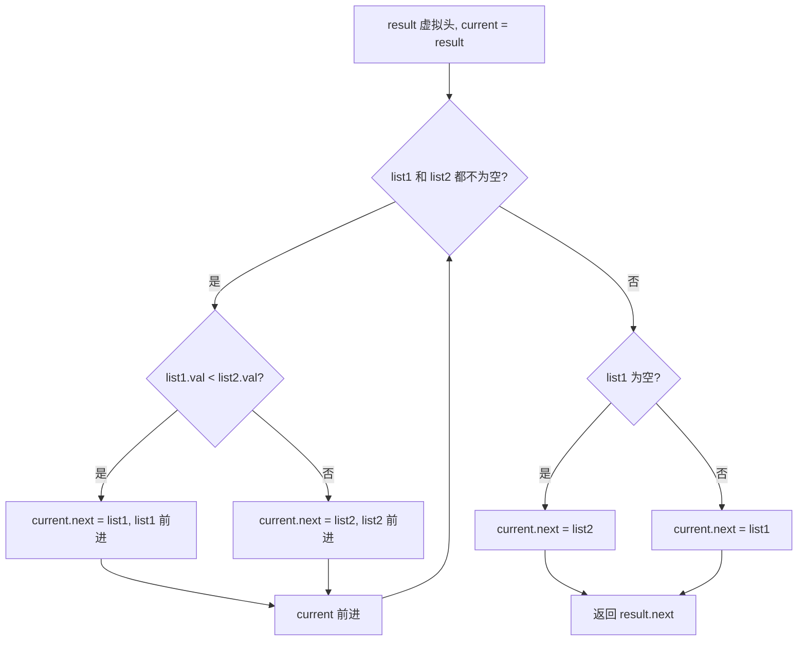

# 虚拟头 - 合并两个有序链表

> [LeetCode 21. 合并两个有序链表](https://leetcode.cn/problems/merge-two-sorted-lists/)

## 题目说明

将两个升序链表合并为一个新的 **升序** 链表并返回。新链表由拼接给定两个链表的所有节点组成。

**示例 1：**

- 输入：`list1 = [1,2,4]`，`list2 = [1,3,4]`
- 输出：`[1,1,2,3,4,4]`

**示例 2：**

- 输入：`list1 = []`，`list2 = []`
- 输出：`[]`

**示例 3：**

- 输入：`list1 = []`，`list2 = [0]`
- 输出：`[0]`

## 解题思路

使用 **虚拟头节点 + 双指针**：

- 虚拟头 `result` 统一处理「合并后的第一个节点还不确定」的情况，最终返回 `result.next`
- 指针 `list1`、`list2` 分别指向两条链表的当前节点，`current` 指向已合并链表的尾部
- 两边都还有节点时，每次取较小的那个接到 `current` 后面，对应指针前进一步
- 某一边走完后，把另一边剩余部分整体接到末尾

两条链表本身已有序，所以每次只比较队头就能保证合并结果有序，无需额外排序。

### 过程

1. 创建虚拟头：`result = new ListNode(0)`，`current = result`
2. 当 `list1`、`list2` 都不为空时比较队头：
   - `list1.val < list2.val`：接上 `list1`，`list1` 前进一步
   - 否则：接上 `list2`，`list2` 前进一步
   - `current` 移到新接上的节点
3. 循环结束后必有一边为空：
   - `list1 == null`：把 `list2` 剩余接到末尾
   - `list2 == null`：把 `list1` 剩余接到末尾
4. 返回 `result.next`

以 `list1 = 1 → 2 → 4`，`list2 = 1 → 3 → 4` 为例：

| 轮次 | list1 | list2 | 比较 | 接上 | 合并结果 |
|------|-------|-------|------|------|----------|
| 1 | 1 | 1 | 1 < 1 为假 | list2 的 1 | `0 → 1` |
| 2 | 1 | 3 | 1 < 3 | list1 的 1 | `0 → 1 → 1` |
| 3 | 2 | 3 | 2 < 3 | list1 的 2 | `0 → 1 → 1 → 2` |
| 4 | 4 | 3 | 4 < 3 为假 | list2 的 3 | `0 → 1 → 1 → 2 → 3` |
| 5 | 4 | 4 | 4 < 4 为假 | list2 的 4 | `0 → 1 → 1 → 2 → 3 → 4` |
| 收尾 | 4 | null | — | 接上 list1 剩余 | `0 → 1 → 1 → 2 → 3 → 4 → 4` |

输出：`[1,1,2,3,4,4]`



虚拟头让第一次拼接不必单独处理「新链表还没有头」的情况；两边相等时走 `else` 接 `list2`，稳定性不影响正确性。

## 复杂度

| 类型 | 复杂度 | 说明 |
|------|------|------|
| 时间复杂度 | O(m + n) | 两条链表各遍历一次 |
| 空间复杂度 | O(1) | 仅使用常数额外指针，原地拼接节点 |

## 代码

```java
/**
 * Definition for singly-linked list.
 * public class ListNode {
 *     int val;
 *     ListNode next;
 *     ListNode() {}
 *     ListNode(int val) { this.val = val; }
 *     ListNode(int val, ListNode next) { this.val = val; this.next = next; }
 * }
 */
class Solution {
    public ListNode mergeTwoLists(ListNode list1, ListNode list2) {
        ListNode result = new ListNode(0);
        ListNode current = result;
        //都不为空才对比
        while(list1!=null && list2!=null){
            if(list1.val<list2.val){
                current.next = list1;
                list1 = list1.next;
            }else{
                current.next = list2;
                list2 = list2.next;
            }
            current = current.next;
        }
        if(list1 == null){
            current.next = list2;
        }
        if(list2 == null){
            current.next = list1;
        }
        return result.next;
    }
}
```

## 参考

- 作者：[青驰](https://leetcode.cn/problems/merge-two-sorted-lists/solutions/4020368/xu-ni-tou-jie-dian-shuang-zhi-zhen-wei-z-6830/)
- 来源：[力扣（LeetCode）](https://leetcode.cn/problems/merge-two-sorted-lists/)
