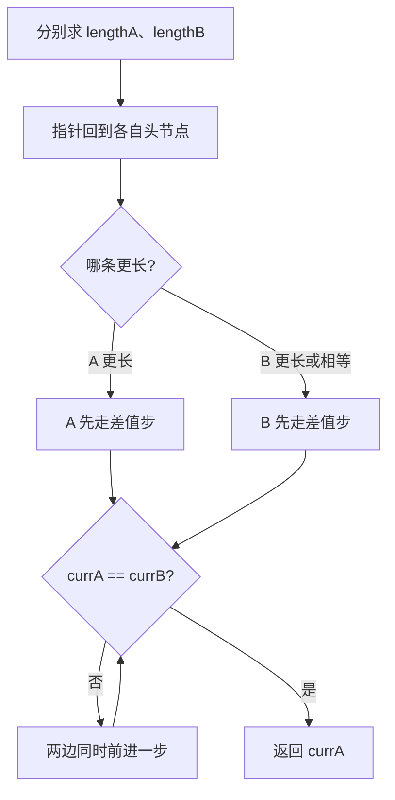

# 链表相交

> [面试题 02.07. 链表相交](https://leetcode.cn/problems/intersection-of-two-linked-lists-lcci/)

## 题目说明

给定两个单链表的头节点 `headA` 和 `headB`，找出并返回两个单链表相交的起始节点。如果两个链表没有交点，返回 `null`。

题目数据保证整个链式结构中不存在环。注意：函数返回结果后，链表必须保持其原始结构。

相交指的是 **节点引用相同**（从某节点开始，两条链共用后续节点），而不是节点值相等。

## 解题思路

使用 **先对齐再同步走**：

- 两条链表可能长度不同，交点之前的「独有部分」长度可能不一样
- 先分别求出 `lengthA`、`lengthB`
- 让较长的那条先走 `|lengthA - lengthB|` 步，使两个指针距离链表尾部同样远
- 再同步前进，第一次相遇的节点就是交点；若走到末尾仍不相等，则不相交，返回 `null`

### 过程

1. 分别遍历两条链表，得到 `lengthA`、`lengthB`
2. `currA`、`currB` 重新回到各自头节点
3. 较长链表的指针先前进差值步数
4. 同步前进，直到 `currA == currB`
5. 返回 `currA`（相交则为交点，不相交则为 `null`）

以链表 A：`4 → 1 → 8 → 4 → 5`，链表 B：`5 → 0 → 1 → 8 → 4 → 5`，在节点 `8` 相交为例：

| 步骤 | A 指针 | B 指针 |
|------|--------|--------|
| 求长度 | lengthA = 5 | lengthB = 6 |
| 对齐 | 停在 4 | 先走 1 步，停在 0 |
| 同步 1 | 1 | 1 |
| 同步 2 | 8 | 8，相遇 |

输出：节点 `8`



## 复杂度

| 类型 | 复杂度 | 说明 |
|------|------|------|
| 时间复杂度 | O(m + n) | 求长度与对齐后遍历，各走一遍 |
| 空间复杂度 | O(1) | 仅使用常数额外指针 |

## 代码

```java
/**
 * Definition for singly-linked list.
 * public class ListNode {
 *     int val;
 *     ListNode next;
 *     ListNode(int x) {
 *         val = x;
 *         next = null;
 *     }
 * }
 */
public class Solution {
    public ListNode getIntersectionNode(ListNode headA, ListNode headB) {
        int lengthA = 0;
        int lengthB = 0;
        ListNode currA = headA;
        ListNode currB = headB;
        while (currA != null) {
            currA = currA.next;
            lengthA++;
        }
        while (currB != null) {
            currB = currB.next;
            lengthB++;
        }
        currA = headA;
        currB = headB;

        if (lengthA > lengthB) {
            for (int i = 0; i < lengthA - lengthB; i++) {
                currA = currA.next;
            }
        } else {
            for (int i = 0; i < lengthB - lengthA; i++) {
                currB = currB.next;
            }
        }
        while (currA != currB) {
            currA = currA.next;
            currB = currB.next;
        }
        return currA;
    }
}
```

## 参考

- 作者：[青驰](https://leetcode.cn/problems/intersection-of-two-linked-lists-lcci/solutions/4013932/lian-biao-xiang-jiao-by-vigilant-parekep-248q/)
- 来源：[力扣（LeetCode）](https://leetcode.cn/problems/intersection-of-two-linked-lists-lcci/)
