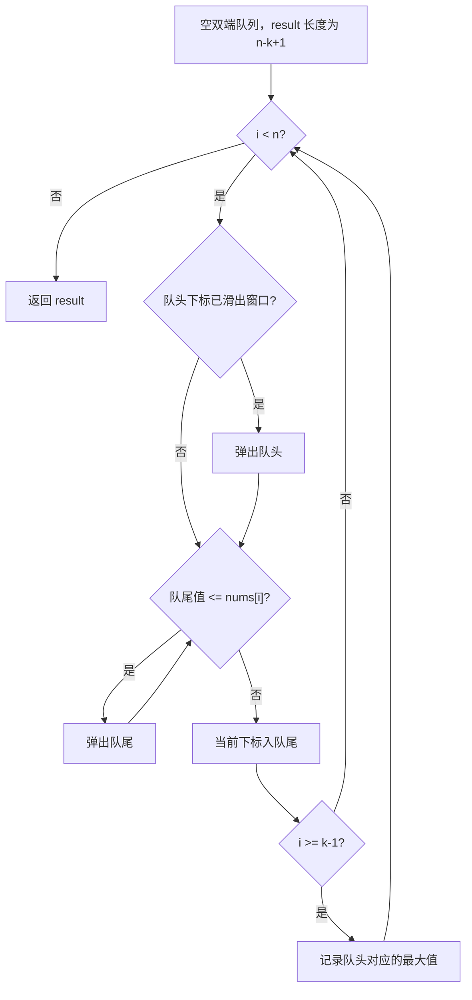

# 单调队列 - 滑动窗口最大值

> [LeetCode 239. 滑动窗口最大值](https://leetcode.cn/problems/sliding-window-maximum/)

## 题目说明

给定一个整数数组 `nums` 和一个整数 `k`。有一个大小为 `k` 的滑动窗口从数组最左侧移动到最右侧。你只可以看到窗口内的 `k` 个数字，滑动窗口每次只向右移动一位。

返回滑动窗口中的最大值。

例如 `nums = [1, 3, -1, -3, 5, 3, 6, 7]`，`k = 3`：

| 窗口位置 | 最大值 |
|----------|--------|
| `[1, 3, -1]` | 3 |
| `[3, -1, -3]` | 3 |
| `[-1, -3, 5]` | 5 |
| `[-3, 5, 3]` | 5 |
| `[5, 3, 6]` | 6 |
| `[3, 6, 7]` | 7 |

输出：`[3, 3, 5, 5, 6, 7]`

## 解题思路

暴力做法是每个窗口扫一遍找最大值，时间复杂度是 O(nk)。窗口每次只右移一位，大部分元素还在窗口里，没必要每次重扫。

用 **单调递减的双端队列**，队列里存的是下标，对应的值从队头到队尾递减。队头下标对应的元素就是当前窗口的最大值。

每个下标 `i` 做三件事：

1. **出队头**：队头下标已经滑出窗口（`<= i - k`）时弹出。窗口每次只右移一位，所以一轮最多弹出一个队头。
2. **清队尾**：从队尾把所有 **小于等于** `nums[i]` 的下标弹出。这些元素既比当前值小，又比当前元素更早进入窗口，不可能再成为后续窗口的最大值。
3. **入队尾**：把当前下标放进去。窗口长度达到 `k` 之后，队头就是本窗口最大值。

相等时也要弹出队尾：后进来的相同值覆盖范围更靠右，先出现的那个会更早滑出窗口。

### 过程

1. `result` 长度为 `nums.length - k + 1`，双端队列初始为空
2. `i` 从 `0` 遍历到末尾：
   - 队头下标 `<= i - k`：弹出队头
   - 队尾对应的值 `<= nums[i]`：不断弹出队尾
   - 当前下标入队尾
   - `i >= k - 1` 时，把 `nums[队头]` 写入结果
3. 返回 `result`

以 `nums = [1, 3, -1, -3, 5, 3, 6, 7]`，`k = 3` 为例（队列中写的是下标，括号内是对应值）：

| i | nums[i] | 弹出队头 | 弹出队尾 | 队列（值） | 记录 |
|---|---------|----------|----------|------------|------|
| 0 | 1 | 否 | 否 | `1` | 窗口未形成 |
| 1 | 3 | 否 | 1 | `3` | 窗口未形成 |
| 2 | -1 | 否 | 否 | `3, -1` | 3 |
| 3 | -3 | 否 | 否 | `3, -1, -3` | 3 |
| 4 | 5 | 下标 1 滑出 | -3、-1 | `5` | 5 |
| 5 | 3 | 否 | 否 | `5, 3` | 5 |
| 6 | 6 | 下标 4 滑出 | 3 | `6` | 6 |
| 7 | 7 | 下标 6 滑出 | 否 | `7` | 7 |

输出：`[3, 3, 5, 5, 6, 7]`



## 复杂度

| 类型 | 复杂度 | 说明 |
|------|------|------|
| 时间复杂度 | O(n) | 每个下标最多入队、出队各一次 |
| 空间复杂度 | O(k) | 队列中最多存放一个窗口内的下标 |

## 代码

```java
class Solution {
    public int[] maxSlidingWindow(int[] nums, int k) {
        // 使用双端队列维护单调递减的下标
        int[] result = new int[nums.length - k + 1];
        Deque<Integer> deque = new LinkedList<>();
        int index = 0;
        for (int i = 0; i < nums.length; i++) {
            // 删除超出当前窗口的元素下标
            if (!deque.isEmpty() && deque.peekFirst() <= i - k) {
                deque.pollFirst();
            }
            // 队尾比当前值小或相等的下标都不可能再成为最大值
            while (!deque.isEmpty() && nums[i] >= nums[deque.peekLast()]) {
                deque.pollLast();
            }
            // 加入当前元素下标
            deque.offer(i);
            // 窗口形成之后记录最大值
            if (i >= k - 1) {
                result[index++] = nums[deque.peekFirst()];
            }
        }
        return result;
    }
}
```

## 参考

- 来源：[力扣（LeetCode）](https://leetcode.cn/problems/sliding-window-maximum/)
