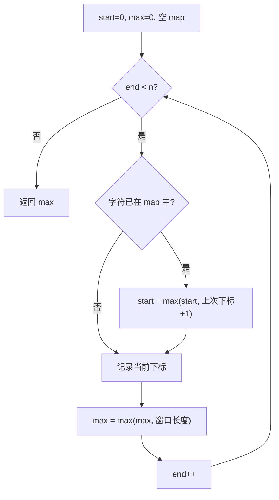

# 滑动窗口 - 无重复字符的最长子串

> [LeetCode 3. 无重复字符的最长子串](https://leetcode.cn/problems/longest-substring-without-repeating-characters/)

## 题目说明

给定一个字符串 `s`，请你找出其中不含有重复字符的 **最长子串** 的长度。

## 解题思路

使用 **滑动窗口 + HashMap**：

- 窗口 `[start, end]` 始终保持无重复字符
- `map` 记录每个字符最近一次出现的下标
- 右指针 `end` 向右扩展；若当前字符已在窗口内出现过，则把左指针 `start` 跳到该字符上次出现位置的下一位

注意要用 `Math.max(start, map.get(...) + 1)`，避免 `start` 被回退到更早的位置（窗口外的旧下标不能再把左边界往左拉）。

### 过程

1. 初始化：空 `map`，`start = 0`，`max = 0`
2. 右指针 `end` 从 `0` 遍历到 `s.length() - 1`：
   - 若 `s[end]` 已在 `map` 中：`start = max(start, 上次下标 + 1)`
   - 更新 `map.put(s[end], end)`
   - 更新最大长度：`max = max(max, end - start + 1)`
3. 返回 `max`

以 `s = "abcabcbb"` 为例：

| end | 字符 | map 中已有? | start | 窗口 | max |
|-----|------|-------------|-------|------|-----|
| 0 | a | 否 | 0 | `a` | 1 |
| 1 | b | 否 | 0 | `ab` | 2 |
| 2 | c | 否 | 0 | `abc` | 3 |
| 3 | a | 是，上次 0 | 1 | `bca` | 3 |
| 4 | b | 是，上次 1 | 2 | `cab` | 3 |
| 5 | c | 是，上次 2 | 3 | `abc` | 3 |
| 6 | b | 是，上次 4 | 5 | `cb` | 3 |
| 7 | b | 是，上次 6 | 7 | `b` | 3 |

输出：`3`（子串 `"abc"`）



## 复杂度

| 类型 | 复杂度 | 说明 |
|------|------|------|
| 时间复杂度 | O(n) | 每个字符最多被访问一次 |
| 空间复杂度 | O(k) | k 为字符集大小，最坏等于字符串中不同字符个数 |

## 代码

```java
class Solution {
    public int lengthOfLongestSubstring(String s) {
        Map<Character, Integer> map = new HashMap<>();
        int start = 0;
        int max = 0;
        for (int end = 0; end < s.length(); end++) {
            if (map.containsKey(s.charAt(end))) {
                start = Math.max(start, map.get(s.charAt(end)) + 1);
            }
            map.put(s.charAt(end), end);
            max = Math.max(max, end - start + 1);
        }
        return max;
    }
}
```

## 参考

- 作者：[青驰](https://leetcode.cn/problems/longest-substring-without-repeating-characters/solutions/4003812/hua-dong-chuang-kou-tong-ji-wu-zhong-fu-jupu3/)
- 来源：[力扣（LeetCode）](https://leetcode.cn/problems/longest-substring-without-repeating-characters/)
