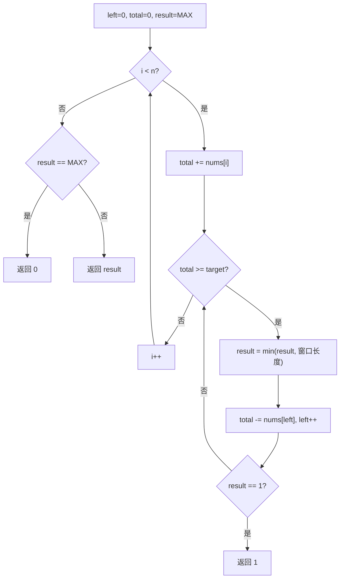

# 滑动窗口 - 长度最小的子数组

> [LeetCode 209. 长度最小的子数组](https://leetcode.cn/problems/minimum-size-subarray-sum/)

## 题目说明

给定一个含有 `n` 个正整数的数组 `nums` 和一个正整数 `target`，找出数组中满足其和 `≥ target` 的长度最小的 **连续子数组**，并返回其长度。若不存在符合条件的子数组，返回 `0`。

## 解题思路

数组元素为正整数，可以用 **滑动窗口**：右指针不断扩窗累加，当窗口和已经 `≥ target` 时，尽量收缩左指针，记录当前最小长度。

窗口含义：`[left, i]` 是当前正在考察的连续子数组，`total` 是窗口内元素之和。

### 过程

1. 初始化：`left = 0`，`total = 0`，`result = Integer.MAX_VALUE`
2. 右指针 `i` 从 `0` 遍历到末尾：
   - `total += nums[i]`，窗口右扩
   - 当 `total >= target`：更新最小长度 `result = min(result, i - left + 1)`，再 `total -= nums[left]`，`left++` 收缩窗口
   - 若已经出现长度为 `1` 的合法窗口，可提前返回（不可能更短）
3. 若从未找到合法窗口，`result` 仍为 `MAX_VALUE`，返回 `0`；否则返回 `result`

以 `target = 7`，`nums = [2, 3, 1, 2, 4, 3]` 为例：

| i | nums[i] | total | 窗口 | 是否收缩 | result |
|---|---------|-------|------|----------|--------|
| 0 | 2 | 2 | `[2]` | 否 | MAX |
| 1 | 3 | 5 | `[2,3]` | 否 | MAX |
| 2 | 1 | 6 | `[2,3,1]` | 否 | MAX |
| 3 | 2 | 8 | `[2,3,1,2]` | 是，长度 4；收缩后 total=6 | 4 |
| 4 | 4 | 10 | `[3,1,2,4]` | 是，长度 4 → 再缩到 `[2,4]` 长度 2 | 2 |
| 5 | 3 | 9 | `[2,4,3]` | 是，长度 3 → 再缩到 `[4,3]` 长度 2 | 2 |

输出：`2`（子数组 `[4, 3]`）



## 复杂度

| 类型 | 复杂度 | 说明 |
|------|------|------|
| 时间复杂度 | O(n) | 左右指针各最多移动 n 次 |
| 空间复杂度 | O(1) | 仅使用常数额外变量 |

## 代码

```java
class Solution {
    public static int minSubArrayLen(int target, int[] nums) {
        int left = 0;
        int total = 0;
        int result = Integer.MAX_VALUE;
        for (int i = 0; i < nums.length; i++) {
            total += nums[i];
            while (total >= target) {
                result = Math.min(result, i - left + 1);
                total -= nums[left];
                left++;
            }
            if (result == 1) {
                return result;
            }
        }
        return result == Integer.MAX_VALUE ? 0 : result;
    }
}
```

## 参考

- 作者：[青驰](https://leetcode.cn/problems/minimum-size-subarray-sum/solutions/4012092/hua-dong-chuang-kou-ji-suan-sui-xiao-de-3x05r/)
- 来源：[力扣（LeetCode）](https://leetcode.cn/problems/minimum-size-subarray-sum/)
