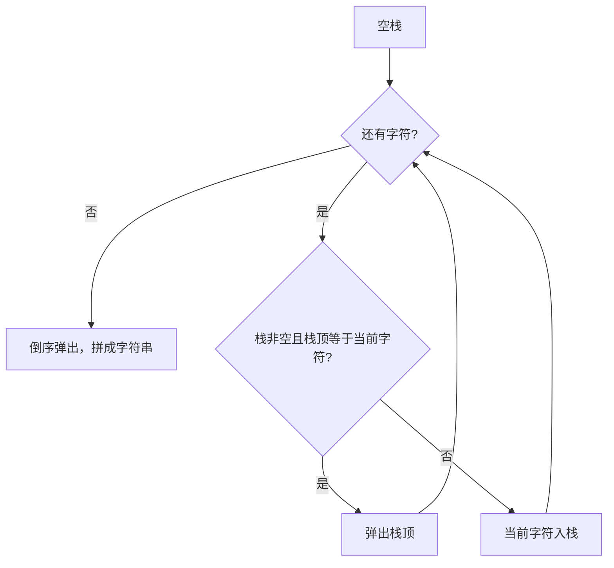

# 栈 - 删除字符串中的所有相邻重复项

> [LeetCode 1047. 删除字符串中的所有相邻重复项](https://leetcode.cn/problems/remove-all-adjacent-duplicates-in-string/)

## 题目说明

给出由小写字母组成的字符串 `s`。重复项删除操作会选择 **两个相邻且相同** 的字母，并删除它们。

在 `s` 上反复执行重复项删除操作，直到无法继续删除。

在完成所有重复项删除操作后返回最终的字符串。答案保证唯一。

例如：

- `"abbaca"` → 删掉 `bb` 得到 `"aaca"`，再删掉 `aa` 得到 `"ca"`
- `"azxxzy"` → 删掉 `xx` 得到 `"azzy"`，再删掉 `zz` 得到 `"ay"`

## 解题思路

相邻相同字符成对消除，和括号匹配一样是 **后进先出**：刚放进去的字符，最先有机会和当前字符抵消。用栈保存还没被消除的字符。

- 栈空，或栈顶与当前字符不同：入栈
- 栈顶与当前字符相同：弹出栈顶（相当于删掉这一对）

扫完后栈里剩下的就是最终结果。因为栈是后进先出，拼字符串时要从栈底到栈顶，也就是 **倒序弹出**。

### 过程

1. 创建空栈
2. 从左到右扫描每个字符 `c`：
   - 栈非空且栈顶等于 `c`：弹出栈顶
   - 否则：把 `c` 入栈
3. 按从栈底到栈顶的顺序拼出字符串并返回

以 `s = "abbaca"` 为例：

| 字符 | 操作 | 栈 |
|------|------|-----|
| `a` | 栈空，入栈 | `a` |
| `b` | 与栈顶不同，入栈 | `a b` |
| `b` | 与栈顶相同，弹出 | `a` |
| `a` | 与栈顶相同，弹出 | 空 |
| `c` | 栈空，入栈 | `c` |
| `a` | 与栈顶不同，入栈 | `c a` |

倒序弹出后得到 `"ca"`。



## 复杂度

| 类型 | 复杂度 | 说明 |
|------|------|------|
| 时间复杂度 | O(n) | 每个字符入栈或出栈一次 |
| 空间复杂度 | O(n) | 最坏没有相邻重复，栈中存放 n 个字符 |

## 代码

```java
class Solution {
    public String removeDuplicates(String s) {
        // 利用栈先入后出的特性，判断最后一个和当前字符是否相等，相等则弹出
        Stack<Character> stack = new Stack<>();
        for (int i = 0; i < s.length(); i++) {
            if (!stack.isEmpty()) {
                Character c = stack.peek();
                if (s.charAt(i) == c) {
                    stack.pop();
                } else {
                    stack.push(s.charAt(i));
                }
            } else {
                stack.push(s.charAt(i));
            }
        }
        char[] chars = new char[stack.size()];
        for (int i = stack.size() - 1; i >= 0; i--) {
            chars[i] = stack.pop();
        }
        return new String(chars);
    }
}
```

## 参考

- 作者：[青驰](https://leetcode.cn/problems/remove-all-adjacent-duplicates-in-string/solutions/4033613/zhan-shan-chu-zi-fu-chuan-zhong-xiang-li-gbcx/)
- 来源：[力扣（LeetCode）](https://leetcode.cn/problems/remove-all-adjacent-duplicates-in-string/)
