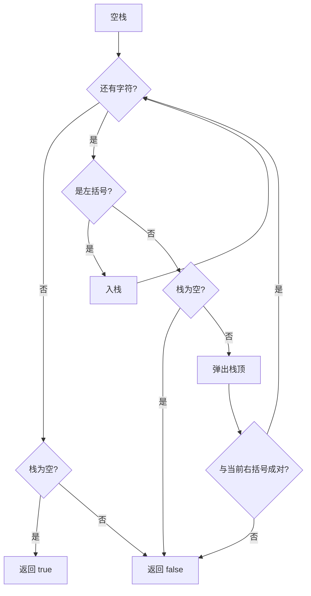

# 栈 - 有效的括号

> [LeetCode 20. 有效的括号](https://leetcode.cn/problems/valid-parentheses/)

## 题目说明

给定一个只包括 `'('`、`')'`、`'{'`、`'}'`、`'['`、`']'` 的字符串 `s`，判断字符串是否有效。

有效字符串需满足：

1. 左括号必须用相同类型的右括号闭合
2. 左括号必须以正确的顺序闭合
3. 每个右括号都有一个对应的相同类型左括号

例如：

- `"()"` → `true`
- `"()[]{}"` → `true`
- `"(]"` → `false`
- `"([])"` → `true`
- `"([)]"` → `false`

## 解题思路

括号匹配是典型的 **后进先出**：最近出现的左括号，要最先被右括号消掉。用栈保存还没匹配的左括号。

- 遇到左括号：入栈
- 遇到右括号：栈空则没有对应左括号，直接失败；否则弹出栈顶，类型对不上也失败
- 扫完后栈必须为空，否则还有未闭合的左括号

三种失败情况：

- 右括号多了：栈空时还要弹
- 类型/顺序错了：栈顶和当前右括号不成对（如 `"(]"`、`"([)]"`）
- 左括号多了：结束时栈非空

### 过程

1. 创建空栈
2. 从左到右扫描每个字符 `c`：
   - `c` 是 `'('`、`'['`、`'{'`：入栈
   - 否则（右括号）：
     - 栈空 → 返回 `false`
     - 弹出栈顶 `top`，若与 `c` 不成对 → 返回 `false`
3. 返回 `stack.isEmpty()`

以 `s = "([{}])"` 为例：

| 字符 | 操作 | 栈 |
|------|------|-----|
| `(` | 入栈 | `(` |
| `[` | 入栈 | `( [` |
| `{` | 入栈 | `( [ {` |
| `}` | 弹出 `{`，配对 | `( [` |
| `]` | 弹出 `[`，配对 | `(` |
| `)` | 弹出 `(`，配对 | 空 |

栈空，返回 `true`。

再看 `s = "([)]"`：

| 字符 | 操作 | 栈 |
|------|------|-----|
| `(` | 入栈 | `(` |
| `[` | 入栈 | `( [` |
| `)` | 弹出 `[`，与 `)` 不成对 | — |

返回 `false`。



## 复杂度

| 类型 | 复杂度 | 说明 |
|------|------|------|
| 时间复杂度 | O(n) | 每个字符入栈或出栈一次 |
| 空间复杂度 | O(n) | 最坏全是左括号，栈中存放 n 个字符 |

## 代码

```java
class Solution {
    public boolean isValid(String s) {
        Stack<Character> stack = new Stack<>();
        for (char c : s.toCharArray()) {
            if (c == '(' || c == '[' || c == '{') {
                stack.push(c);
            } else {
                if (stack.isEmpty()) {
                    return false;
                }
                char top = stack.pop();
                if ((top == '(' && c != ')') ||
                    (top == '[' && c != ']') ||
                    (top == '{' && c != '}')) {
                    return false;
                }
            }
        }
        return stack.isEmpty();
    }
}
```

## 参考

- 作者：[青驰](https://leetcode.cn/problems/valid-parentheses/solutions/4022613/zhan-you-xiao-de-gua-hao-by-vigilant-par-45u1/)
- 来源：[力扣（LeetCode）](https://leetcode.cn/problems/valid-parentheses/)
