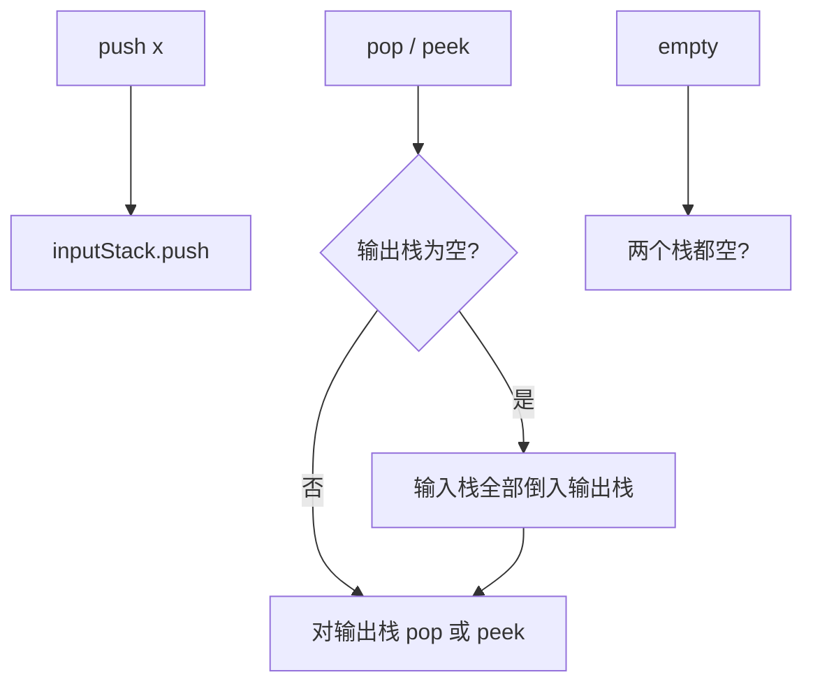

# 栈 - 用栈实现队列

> [LeetCode 232. 用栈实现队列](https://leetcode.cn/problems/implement-queue-using-stacks/)

## 题目说明

请用两个栈实现一个先入先出队列。队列应支持：

- `push(x)`：将元素 x 推到队列末尾
- `pop()`：从队列开头移除并返回元素
- `peek()`：返回队列开头的元素
- `empty()`：队列是否为空

例如：`push(1)`、`push(2)`、`peek()` → `1`，`pop()` → `1`，`empty()` → `false`

## 解题思路

栈是后进先出，队列是先进先出。一个栈只能倒序，**两个栈对倒一次**就把顺序正回来。

- `inputStack`：只负责入队，新元素一律 `push` 到这里
- `outPutStack`：只负责出队。要 `pop` / `peek` 时，若它为空，就把 `inputStack` **全部倒进去**，栈底那个最早入队的元素会翻到栈顶

倒栈只在出栈为空时做一次。输出栈里还有元素时，继续从栈顶取，顺序已经是队列顺序，不必每次都倒。

`empty()`：两个栈都空才是空队列。

### 过程

1. `push(x)`：`inputStack.push(x)`
2. `pop` / `peek`：输出栈为空则把输入栈逐个弹入输出栈，再对输出栈 `pop` 或 `peek`
3. `empty`：两个栈都空则为 `true`

以 `push(1)`、`push(2)`、`push(3)`，再 `pop` 两次为例：

| 操作 | inputStack | outPutStack | 说明 |
|------|------------|-------------|------|
| push 1 | `[1]` | `[]` | 只进输入栈 |
| push 2 | `[1, 2]` | `[]` | |
| push 3 | `[1, 2, 3]` | `[]` | |
| pop | `[]` | `[3, 2]` | 先倒栈，再弹出 `1` |
| pop | `[]` | `[3]` | 输出栈非空，直接弹出 `2` |

输出栈还有 `3`，下次 `peek` 不必再倒。



每个元素最多入两次栈、出两次栈，均摊 O(1)。

## 复杂度

| 类型 | 复杂度 | 说明 |
|------|------|------|
| 时间复杂度 | 均摊 O(1) | push 直接入栈；每个元素最多被倒一次 |
| 空间复杂度 | O(n) | 两个栈合计存 n 个元素 |

## 代码

```java
class MyQueue {
    Stack<Integer> inputStack;
    Stack<Integer> outPutStack;
    public MyQueue() {
        inputStack = new Stack<>();
        outPutStack = new Stack<>();
    }
    
    public void push(int x) {
        inputStack.push(x);
    }
    
    public int pop() {
        // 出栈如果为空则全部倒入
        if(outPutStack.isEmpty()){
            while(!inputStack.isEmpty()){
                Integer element = inputStack.pop();
                outPutStack.push(element);
            }   
        }
        return outPutStack.pop();
    }
    
    public int peek() {
       // 出栈如果为空则全部倒入
       if(outPutStack.isEmpty()){
            while(!inputStack.isEmpty()){
                Integer element = inputStack.pop();
                outPutStack.push(element);
            }   
        }
        return outPutStack.peek();
    }
    
    public boolean empty() {
        return outPutStack.isEmpty() && inputStack.isEmpty();
    }
}

/**
 * Your MyQueue object will be instantiated and called as such:
 * MyQueue obj = new MyQueue();
 * obj.push(x);
 * int param_2 = obj.pop();
 * int param_3 = obj.peek();
 * boolean param_4 = obj.empty();
 */
```

## 参考

- 作者：[青驰](https://leetcode.cn/problems/implement-queue-using-stacks/solutions/4029566/liang-ge-zhan-shi-xian-dui-lie-xian-ru-x-ceq2/)
- 来源：[力扣（LeetCode）](https://leetcode.cn/problems/implement-queue-using-stacks/)
