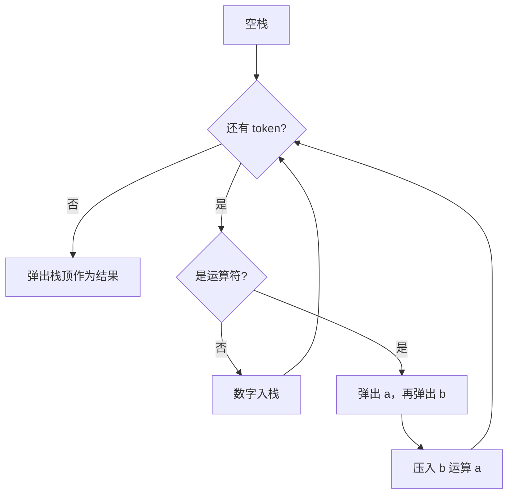

# 栈 - 逆波兰表达式求值

> [LeetCode 150. 逆波兰表达式求值](https://leetcode.cn/problems/evaluate-reverse-polish-notation/)

## 题目说明

给你一个字符串数组 `tokens`，表示一个根据 **逆波兰表示法** 表示的算术表达式，请计算该表达式的值。

- 有效运算符：`+`、`-`、`*`、`/`
- 每个操作数可以是整数，也可以是另一个表达式
- 两个整数之间的除法向零截断
- 题目保证给定的逆波兰表达式总是有效的，且结果可以用 32 位整数表示

例如：

- `["2", "1", "+", "3", "*"]` → `((2 + 1) * 3)` → `9`
- `["4", "13", "5", "/", "+"]` → `(4 + (13 / 5))` → `6`

## 解题思路

逆波兰表达式（后缀表达式）把运算符放在两个操作数后面，天然对应 **栈** 的后进先出：

- 遇到数字：入栈
- 遇到运算符：弹出两个操作数，算出结果再压回去

注意出栈顺序：先弹出的是 **右操作数** `a`，后弹出的是 **左操作数** `b`。减法和除法不满足交换律，必须写成 `b - a`、`b / a`。

### 过程

1. 创建空栈
2. 从左到右扫描每个 token `s`：
   - `s` 是 `+`、`-`、`*`、`/`：弹出 `a`、再弹出 `b`，把 `b 运算 a` 的结果入栈
   - 否则：把 `s` 转成整数入栈
3. 栈中剩下的唯一元素就是表达式的值

以 `tokens = ["2", "1", "+", "3", "*"]` 为例：

| token | 操作 | 栈 |
|-------|------|-----|
| `2` | 入栈 | `2` |
| `1` | 入栈 | `2 1` |
| `+` | 弹出 `a=1`、`b=2`，压入 `2+1=3` | `3` |
| `3` | 入栈 | `3 3` |
| `*` | 弹出 `a=3`、`b=3`，压入 `3*3=9` | `9` |

输出：`9`

再看 `tokens = ["4", "13", "5", "/", "+"]`：

| token | 操作 | 栈 |
|-------|------|-----|
| `4` | 入栈 | `4` |
| `13` | 入栈 | `4 13` |
| `5` | 入栈 | `4 13 5` |
| `/` | 弹出 `a=5`、`b=13`，压入 `13/5=2` | `4 2` |
| `+` | 弹出 `a=2`、`b=4`，压入 `4+2=6` | `6` |

输出：`6`



## 复杂度

| 类型 | 复杂度 | 说明 |
|------|------|------|
| 时间复杂度 | O(n) | 每个 token 入栈或出栈常数次 |
| 空间复杂度 | O(n) | 最坏情况下栈中存放 n 个数字 |

## 代码

```java
class Solution {
    public int evalRPN(String[] tokens) {
        int result = 0;
        // 入栈，碰到运算符就出栈运算
        Stack<Integer> stack = new Stack<>();
        for (int i = 0; i < tokens.length; i++) {
            String s = tokens[i];
            if (s.equals("+")) {
                int a = stack.pop();
                int b = stack.pop();
                stack.push(b + a);
            } else if (s.equals("-")) {
                int a = stack.pop();
                int b = stack.pop();
                stack.push(b - a);
            } else if (s.equals("*")) {
                int a = stack.pop();
                int b = stack.pop();
                stack.push(b * a);
            } else if (s.equals("/")) {
                int a = stack.pop();
                int b = stack.pop();
                stack.push(b / a);
            } else {
                stack.push(Integer.parseInt(s));
            }
        }
        if (!stack.isEmpty()) {
            result = stack.pop();
        }
        return result;
    }
}
```

## 参考

- 作者：[青驰](https://leetcode.cn/problems/evaluate-reverse-polish-notation/solutions/4033704/zhan-ni-bo-lan-biao-da-shi-by-vigilant-p-09m9/)
- 来源：[力扣（LeetCode）](https://leetcode.cn/problems/evaluate-reverse-polish-notation/)
