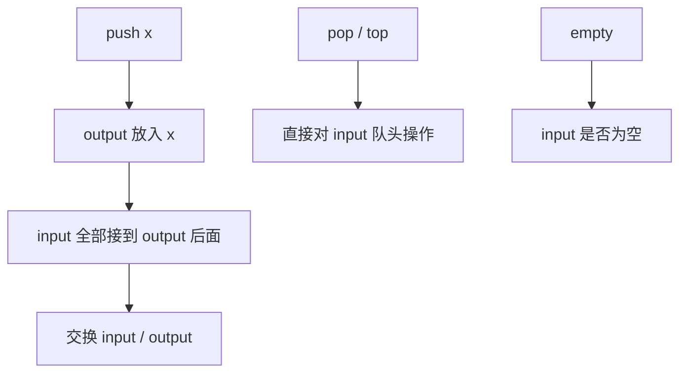

# 队列 - 用队列实现栈

> [LeetCode 225. 用队列实现栈](https://leetcode.cn/problems/implement-stack-using-queues/)

## 题目说明

请用两个队列实现一个后进先出栈。栈应支持：

- `push(x)`：将元素 x 压入栈顶
- `pop()`：移除并返回栈顶元素
- `top()`：返回栈顶元素
- `empty()`：栈是否为空

例如：`push(1)`、`push(2)`、`top()` → `2`，`pop()` → `2`，`empty()` → `false`

## 解题思路

队列是先进先出，栈是后进先出。和 [用栈实现队列](./栈-用栈实现队列) 对称：这里用 **两个队列在入栈时倒序**，让最新元素始终排在队头。

- `inputQueue`：始终保持「栈顶在队头」的顺序，`pop` / `top` 直接取队头
- `outputQueue`：入栈时的临时队列。先放新元素 `x`，再把 `inputQueue` 全部接到后面，然后两个队列交换引用

这样每次 `push` 后，最新元素都在 `inputQueue` 队头，后面是旧元素，读栈顶和弹栈都是 O(1)。

### 过程

1. `push(x)`：`outputQueue` 先放 `x`，再把 `inputQueue` 全部 `poll` 进 `outputQueue`，最后交换两个队列
2. `pop`：`inputQueue.poll()`
3. `top`：`inputQueue.peek()`
4. `empty`：`inputQueue` 是否为空

以 `push(1)`、`push(2)`、`push(3)`，再 `pop` 为例：

| 操作 | inputQueue（队头→队尾） | 说明 |
|------|-------------------------|------|
| push 1 | `[1]` | output 放 1，input 空，交换后 input 为 `[1]` |
| push 2 | `[2, 1]` | output 先放 2，再接上 1，交换 |
| push 3 | `[3, 2, 1]` | 最新在队头 |
| pop | `[2, 1]` | 队头弹出 `3` |



代价压在 `push` 上，每个元素入队时会被搬一次；`pop` / `top` 常数时间。也可以反过来：入栈 O(1)，出栈时再倒队列，思路一样。

## 复杂度

| 类型 | 复杂度 | 说明 |
|------|------|------|
| 时间复杂度 | push O(n)，pop / top O(1) | 入栈要把旧元素全部接到新元素后面 |
| 空间复杂度 | O(n) | 两个队列合计存 n 个元素 |

## 代码

```java
class MyStack {
    Queue<Integer> inputQueue;
    Queue<Integer> outputQueue;
    public MyStack() {
        inputQueue = new LinkedList<>();
        outputQueue = new LinkedList<>();
    }
    
    public void push(int x) {
        // 放入队列output
        outputQueue.offer(x);
        // 将input的内容全部放到x之后实现反转
        while(!inputQueue.isEmpty()){
            outputQueue.offer(inputQueue.poll());
        }
        // 将output作为input使用
        Queue<Integer> tmp = inputQueue;
        inputQueue = outputQueue;
        outputQueue = tmp;
    }
    
    public int pop() {
        return inputQueue.poll();
    }
    
    public int top() {
        return inputQueue.peek();
    }
    
    public boolean empty() {
        return inputQueue.isEmpty();
    }
}

/**
 * Your MyStack object will be instantiated and called as such:
 * MyStack obj = new MyStack();
 * obj.push(x);
 * int param_2 = obj.pop();
 * int param_3 = obj.top();
 * boolean param_4 = obj.empty();
 */
```

## 参考

- 作者：[青驰](https://leetcode.cn/problems/implement-stack-using-queues/solutions/4030169/dui-lie-shi-xian-zhan-by-vigilant-pareke-3g16/)
- 来源：[力扣（LeetCode）](https://leetcode.cn/problems/implement-stack-using-queues/)
