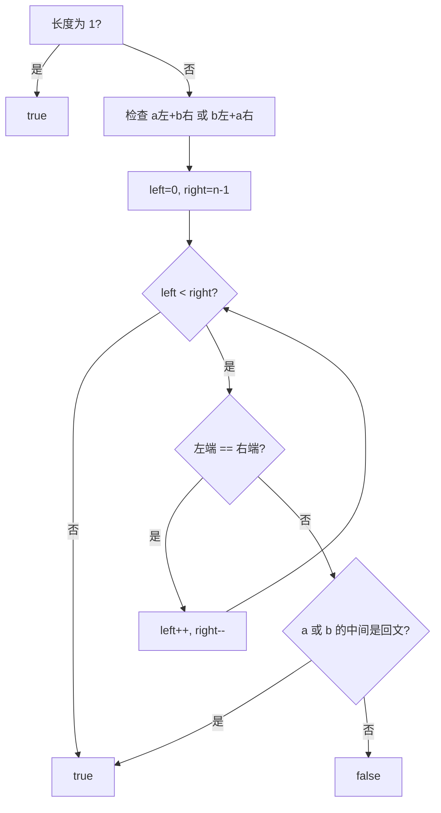

# 双指针 - 分割两个字符串得到回文串

> [LeetCode 1616. 分割两个字符串得到回文串](https://leetcode.cn/problems/split-two-strings-to-make-palindrome/)

## 题目说明

给你两个字符串 `a` 和 `b`，长度相同。请选择一个下标，将两个字符串都在相同位置切开，得到 `a_prefix + a_suffix` 和 `b_prefix + b_suffix`。

判断是否存在一种切法，使得 `a_prefix + b_suffix` 或 `b_prefix + a_suffix` 是回文串。切在开头或末尾也合法，相当于直接用整串 `a` 或整串 `b`。

例如：

- `a = "x"`, `b = "y"` → `true`（长度为 1，一定是回文）
- `a = "abdef"`, `b = "fecab"` → `true`（`"fedef"`）
- `a = "ulacfd"`, `b = "jizalu"` → `true`（`"ulaalu"`）

## 解题思路

要组成回文，左右两端必须成对相等。以 `a_prefix + b_suffix` 为例：左半边尽量用 `a`，右半边尽量用 `b`，左右双指针从两端往中间走。

- `a[left] == b[right]`：这一对已经配上，继续往里
- 一旦不相等：外层不能再交叉配对。剩下的区间 `[left, right]` 必须整段来自同一条串，所以检查 `a[left..right]` 或 `b[left..right]` 是否本身就是回文

`b_prefix + a_suffix` 把两串对调再做一遍。长度为 1 时直接返回 `true`。

切点对应关系：外层配到 `[left, right]` 失配时，

- 切在 `left`：中间整段来自 `b`，看 `b[left..right]`
- 切在 `right + 1`：中间整段来自 `a`，看 `a[left..right]`

### 过程

1. 长度为 1：返回 `true`
2. 检查 `a` 左 + `b` 右，或 `b` 左 + `a` 右，任一成功即可
3. 每次检查：`left = 0`，`right = n - 1`
   - 相等则 `left++`、`right--`
   - 不等则判断 `a[left..right]` 或 `b[left..right]` 是否回文
   - 两指针相遇：外层全部配对成功，返回 `true`

以 `a = "abdef"`, `b = "fecab"` 为例。

先查 `a` 左 + `b` 右：

| left | right | a[left] | b[right] | 动作 |
|------|-------|---------|----------|------|
| 0 | 4 | a | b | 不等，检查中间 |

`"abdef"`、`"fecab"` 都不是回文 → 这条方向失败。

再查 `b` 左 + `a` 右：

| left | right | b[left] | a[right] | 动作 |
|------|-------|---------|----------|------|
| 0 | 4 | f | f | 配对，继续 |
| 1 | 3 | e | e | 配对，继续 |
| 2 | 2 | — | — | 相遇，成功 |

拼出 `"fe" + "def"` = `"fedef"`。



## 复杂度

| 类型 | 复杂度 | 说明 |
|------|------|------|
| 时间复杂度 | O(n) | 两个方向各扫一遍，中间再各扫一次，都线性 |
| 空间复杂度 | O(1) | 只用左右指针 |

## 代码

```java
class Solution {
    public boolean checkPalindromeFormation(String a, String b) {
        if(a.length()==1){
            return true;
        }
        return checkPalindrome( a, b) || checkPalindrome( b, a);
    }
    private boolean checkPalindrome(String a, String b){
        int left = 0;
        int rigth = a.length() - 1;
        while(left < rigth){
            if(a.charAt(left) == b.charAt(rigth)){
                left++;
                rigth--;
            }else{
                return checkPalindrome(a, left, rigth) || checkPalindrome(b, left, rigth);
            }
        }
        return true;
    }
    private boolean checkPalindrome(String s, int left, int rigth){
        while(left < rigth){
            if(s.charAt(left) == s.charAt(rigth)){
                left++;
                rigth--;
            }else{
                return false;
            }
        }
        return true;
    }
}
```

## 参考

- 作者：[青驰](https://leetcode.cn/problems/split-two-strings-to-make-palindrome/solutions/4025713/shuang-zhi-zhen-fen-ge-liang-ge-zi-fu-ch-kiql/)
- 来源：[力扣（LeetCode）](https://leetcode.cn/problems/split-two-strings-to-make-palindrome/)
