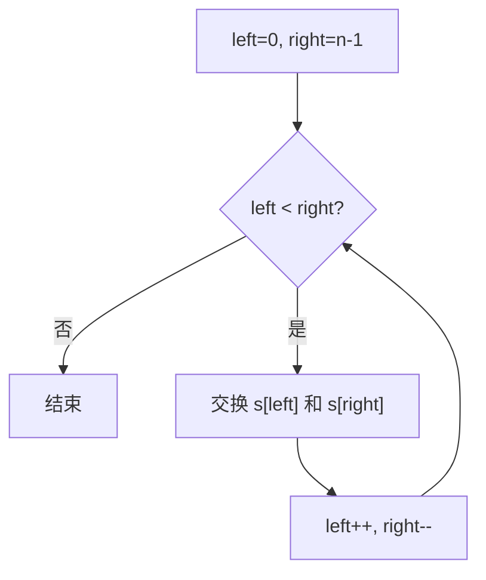

# 双指针 - 反转字符串

> [LeetCode 344. 反转字符串](https://leetcode.cn/problems/reverse-string/)

## 题目说明

编写一个函数，将输入的字符串反转过来。输入字符串以字符数组 `s` 的形式给出。

必须 **原地** 修改输入数组，使用 O(1) 的额外空间。

例如：

- `s = ["h","e","l","l","o"]` → `["o","l","l","e","h"]`
- `s = ["H","a","n","n","a","h"]` → `["h","a","n","n","a","H"]`

## 解题思路

和 [有序数组平方](../array/双指针-有序数组平方) 一样，用 **左右双指针** 从两端向中间走：交换 `s[left]` 与 `s[right]`，然后 `left++`、`right--`，直到两指针相遇。奇数长度时正中间的字符不用动。

循环条件用 `left < right`，相等时已到中点，再交换没有意义。

### 过程

1. 初始化：`left = 0`，`right = s.length - 1`
2. 当 `left < right` 时：
   - 用临时变量交换 `s[left]` 和 `s[right]`
   - `left++`，`right--`
3. 循环结束，数组已原地反转

以 `s = ["h", "e", "l", "l", "o"]` 为例：

| 轮次 | left | right | 交换 | 数组状态 |
|------|------|-------|------|----------|
| 1 | 0 | 4 | h ↔ o | `["o", "e", "l", "l", "h"]` |
| 2 | 1 | 3 | e ↔ l | `["o", "l", "l", "e", "h"]` |
| 3 | 2 | 2 | 相遇，结束 | `["o", "l", "l", "e", "h"]` |

输出：`["o", "l", "l", "e", "h"]`



## 复杂度

| 类型 | 复杂度 | 说明 |
|------|------|------|
| 时间复杂度 | O(n) | 左右指针共移动 n 次，各元素交换一次 |
| 空间复杂度 | O(1) | 原地修改，仅使用一个临时变量 |

## 代码

```java
class Solution {
    public void reverseString(char[] s) {
        int left = 0;
        int right = s.length - 1;
        while (left < right) {
            char change = s[left];
            s[left] = s[right];
            s[right] = change;
            left++;
            right--;
        }
    }
}
```

## 参考

- 作者：[青驰](https://leetcode.cn/problems/reverse-string/solutions/4024317/shuang-zhi-zhen-zi-fu-chuan-fan-zhuan-by-f7ri/)
- 来源：[力扣（LeetCode）](https://leetcode.cn/problems/reverse-string/)
