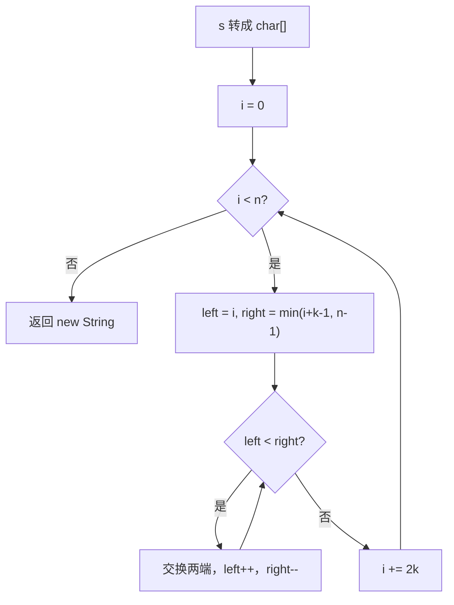

# 双指针 - 反转字符串 II

> [LeetCode 541. 反转字符串 II](https://leetcode.cn/problems/reverse-string-ii/)

## 题目说明

给定字符串 `s` 和整数 `k`，从字符串开头算起，每计数至 `2k` 个字符，就反转这 `2k` 个字符中的前 `k` 个字符。

- 剩余字符少于 `k` 个：将剩余字符全部反转
- 剩余字符小于 `2k` 但大于或等于 `k` 个：反转前 `k` 个字符，其余字符保持原样

例如：

- `s = "abcdefg"`，`k = 2` → `"bacdfeg"`
- `s = "abcd"`，`k = 2` → `"bacd"`

## 解题思路

在 [反转字符串](./双指针-反转字符串) 上加一层分段：每隔 `2k` 取一段，只反转这一段的前 `k` 个字符。反转本身仍是左右双指针交换。

Java 字符串不可变，先转成 `char[]`，改完再 `new String` 回去。

下标 `i` 每次加 `2k`，当前段起点是 `i`。右端点取 `min(i + k - 1, n - 1)`：后面还够 `k` 个就只反转前 `k` 个，不够就把剩下来的全部反转。这样两种尾巴情况都不用单独写。

### 过程

1. 将 `s` 转为字符数组
2. `i` 从 `0` 开始，每次 `i += 2k`：
   - `left = i`
   - `right = min(i + k - 1, n - 1)`
   - 双指针交换，直到 `left >= right`
3. 用处理后的字符数组构造新字符串并返回

以 `s = "abcdefg"`，`k = 2` 为例，`2k = 4`：

| 段 | i | 反转区间 | 交换 | 数组状态 |
|----|---|---------|------|----------|
| 1 | 0 | `[0, 1]` | a ↔ b | `bacdefg` |
| 2 | 4 | `[4, 5]` | e ↔ f | `bacdfeg` |
| 3 | 8 | 越界，结束 | — | `bacdfeg` |

再看剩余不足 `k` 的情况：`s = "abcdefgh"`，`k = 3`，`2k = 6`：

| 段 | i | 反转区间 | 说明 | 数组状态 |
|----|---|---------|------|----------|
| 1 | 0 | `[0, 2]` | 够 3 个，反转前 k | `cbadefgh` |
| 2 | 6 | `[6, 7]` | 只剩 `gh`，不足 k，全部反转 | `cbadefhg` |

输出：`"cbadefhg"`



## 复杂度

| 类型 | 复杂度 | 说明 |
|------|------|------|
| 时间复杂度 | O(n) | 每个字符最多被交换一次 |
| 空间复杂度 | O(n) | Java 字符串不可变，需要字符数组和结果字符串 |

## 代码

```java
class Solution {
    public String reverseStr(String s, int k) {
        char[] sArray = s.toCharArray();
        for (int i = 0; i < sArray.length; i += 2 * k) {
            int left = i;
            int right = Math.min(i + k - 1, sArray.length - 1);
            while (right > left) {
                char change = sArray[left];
                sArray[left] = sArray[right];
                sArray[right] = change;
                right--;
                left++;
            }
        }
        return new String(sArray);
    }
}
```

## 参考

- 作者：[青驰](https://leetcode.cn/problems/reverse-string-ii/)
- 来源：[力扣（LeetCode）](https://leetcode.cn/problems/reverse-string-ii/)
