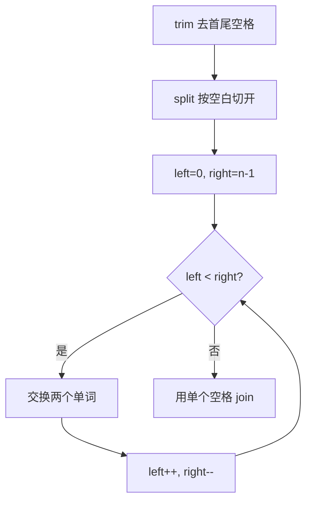

# 双指针 - 反转字符串中的单词

> [LeetCode 151. 反转字符串中的单词](https://leetcode.cn/problems/reverse-words-in-a-string/)

## 题目说明

给你一个字符串 `s`，请你反转字符串中 **单词** 的顺序。

单词是由非空格字符组成的字符串。`s` 中的单词至少由一个空格分隔。返回单词顺序颠倒且单词之间用 **单个空格** 连接的结果字符串。

输入可能有前导空格、尾随空格，以及单词间的多个空格。输出中不应包含额外空格。

例如：

- `s = "the sky is blue"` → `"blue is sky the"`
- `s = "  hello world  "` → `"world hello"`
- `s = "a good   example"` → `"example good a"`

## 解题思路

单词整体对调，和 [反转字符串](./双指针-反转字符串) 同一套左右双指针，只是交换的单位从字符变成了单词。

先把多余空格清掉，再反转单词数组：

1. `trim()`：去掉首尾空格
2. `split("\\s+")`：按 **一个或多个空白** 切开。必须用 `\\s+`，若只 `split(" ")`，连续空格会产生空串
3. 左右指针交换单词
4. `String.join(" ", array)`：单词之间只留一个空格

`\\s` 是正则里的空白，`+` 表示连续多个都当成一个分隔符。

### 过程

1. `s.trim().split("\\s+")` 得到单词数组
2. `left = 0`，`right = array.length - 1`
3. 当 `left < right` 时交换 `array[left]` 与 `array[right]`，然后 `left++`、`right--`
4. 用单个空格拼接后返回

以 `s = "  a good   example  "` 为例：

| 步骤 | 结果 |
|------|------|
| `trim()` | `"a good   example"` |
| `split("\\s+")` | `["a", "good", "example"]` |
| 交换 0 ↔ 2 | `["example", "good", "a"]` |
| `left == right`，结束 | `["example", "good", "a"]` |
| `join` | `"example good a"` |



也可以整串先反转、再逐个单词反转，最后清理空格，不依赖 `split`。面试若要求 O(1) 额外空间（可变字符数组），用那种写法。

## 复杂度

| 类型 | 复杂度 | 说明 |
|------|------|------|
| 时间复杂度 | O(n) | trim、split、反转、join 都线性于字符串长度 |
| 空间复杂度 | O(n) | 单词数组和结果字符串 |

## 代码

```java
class Solution {
    public String reverseWords(String s) {
        String[] array = s.trim().split("\\s+");
        int left = 0;
        int right = array.length - 1;
        while (left < right) {
            String change = array[left];
            array[left] = array[right];
            array[right] = change;
            left++;
            right--;
        }
        return String.join(" ", array);
    }
}
```

## 参考

- 作者：[青驰](https://leetcode.cn/problems/reverse-words-in-a-string/solutions/4024404/fan-zhuan-zi-fu-chuan-zhong-de-dan-ci-by-yn8k/)
- 来源：[力扣（LeetCode）](https://leetcode.cn/problems/reverse-words-in-a-string/)
