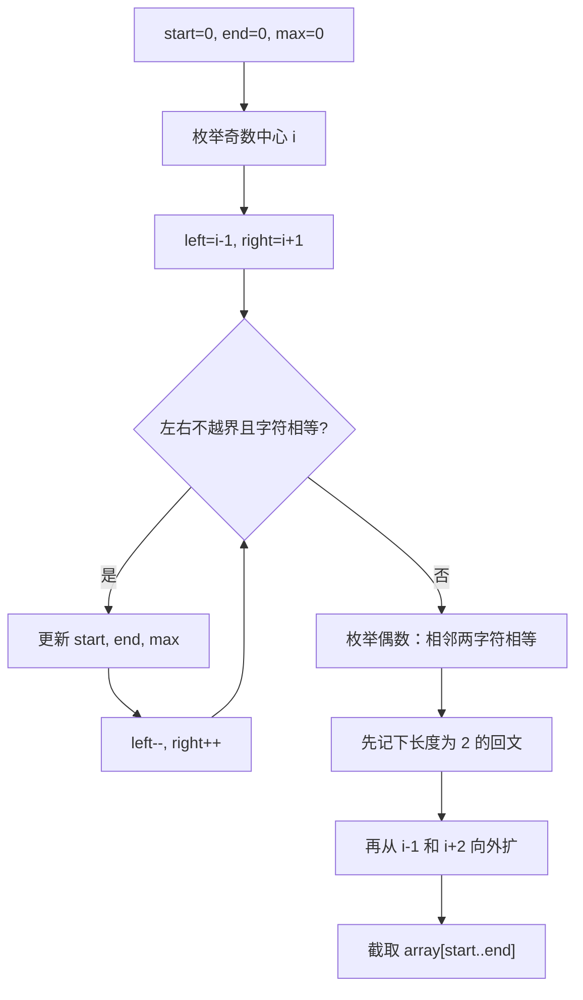

# 双指针 - 最长回文子串

> [LeetCode 5. 最长回文子串](https://leetcode.cn/problems/longest-palindromic-substring/)

## 题目说明

给你一个字符串 `s`，找到 `s` 中最长的回文子串。

回文串：正着读和倒着读一样。子串必须连续。

例如：

- `s = "babad"` → `"bab"`（`"aba"` 也是正确答案）
- `s = "cbbd"` → `"bb"`

## 解题思路

回文关于中心对称，用 **中心扩散**：枚举每个可能的中心，左右双指针同时向外走，直到两侧字符不相等。回文有两种中心：

- **奇数长度**：中心是一个字符，如 `"aba"`，从 `i-1` 和 `i+1` 开始比
- **偶数长度**：中心在两个字符之间，如 `"abba"`，先确认 `s[i] == s[i+1]`，再从 `i-1` 和 `i+2` 向外扩

记录当前最长回文的左右端点 `start`、`end`。`max` 存的是 `right - left`（长度减 1），只用来比较谁更长，不必再加 1。

单个字符本身就是回文。奇数循环从 `i = 1` 开始，不会单独把长度为 1 的写进循环；若整串找不到更长的，默认 `start = 0`、`end = 0`，返回第一个字符。

### 过程

1. 转成 `char[]`，`start = 0`，`end = 0`，`max = 0`
2. **扩奇数**：`i` 从 1 到末尾，`left = i - 1`，`right = i + 1`。两侧相等就更新区间并继续 `left--`、`right++`
3. **扩偶数**：`i` 从 0 到倒数第二个。若 `array[i] == array[i+1]`：
   - 若还没有更长回文（`max < 1`），先记下这对字符
   - 再从 `i - 1` 和 `i + 2` 向外扩，同样更新最长区间
4. 把 `array[start..end]` 拷出来返回

以 `s = "babad"` 为例（奇数）：

| 中心 i | 字符 | left, right | 是否相等 | 回文 | start, end |
|--------|------|-------------|----------|------|------------|
| 1 | a | 0, 2 | b == b | `bab` | 0, 2 |
| 2 | b | 1, 3 | a == a | `aba`（同长，不替换） | 0, 2 |
| 3 | a | 2, 4 | b != d | — | 0, 2 |

偶数侧相邻字符都不相等，最终返回 `"bab"`。

再以 `s = "cbbd"` 为例（偶数）：

| 阶段 | 中心 | 过程 | 回文 | start, end |
|------|------|------|------|------------|
| 奇数 | i=1 (b) | c 与 b 不等 | — | 0, 0 |
| 奇数 | i=2 (b) | b 与 d 不等 | — | 0, 0 |
| 偶数 | i=1 | `bb` 相等，记下；再向外 c 与 d 不等 | `bb` | 1, 2 |

输出：`"bb"`



也可以用动态规划 `dp[i][j]` 表示 `s[i..j]` 是否回文，或 Manacher 做到线性时间。中心扩散实现短，面试常用。

## 复杂度

| 类型 | 复杂度 | 说明 |
|------|------|------|
| 时间复杂度 | O(n²) | 最多 n 个中心，每个最多向外扩 n 步 |
| 空间复杂度 | O(n) | 字符数组和结果字符串（不计输出也可看成 O(1) 额外变量） |

## 代码

```java
class Solution {
    public String longestPalindrome(String s) {
        char[] array = s.toCharArray();
        int start = 0;
        int end = 0;
        int max = 0;
        for(int i = 1; i < array.length; i++){
            int left = i - 1;
            int right = i + 1;
            while(left >= 0 && right < array.length && array[left] == array[right]){
                if(right - left > max){
                    start = left;
                    end = right;
                }
                max = Math.max(max, right - left);
                left--;
                right++;
            }
        }
        for(int i = 0; i < array.length - 1; i++){
            if(array[i]==array[i+1]){
                if(max < 1){
                    start = i;
                    end = i + 1;
                    max = 1;
                 }
                 int left = i - 1;
                 int right = i + 2;
                 while(left >= 0 && right < array.length && array[left] == array[right]){
                    if(right - left > max){
                        start = left;
                        end = right;
                    }
                    max = Math.max(max, right - left);
                    left--;
                    right++;
                }
            }
        }
        char[] result = new char[end+1-start];
        for(int i = 0; i < result.length; i++){
            result[i] = array[(start+i)];
        }
        return new String(result);
    }
}
```

## 参考

- 来源：[力扣（LeetCode）](https://leetcode.cn/problems/longest-palindromic-substring/)
