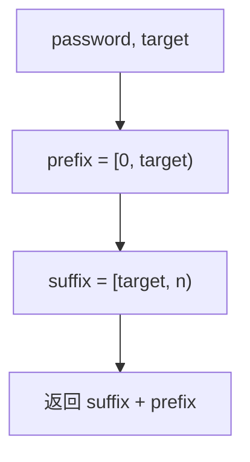

# 字符串 - 动态口令

> [LeetCode LCR 182. 动态口令](https://leetcode.cn/problems/zuo-xuan-zhuan-zi-fu-chuan-lcof/)

## 题目说明

某公司门禁密码使用动态口令。口令是一个字符串 `password`，每天都会把前 `target` 个字符挪到末尾。请返回变动后的口令。

本质是字符串 **左旋转** `target` 位：把 `[0, target)` 接到尾部。

例如：

- `password = "s3cur1tyC0d3"`, `target = 4` → `"r1tyC0d3s3cu"`
- `password = "lrloseumgh"`, `target = 6` → `"umghlrlose"`

## 解题思路

切开再拼接：前 `target` 个是 `prefix`，剩下是 `suffix`，新口令就是 `suffix + prefix`。

Java 的 `substring(begin, end)` 是左闭右开，`substring(0, target)` 正好取到下标 `target - 1`。`substring(target)` 从 `target` 取到末尾。

字符串不可变，拼接会生成新串。若要求原地（可变字符数组），可以三次反转：先反转前 `target` 段，再反转后面，最后整串反转，效果和左旋相同。

### 过程

1. `prefix = password.substring(0, target)`
2. `suffix = password.substring(target, password.length())`
3. 返回 `suffix + prefix`

以 `password = "lrloseumgh"`, `target = 6` 为例：

| 部分 | 下标范围 | 内容 |
|------|---------|------|
| prefix | `[0, 6)` | `"lrlose"` |
| suffix | `[6, 10)` | `"umgh"` |
| 拼接 | — | `"umgh" + "lrlose"` |

输出：`"umghlrlose"`



## 复杂度

| 类型 | 复杂度 | 说明 |
|------|------|------|
| 时间复杂度 | O(n) | 截取和拼接都线性于字符串长度 |
| 空间复杂度 | O(n) | Java 字符串不可变，必须生成新串 |

## 代码

```java
class Solution {
    public String dynamicPassword(String password, int target) {
        String prefix = password.substring( 0, target);
        String suffix = password.substring( target, password.length());
        return suffix + prefix;
    }
}
```

## 参考

- 作者：[青驰](https://leetcode.cn/problems/zuo-xuan-zhuan-zi-fu-chuan-lcof/solutions/4026195/pin-jie-zi-fu-chuan-dong-tai-kou-ling-by-sx7x/)
- 来源：[力扣（LeetCode）](https://leetcode.cn/problems/zuo-xuan-zhuan-zi-fu-chuan-lcof/)
