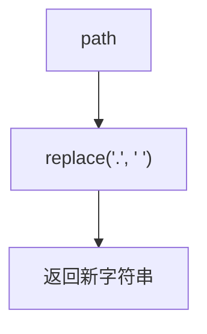

# 字符串 - 路径加密

> [LeetCode LCR 122. 路径加密](https://leetcode.cn/problems/ti-huan-kong-ge-lcof/)

## 题目说明

假定一段路径记作字符串 `path`，其中以 `"."` 作为分隔符。请将路径加密，即用空格 `" "` 替换所有的 `"."`。

例如：

- `path = "a.aef.qerf.bb"` → `"a aef qerf bb"`

## 解题思路

`.` 和空格长度相同，直接逐字符替换即可。Java 里最省事的是 `String.replace`：它按 **普通字符串** 匹配，不会把 `.` 当成正则。

`replaceAll` 的第一个参数是 **正则**。正则里 `.` 匹配任意字符，必须写成 `"\\."` 才表示点号本身。本题用 `replaceAll` 没有额外好处。

Java 字符串不可变，`replace` 内部仍会新建字符串，和自己遍历 `char[]` 再拼回去本质一样。

### 过程

1. 调用 `path.replace(".", " ")`，把每个 `.` 换成空格
2. 返回新字符串

若手写：转成 `char[]`，遇到 `.` 写成 `' '`，再 `new String`。

以 `path = "a.b.c"` 为例：

| 下标 | 原字符 | 替换后 |
|------|--------|--------|
| 0 | a | a |
| 1 | . | 空格 |
| 2 | b | b |
| 3 | . | 空格 |
| 4 | c | c |

输出：`"a b c"`



本题是等长替换。面试里更常见的变体是把空格换成 `"%20"`（剑指 Offer 05）：一个字符变三个，需要先扩容，再从后往前填，避免覆盖还没处理的字符。

## 复杂度

| 类型 | 复杂度 | 说明 |
|------|------|------|
| 时间复杂度 | O(n) | 扫描整串一次 |
| 空间复杂度 | O(n) | Java 字符串不可变，必须生成新串 |

## 代码

```java
class Solution {
    public String pathEncryption(String path) {
        return path.replace(".", " ");
        // return path.replaceAll("\\.", " ");
    }
}
```

手写遍历：

```java
class Solution {
    public String pathEncryption(String path) {
        char[] arr = path.toCharArray();
        for (int i = 0; i < arr.length; i++) {
            if (arr[i] == '.') {
                arr[i] = ' ';
            }
        }
        return new String(arr);
    }
}
```

## 参考

- 作者：[青驰](https://leetcode.cn/problems/ti-huan-kong-ge-lcof/solutions/4024381/zi-fu-chuan-zi-fu-ti-huan-by-vigilant-pa-9y4j/)
- 来源：[力扣（LeetCode）](https://leetcode.cn/problems/ti-huan-kong-ge-lcof/)
