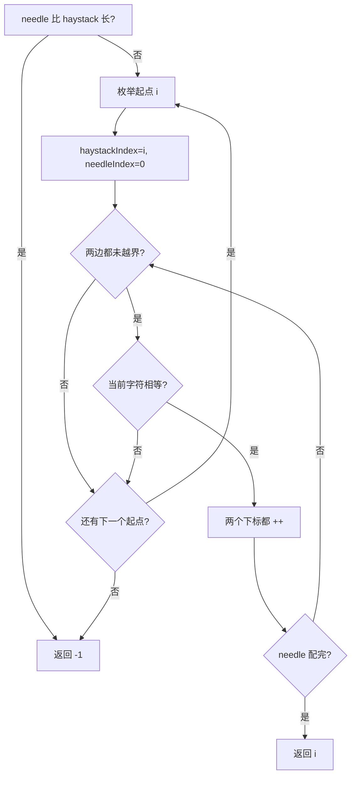

# 暴力匹配 - 找出字符串中第一个匹配项的下标

> [LeetCode 28. 找出字符串中第一个匹配项的下标](https://leetcode.cn/problems/find-the-index-of-the-first-occurrence-in-a-string/)

## 题目说明

给你两个字符串 `haystack` 和 `needle`，请在 `haystack` 中找出 `needle` 第一次出现的下标。如果不存在，返回 `-1`。

例如：

- `haystack = "sadbutsad"`, `needle = "sad"` → `0`
- `haystack = "leetcode"`, `needle = "leeto"` → `-1`
- `haystack = "hello"`, `needle = "ll"` → `2`

## 解题思路

使用 **暴力匹配**：把 `haystack` 的每个位置都当成起点，和 `needle` 逐字符比。

外层 `i` 是本次尝试的起点。内层两个下标同步前进：

- `haystackIndex` 从 `i` 开始走 `haystack`
- `needleIndex` 从 `0` 开始走 `needle`

字符相等就两边都 `++`；一旦不等就 `break`，换下一个起点。若 `needleIndex` 走到 `needle` 末尾，说明整段对上了，返回 `i`。

`needle` 比 `haystack` 还长时直接 `-1`。外层不必提前写成 `n - m`，内层有 `haystackIndex < haystack.length()`，剩的字符不够时自然配不完。

### 过程

1. `needle.length() > haystack.length()`：返回 `-1`
2. `i` 从 `0` 扫到 `haystack` 末尾：
   - `haystackIndex = i`，`needleIndex = 0`
   - 两边都未越界时比较当前字符
   - 不等则跳出；相等则两个下标都加一
   - `needleIndex == needle.length()`：返回 `i`
3. 所有起点都失败：返回 `-1`

以 `haystack = "hello"`, `needle = "ll"` 为例：

| 起点 i | 比较过程 | 结果 |
|--------|----------|------|
| 0 | `h` ≠ `l` | 失败 |
| 1 | `e` ≠ `l` | 失败 |
| 2 | `l` == `l`，`l` == `l`，needle 配完 | 返回 `2` |



也可以用 KMP，失配时用 `next` 数组把模式串往前跳，避免外层每次只挪一位。本题长度不大，暴力就能过。

## 复杂度

| 类型 | 复杂度 | 说明 |
|------|------|------|
| 时间复杂度 | O((n - m + 1) × m) | n、m 分别为 haystack、needle 长度，每个起点最多比 m 次 |
| 空间复杂度 | O(1) | 只用几个下标 |

## 代码

```java
class Solution {
    public int strStr(String haystack, String needle) {
        if(needle.length() > haystack.length()){
            return -1;
        }
        for(int i = 0; i < haystack.length(); i++){
            int haystackIndex = i;
            int needleIndex = 0;
            while( needleIndex < needle.length() && haystackIndex < haystack.length()){
                if(haystack.charAt(haystackIndex) != needle.charAt(needleIndex)){
                    break;
                }
                haystackIndex++;
                needleIndex++;
                if(needleIndex == needle.length()){
                    return i;
                }
            }
        }
        return -1;
    }
}
```

## 参考

- 作者：[青驰](https://leetcode.cn/problems/find-the-index-of-the-first-occurrence-in-a-string/solutions/4026250/bao-li-po-jie-zhao-chu-zi-fu-chuan-zhong-81x7/)
- 来源：[力扣（LeetCode）](https://leetcode.cn/problems/find-the-index-of-the-first-occurrence-in-a-string/)
