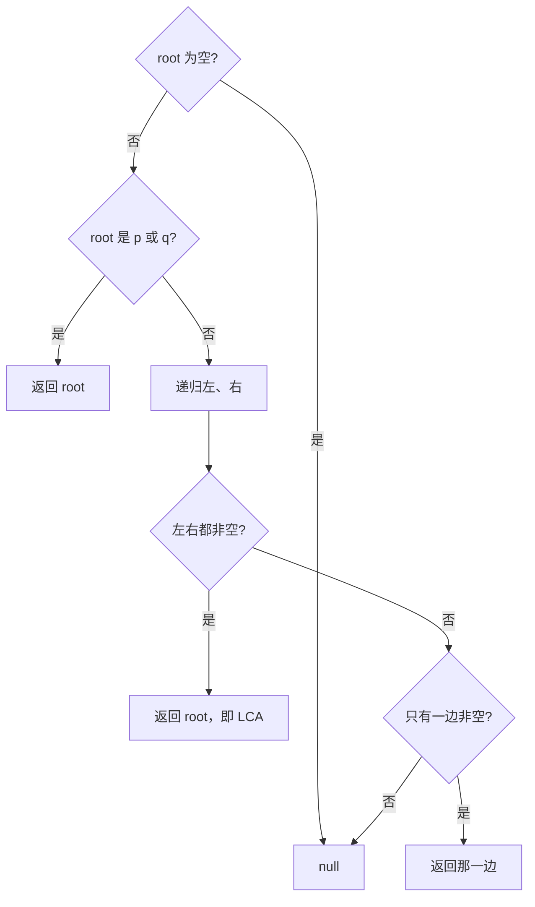

# 递归 - 二叉树的最近公共祖先

> [LeetCode 236. 二叉树的最近公共祖先](https://leetcode.cn/problems/lowest-common-ancestor-of-a-binary-tree/)

## 题目说明

给定一棵二叉树，找到两个指定节点 `p` 和 `q` 的最近公共祖先（LCA）。

最近公共祖先：`p`、`q` 的公共祖先中，离它们最近的那个节点。一个节点也可以是它自己的祖先。题目保证 `p`、`q` 都在树中。

例如：

```
      3
     / \
    5   1
   / \ / \
  6  2 0  8
    / \
   7   4
```

- `p = 5`, `q = 1` → 节点 `3`
- `p = 5`, `q = 4` → 节点 `5`（`5` 是 `4` 的祖先）

## 解题思路

用 **后序递归**（先左右、再自己）：在一棵子树里搜 `p` 和 `q`，根据左右返回值判断当前根是不是分叉点。

对当前 `root`：

- 空节点：这棵子树没有目标，返回 `null`
- `root` 就是 `p` 或 `q`：这棵子树已经找到其中一个，把它往上交（它可能自己就是祖先）
- 否则分别搜左、右子树

左右结果组合：

| 左 | 右 | 含义 | 返回 |
|----|----|------|------|
| 非空 | 非空 | `p`、`q` 分居两侧 | 当前 `root` 就是 LCA |
| 非空 | 空 | 两个都在左边（或只找到一个） | 左边的结果 |
| 空 | 非空 | 两个都在右边 | 右边的结果 |
| 空 | 空 | 这棵子树没有 | `null` |

因为是后序，最先同时看到左右都非空的那个节点，就是离 `p`、`q` 最近的分叉，也就是最近公共祖先。

### 过程

1. `root == null`：返回 `null`
2. `root == p` 或 `root == q`：返回 `root`
3. 递归左子树、右子树
4. 按上表组合左右结果

以 `p = 5`, `q = 1` 为例（LCA 是 `3`）：

| 当前节点 | 左返回 | 右返回 | 本层返回 |
|----------|--------|--------|----------|
| 6 / 7 / 4 / 0 / 8 / 2 | — | — | `null`（都不是目标） |
| 5 | null | null | **5**（自己就是 p） |
| 1 | null | null | **1**（自己就是 q） |
| 3 | 5 | 1 | **3**（两侧都找到） |

以 `p = 5`, `q = 4` 为例（LCA 是 `5`）：递归一到 `5` 就因 `root == p` 直接返回，**不会再往下搜 `4`**。上层左侧拿到 `5`、右侧为 `null`，一直把 `5` 交上去。题目保证两个节点都在树中，另一个一定在这棵子树里，所以当前节点就是祖先。



## 复杂度

| 类型 | 复杂度 | 说明 |
|------|------|------|
| 时间复杂度 | O(n) | 每个节点最多访问一次 |
| 空间复杂度 | O(h) | 递归栈深度为树高，最坏链状为 O(n) |

## 代码

```java
/**
 * Definition for a binary tree node.
 * public class TreeNode {
 *     int val;
 *     TreeNode left;
 *     TreeNode right;
 *     TreeNode(int x) { val = x; }
 * }
 */
class Solution {
    public TreeNode lowestCommonAncestor(TreeNode root, TreeNode p, TreeNode q) {
        if(root == null){
            return null;
        }
        if(root == p || root == q){
            return root;
        }
        TreeNode left = lowestCommonAncestor(root.left, p, q);
        TreeNode right = lowestCommonAncestor(root.right, p, q);
        if(left != null && right == null){
            return left;
        }
        if(left == null && right != null){
            return right;
        }
        if(left != null && right != null){
            return root;
        }
        return null;
    }
}
```

## 参考

- 作者：[青驰](https://leetcode.cn/problems/lowest-common-ancestor-of-a-binary-tree/solutions/4028941/di-gui-er-cha-shu-de-zui-jin-gong-gong-z-ce2y/)
- 来源：[力扣（LeetCode）](https://leetcode.cn/problems/lowest-common-ancestor-of-a-binary-tree/)
