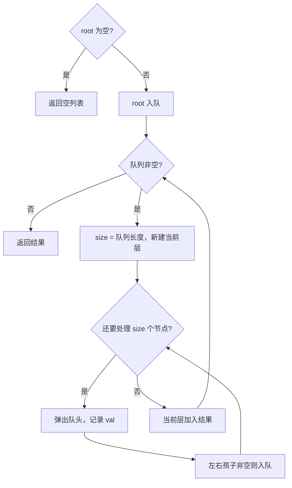

# 队列 - 二叉树层序遍历

> [LeetCode 102. 二叉树的层序遍历](https://leetcode.cn/problems/binary-tree-level-order-traversal/)

## 题目说明

给你二叉树的根节点 `root`，返回其节点值的 **层序遍历**。即逐层地、从左到右访问所有节点。

例如：

```
    3
   / \
  9  20
    /  \
   15   7
```

输出：`[[3], [9, 20], [15, 7]]`

## 解题思路

层序遍历就是 **BFS**：用队列保证「先遇到的节点先处理」。队列里同一层的节点会连在一起，关键是 **进入内层循环前先记下当前队列长度 `size`**，这一轮只弹出 `size` 个节点，它们恰好构成当前层；弹出时再把左右孩子入队，留给下一层。

若不先记下 `size`，一边出队一边入队，不同层会混在一次循环里，无法按层分组。

### 过程

1. 根节点为空：直接返回空列表
2. 队列放入 `root`
3. 当队列非空时：
   - `size = queue.size()`，新建当前层列表
   - 循环 `size` 次：弹出队头，把值写入当前层；若左/右孩子非空则入队（先左后右，保证从左到右）
   - 当前层列表加入结果
4. 返回结果

以题目示例为例：

| 层 | 循环前队列 | size | 弹出 | 入队 | 当前层 |
|----|------------|------|------|------|--------|
| 1 | `[3]` | 1 | 3 | 9, 20 | `[3]` |
| 2 | `[9, 20]` | 2 | 9；20 | 15, 7 | `[9, 20]` |
| 3 | `[15, 7]` | 2 | 15；7 | — | `[15, 7]` |

输出：`[[3], [9, 20], [15, 7]]`



## 复杂度

| 类型 | 复杂度 | 说明 |
|------|------|------|
| 时间复杂度 | O(n) | 每个节点入队、出队各一次 |
| 空间复杂度 | O(n) | 队列最多存放一层节点，最坏约 n/2（完全二叉树最底层） |

## 代码

```java
/**
 * Definition for a binary tree node.
 * public class TreeNode {
 *     int val;
 *     TreeNode left;
 *     TreeNode right;
 *     TreeNode() {}
 *     TreeNode(int val) { this.val = val; }
 *     TreeNode(int val, TreeNode left, TreeNode right) {
 *         this.val = val;
 *         this.left = left;
 *         this.right = right;
 *     }
 * }
 */
class Solution {
    public List<List<Integer>> levelOrder(TreeNode root) {
        if (root == null) {
            return new ArrayList<>();
        }
        Queue<TreeNode> queue = new LinkedList<>();
        queue.offer(root);
        List<List<Integer>> lists = new ArrayList<>();
        while (!queue.isEmpty()) {
            List<Integer> list = new ArrayList<>();
            int size = queue.size();
            for (int i = 0; i < size; i++) {
                TreeNode node = queue.poll();
                list.add(node.val);
                if (node.left != null) {
                    queue.offer(node.left);
                }
                if (node.right != null) {
                    queue.offer(node.right);
                }
            }
            lists.add(list);
        }
        return lists;
    }
}
```

## 参考

- 作者：[青驰](https://leetcode.cn/problems/binary-tree-level-order-traversal/solutions/4022030/queueer-cha-shu-ceng-xu-bian-li-by-vigil-belg/)
- 来源：[力扣（LeetCode）](https://leetcode.cn/problems/binary-tree-level-order-traversal/)
