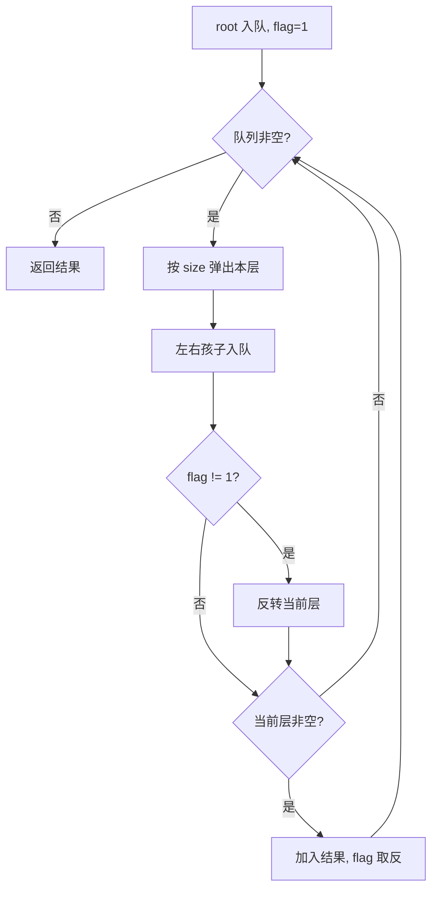

# 队列 - 二叉树的锯齿形层序遍历

> [LeetCode 103. 二叉树的锯齿形层序遍历](https://leetcode.cn/problems/binary-tree-zigzag-level-order-traversal/)

## 题目说明

给你二叉树的根节点 `root`，返回其节点值的 **锯齿形层序遍历**。即先从左往右，再从右往左，下一层再从左往右，依此类推，层与层之间交替进行。

例如：

```
    3
   / \
  9  20
    /  \
   15   7
```

输出：`[[3], [20, 9], [15, 7]]`

## 解题思路

和 [二叉树层序遍历](./队列-二叉树层序遍历) 同一套 BFS：队列按层弹出，先记下 `size`，再把左右孩子入队。唯一差别是 **奇数层从左到右，偶数层从右到左**。

队列入队顺序始终先左后右，不必改遍历方向。每层先按从左到右收集，再用 `flag` 决定要不要把当前层 `reverse`：

- `flag = 1`：正序，不反转
- `flag = -1`：反转后再加入结果

一层处理完把 `flag` 取反。空层（例如 `root == null` 入队后弹出得到空列表）不加入结果，也不翻转 `flag`。

也可以用双端队列按层头插 / 尾插，效果一样，本写法更直观。

### 过程

1. 根节点入队，`flag = 1`
2. 当队列非空时：
   - `size = queue.size()`，新建当前层列表
   - 循环 `size` 次：弹出节点，空节点跳过；把值加入当前层，左右孩子非空则入队
   - `flag != 1` 时反转当前层
   - 当前层非空则加入结果，并 `flag = -flag`
3. 返回结果

以题目示例为例：

| 层 | flag | 收集顺序 | 是否反转 | 当前层 |
|----|------|----------|----------|--------|
| 1 | 1 | 3 | 否 | `[3]` |
| 2 | -1 | 9, 20 | 是 | `[20, 9]` |
| 3 | 1 | 15, 7 | 否 | `[15, 7]` |

输出：`[[3], [20, 9], [15, 7]]`



## 复杂度

| 类型 | 复杂度 | 说明 |
|------|------|------|
| 时间复杂度 | O(n) | 每个节点入队、出队各一次；反转一层最多 O(该层节点数)，合计仍是 O(n) |
| 空间复杂度 | O(n) | 队列最多存放一层节点 |

## 代码

```java
/**
 * Definition for a binary tree node.
 * public class TreeNode {
 *     int val;
 *     TreeNode left;
 *     TreeNode right;
 *     TreeNode() {}
 *     TreeNode(int val) { this.val = val; }
 *     TreeNode(int val, TreeNode left, TreeNode right) {
 *         this.val = val;
 *         this.left = left;
 *         this.right = right;
 *     }
 * }
 */
class Solution {
    public List<List<Integer>> zigzagLevelOrder(TreeNode root) {
        List<List<Integer>> lists = new ArrayList<>();
        // 使用queue
        Queue<TreeNode> queue = new LinkedList<>();
        queue.offer(root);
        int falg = 1;
        while(!queue.isEmpty()){
           int size = queue.size();
           List<Integer> list = new ArrayList<>();

           for(int i = 0; i < size; i++){
                TreeNode node = queue.poll();
                if(node == null){
                    continue;
                }
                list.add(node.val);
                if(node.left != null){
                    queue.offer(node.left);
                }
                if(node.right != null){
                    queue.offer(node.right);
                }
           }
           if(falg != 1){
            Collections.reverse(list);
           }
           if(list.size() != 0){
               lists.add(list);
               falg = -falg;
           }
        }
        return lists;
    }
}
```

## 参考

- 作者：[青驰](https://leetcode.cn/problems/binary-tree-zigzag-level-order-traversal/solutions/4027036/queueyan-du-you-xian-bfs-er-cha-shu-ceng-1r7o/)
- 来源：[力扣（LeetCode）](https://leetcode.cn/problems/binary-tree-zigzag-level-order-traversal/)
